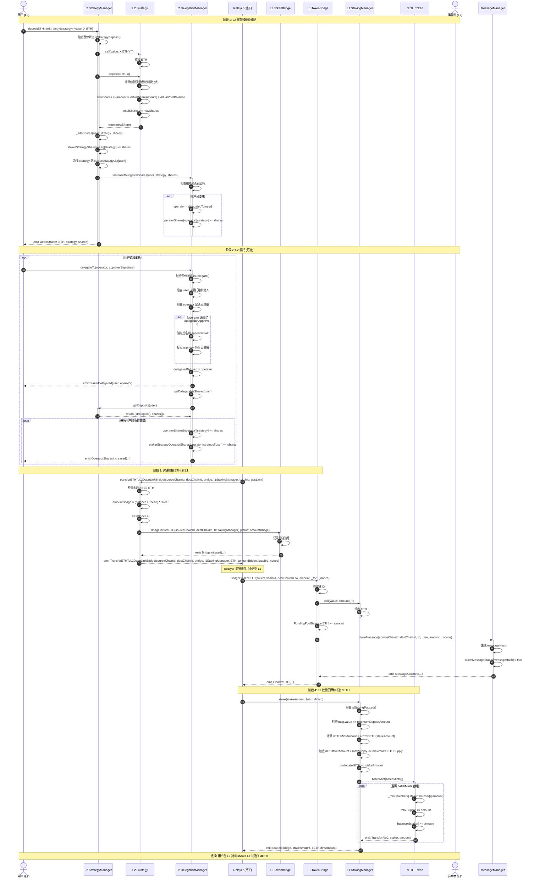

# 流程 1: 用户质押 (L2 → L1)

## 📋 目录

- [流程概述](#流程概述)
- [完整流程图](#完整流程图)
- [详细步骤拆解](#详细步骤拆解)
- [关键函数详解](#关键函数详解)
- [数据流和状态变化](#数据流和状态变化)
- [错误处理和边界情况](#错误处理和边界情况)

---

## 流程概述

**目标**: 用户在 L2 存入 ETH/WETH 到策略,通过跨链桥将资金转移到 L1,在 L1 铸造 dETH 凭证代币。

**参与角色**:
- **用户** (User): 在 L2 存入 ETH/WETH 的质押者
- **Relayer**: 中继跨链消息的链下服务
- **运营商** (Operator): 可选的委托目标

**关键合约**:
- **L2 层**: StrategyManager, Strategy (StrategyBase), DelegationManager
- **桥接层**: L2 TokenBridge, L1 TokenBridge
- **L1 层**: StakingManager, DETH

**核心流程**:
1. 用户在 L2 存入 ETH 到策略
2. L2 策略计算并分配份额
3. 用户可选择在 L2 委托给运营商
4. 策略合约积累到 32 ETH 后触发跨链转移
5. Relayer 中继消息到 L1
6. L1 StakingManager 批量铸造 dETH

---

## 完整流程图



---

## 详细步骤拆解

### 阶段 1: L2 存款和份额分配

#### 步骤 1: 用户在 L2 StrategyManager 存入 ETH

**合约**: `StrategyManager.sol`
**函数**: `depositETHIntoStrategy(address strategy)`
**文件位置**: `src/L2/core/StrategyManager.sol:91-99`

```solidity
function depositETHIntoStrategy(
    address strategy
) external payable nonReentrant returns (uint256 shares) {
    // 检查策略存款是否暂停
    require(getL2Pauser().isStrategyDeposit(), "StrategyManager.t.sol:depositETHIntoStrategy paused");

    // 调用内部函数处理存款
    shares = _depositETHIntoStrategy(msg.sender, strategy);
}
```

**状态变化**:
- 用户的 ETH 转入 Strategy 合约
- 触发 `Deposit` 事件

**前置条件**:
- 合约未暂停 (`isStrategyDeposit()`)
- 策略已加入白名单 (`strategyIsWhitelistedForDeposit[strategy]`)
- 用户发送 ETH (`msg.value > 0`)

---

#### 步骤 2: Strategy 计算并分配份额

**合约**: `StrategyBase.sol`
**函数**: `deposit(IERC20 weth, uint256 amount)`
**文件位置**: `src/L2/strategies/StrategyBase.sol:91-116`

```solidity
function deposit(IERC20 weth, uint256 amount)
    external
    virtual
    override
    onlyStrategyManager
    returns (uint256 newShares)
{
    require(pauser.isStrategyDeposit(), "StrategyBase:deposit paused");

    _beforeDeposit(weth, amount);

    // 1. 记录存款前的总份额
    uint256 priorTotalShares = totalShares;

    // 2. 计算虚拟份额总量（防止除零和通胀攻击）
    uint256 virtualShareAmount = priorTotalShares + SHARES_OFFSET;

    // 3. 计算虚拟代币余额（当前余额已包含刚转入的 amount）
    uint256 virtualTokenBalance = ethWethBalance() + BALANCE_OFFSET;

    // 4. 计算存款前的虚拟余额
    uint256 virtualPriorTokenBalance = virtualTokenBalance - amount;

    // 5. 新份额 = (本次质押 × 虚拟份额总量) ÷ 存款前虚拟余额
    newShares = (amount * virtualShareAmount) / virtualPriorTokenBalance;

    require(newShares != 0, "StrategyBase.deposit: newShares cannot be zero");

    // 6. 更新总份额
    totalShares = (priorTotalShares + newShares);
    return newShares;
}
```

**关键特性**:
- ⭐ **虚拟余额机制**: 使用 `SHARES_OFFSET` (1e3) 和 `BALANCE_OFFSET` (1e3) 防止通胀攻击
- ⭐ **汇率计算**: 份额价值随策略收益浮动
- ⭐ **仅限 StrategyManager 调用**: `onlyStrategyManager` 修饰符

**份额计算示例**:
```
初始状态:
- totalShares = 0
- 合约余额 = 0
- SHARES_OFFSET = 1000, BALANCE_OFFSET = 1000

用户 A 存入 10 ETH:
- virtualShareAmount = 0 + 1000 = 1000
- virtualTokenBalance = 10 + 1000 = 1010
- virtualPriorBalance = 1010 - 10 = 1000
- newShares = (10 × 1000) / 1000 = 10
- totalShares = 10

策略产生 2 ETH 收益:
- totalShares = 10 (不变)
- 合约余额 = 12 ETH
- 每份额价值 = 12 / 10 = 1.2 ETH

用户 B 存入 12 ETH:
- virtualShareAmount = 10 + 1000 = 1010
- virtualTokenBalance = 24 + 1000 = 1024
- virtualPriorBalance = 1024 - 12 = 1012
- newShares = (12 × 1010) / 1012 ≈ 11.98
- totalShares = 21.98
- 每份额价值 = 24 / 21.98 ≈ 1.09 ETH (略有稀释,但接近 1.2)
```

---

#### 步骤 3: StrategyManager 记录份额并更新委托

**合约**: `StrategyManager.sol`
**内部函数**: `_depositETHIntoStrategy()` 和 `_addShares()`
**文件位置**: `src/L2/core/StrategyManager.sol:357-373, 308-325`

```solidity
function _depositETHIntoStrategy(
    address staker,
    address strategy
) internal onlyStrategiesWhitelistedForDeposit(strategy) returns (uint256 shares) {
    // 1. 将 ETH 转入对应的 strategy
    (bool sent, ) = payable(strategy).call{value: msg.value}("");
    require(sent, "StrategyManager._depositETHIntoStrategy: send eth to strategy fail");

    // 2. 调用策略合约的 deposit 方法计算份额
    shares = getStrategy(strategy).deposit(IERC20(ETHAddress.EthAddress), msg.value);

    // 3. 将 shares 加给 staker
    _addShares(staker, IERC20(ETHAddress.EthAddress), strategy, shares);

    // 4. 若 staker 已经 delegate,将 staker 质押 shares 委托给对应的 operator
    getDelegationManager().increaseDelegatedShares(staker, strategy, shares);

    return shares;
}

function _addShares(address staker, IERC20 weth, address strategy, uint256 shares) internal {
    require(staker != address(0), "StrategyManager._addShares: staker cannot be zero address");
    require(shares != 0, "StrategyManager._addShares: shares should not be zero!");

    // 如果是新策略,添加到质押者的策略列表
    if (stakerStrategyShares[staker][strategy] == 0) {
        require(
            stakerStrategyList[staker].length < MAX_STAKER_STRATEGY_LIST_LENGTH,
            "StrategyManager._addShares: deposit would exceed MAX_STAKER_STRATEGY_LIST_LENGTH"
        );
        stakerStrategyList[staker].push(strategy);
    }

    // 增加份额
    stakerStrategyShares[staker][strategy] += shares;

    emit Deposit(staker, weth, strategy, shares);
}
```

**状态变化**:
- `stakerStrategyShares[staker][strategy]` 增加 `shares`
- 如果是新策略,添加到 `stakerStrategyList[staker]`
- 如果用户已委托,`operatorShares[operator][strategy]` 增加 `shares`

---

### 阶段 2: L2 委托 (可选)

#### 步骤 4: 用户委托给运营商

**合约**: `DelegationManager.sol`
**函数**: `delegateTo(address operator, SignatureWithExpiry memory approverSignatureAndExpiry, bytes32 approverSalt)`
**文件位置**: `src/L2/core/DelegationManager.sol:69-73, 241-288, 351-355`

```solidity
function delegateTo(
    address operator,
    SignatureWithExpiry memory approverSignatureAndExpiry,
    bytes32 approverSalt
) external {
    _delegate(msg.sender, operator, approverSignatureAndExpiry, approverSalt);
}

function _delegate(
    address staker,
    address operator,
    SignatureWithExpiry memory approverSignatureAndExpiry,
    bytes32 approverSalt
) internal {
    // 0. 检查暂停状态
    require(getL2Pauser().isDelegate(), "DelegationManager:isDelegate paused");

    // 1. 检查质押者未委托给其他人
    require(!isDelegated(staker), "DelegationManager._delegate: staker is already actively delegated");

    // 2. 检查运营商是否已注册
    require(isOperator(operator), "DelegationManager._delegate: operator is not registered in DappLink");

    // 3. 验证授权者签名(如果运营商设置了 delegationApprover)
    address _delegationApprover = _operatorDetails[operator].delegationApprover;
    if (_delegationApprover != address(0) && msg.sender != _delegationApprover && msg.sender != operator) {
        // 检查签名是否过期
        require(
            approverSignatureAndExpiry.expiry >= block.timestamp,
            "DelegationManager._delegate: approver signature expired"
        );

        // 检查 salt 是否已使用
        require(
            !delegationApproverSaltIsSpent[_delegationApprover][approverSalt],
            "DelegationManager._delegate: approverSalt already spent"
        );
        delegationApproverSaltIsSpent[_delegationApprover][approverSalt] = true;

        // 计算签名哈希
        bytes32 approverDigestHash = calculateDelegationApprovalDigestHash(
            staker, operator, _delegationApprover, approverSalt, approverSignatureAndExpiry.expiry
        );

        // 验证 EIP-1271 签名
        EIP1271SignatureUtils.checkSignature_EIP1271(
            staker, approverDigestHash, approverSignatureAndExpiry.signature
        );
    }

    // 4. 设置委托关系
    delegatedTo[staker] = operator;

    // 5. 触发委托事件
    emit StakerDelegated(staker, operator);

    // 6. 获取质押者在所有策略中的份额
    (address[] memory strategies, uint256[] memory shares) = getDelegatableShares(staker);

    // 7. 遍历所有策略,增加运营商的份额
    for (uint256 i = 0; i < strategies.length;) {
        _increaseOperatorShares({
            operator: operator,
            staker: staker,
            strategy: strategies[i],
            shares: shares[i]
        });
        unchecked {
            ++i;
        }
    }
}

function _increaseOperatorShares(
    address operator,
    address staker,
    address strategy,
    uint256 shares
) internal {
    // 增加运营商在该策略的总份额
    operatorShares[operator][strategy] += shares;

    // ⭐ 记录该运营商从特定质押者获得的份额(用于精确追踪)
    stakerStrategyOperatorShares[operator][strategy][staker] += shares;

    emit OperatorSharesIncreased(operator, staker, strategy, shares);
}

// 辅助函数: 获取质押者可委托的份额
function getDelegatableShares(address staker) public view returns (address[] memory, uint256[] memory) {
    (address[] memory strategyManagerStrats, uint256[] memory strategyManagerShares) =
        getStrategyManager().getDeposits(staker);
    return (strategyManagerStrats, strategyManagerShares);
}
```

**状态变化**:
- `delegatedTo[staker]` 设置为 `operator`
- 对于质押者的每个策略:
  - `operatorShares[operator][strategy]` 增加相应份额
  - ⭐ `stakerStrategyOperatorShares[operator][strategy][staker]` 增加相应份额(新增)
- 如果使用了 `delegationApprover`:
  - `delegationApproverSaltIsSpent[_delegationApprover][approverSalt]` 设置为 `true`

**前置条件**:
- ✅ 合约未暂停委托功能 (`getL2Pauser().isDelegate()`)
- ✅ 质押者未委托给其他运营商 (`!isDelegated(staker)`)
- ✅ 运营商已调用 `registerAsOperator()` 注册 (`isOperator(operator)`)
- ✅ 如果运营商设置了 `delegationApprover` 且调用者不是 approver 或 operator:
  - 需要提供有效的 EIP-1271 签名
  - 签名未过期 (`approverSignatureAndExpiry.expiry >= block.timestamp`)
  - `approverSalt` 未被使用过

---

### 阶段 3: 跨链桥接 ETH 到 L1

#### 步骤 5: Relayer 触发策略合约转移 ETH 到 L1

**合约**: `StrategyBase.sol`
**函数**: `transferETHToL2DappLinkBridge(...)`
**文件位置**: `src/L2/strategies/StrategyBase.sol:227-263`

```solidity
function transferETHToL2DappLinkBridge(
    uint256 sourceChainId,
    uint256 destChainId,
    address bridge,
    address l1StakingManagerAddr,
    uint256 batchId,
    uint256 gasLimit
) external payable onlyRelayer returns (bool) {
    // 检查余额是否达到 32 ETH
    if (address(this).balance > 32e18) {
        // 计算可桥接金额(必须是 32 的整数倍)
        uint256 amountBridge = ((address(this).balance) / 32e18) * 32e18;
        nextNonce++;

        // 调用 bridge 合约 BridgeInitiateETH,将资金转移到 L1 层
        bool success = SafeCall.callWithMinGas(
            bridge,
            gasLimit,
            amountBridge,
            abi.encodeWithSignature(
                "BridgeInitiateETH(uint256,uint256,address)",
                sourceChainId,
                destChainId,
                l1StakingManagerAddr
            )
        );
        require(success, "StrategyBase.transferETHToL2DappLinkBridge: transfer failed");

        emit TransferETHToL2DappLinkBridge(
            sourceChainId,
            destChainId,
            bridge,
            l1StakingManagerAddr,
            ETHAddress.EthAddress,
            amountBridge,
            batchId,
            nextNonce
        );
        return success;
    }
    return false;
}
```

**关键特性**:
- ⭐ **批量处理**: 只有当余额 > 32 ETH 时才触发跨链
- ⭐ **32 ETH 对齐**: 转移金额必须是 32 ETH 的整数倍
- ⭐ **仅限 Relayer 调用**: `onlyRelayer` 修饰符
- ⭐ **Nonce 递增**: 每次跨链转移增加 nonce,确保唯一性

**状态变化**:
- Strategy 合约余额减少 `amountBridge`
- L2 TokenBridge 记录跨链消息
- `nextNonce` 递增

---

#### 步骤 6: L2 TokenBridge 发起跨链消息

**合约**: `TokenBridgeBase.sol` (L2 实例)
**函数**: `BridgeInitiateETH(uint256 sourceChainId, uint256 destChainId, address to)`
**文件位置**: `src/bridge/core/bridge/TokenBridgeBase.sol:149-173`

```solidity
function BridgeInitiateETH(
    uint256 sourceChainId,
    uint256 destChainId,
    address to
) external payable returns (bool) {
    // 1. 验证源链 ID 与当前链 ID 一致
    if (sourceChainId != block.chainid) {
        revert sourceChainIdError();
    }

    // 2. 验证目标链 ID 在支持列表中
    if (!IsSupportChainId(destChainId)) {
        revert ChainIdIsNotSupported(destChainId);
    }

    // 3. 检查转账金额是否达到最小限额
    if (msg.value < MinTransferAmount) {
        revert LessThanMinTransferAmount(MinTransferAmount, msg.value);
    }

    // 4. 增加资金池余额
    FundingPoolBalance[ContractsAddress.ETHAddress] += msg.value;

    // 5. ⭐ 计算手续费(默认 1% = 10000/1000000)
    uint256 fee = (msg.value * PerFee) / 1_000_000;
    uint256 amount = msg.value - fee;

    // 6. 将手续费记录到费用池
    FeePoolValue[ContractsAddress.ETHAddress] += fee;

    // 7. ⭐ 调用 MessageManager 发送跨链消息
    messageManager.sendMessage(block.chainid, destChainId, to, amount, fee);

    // 8. 触发事件供 Relayer 监听
    emit InitiateETH(sourceChainId, destChainId, msg.sender, to, amount);

    return true;
}
```

**关键差异**:
- ⭐ **手续费机制**: 从转账金额中扣除 1% 手续费 (`PerFee = 10000`)
- ⭐ **MessageManager 集成**: 通过 `messageManager.sendMessage()` 发送跨链消息,而不是直接生成哈希
- ⭐ **资金池管理**: 维护 `FundingPoolBalance` 和 `FeePoolValue` 两个独立的池
- ⭐ **事件参数**: `emit InitiateETH` 包含 `msg.sender` (from) 和扣除手续费后的 `amount`

**状态变化**:
- Bridge 合约接收 ETH (`msg.value`)
- `FundingPoolBalance[ETHAddress]` 增加 `msg.value`
- `FeePoolValue[ETHAddress]` 增加 `fee`
- MessageManager 状态变化:
  - `nextMessageNumber` 递增
  - `sentMessageStatus[messageHash]` 设置为 `true`
  - 触发 `MessageSent` 事件供 Relayer 监听

**MessageManager.sendMessage() 详解**:
```solidity
// src/bridge/core/message/MessageManager.sol:58-91
function sendMessage(
    uint256 sourceChainId,
    uint256 destChainId,
    address _to,
    uint256 _value,
    uint256 _fee
) external onlyTokenBridge {
    uint256 messageNumber = nextMessageNumber;

    // 生成消息哈希(注意参数顺序: sourceChainId, destChainId, _to, _fee, _value, messageNumber)
    bytes32 messageHash = keccak256(
        abi.encode(
            sourceChainId,
            destChainId,
            _to,
            _fee,
            _value,
            messageNumber
        )
    );

    nextMessageNumber++;
    sentMessageStatus[messageHash] = true;

    emit MessageSent(
        sourceChainId,
        destChainId,
        msg.sender,
        _to,
        _fee,
        _value,
        messageNumber,
        messageHash
    );
}
```

**前置条件**:
- ✅ `sourceChainId` 必须等于 `block.chainid`
- ✅ `destChainId` 必须在 `IsSupportedChainId` 映射中为 `true`
- ✅ `msg.value` 必须 >= `MinTransferAmount` (默认 0.1 ETH)

---

#### 步骤 7: Relayer 中继消息到 L1

**操作者**: Relayer (链下服务)
**流程**:

1. **监听 L2 事件**:
```javascript
// Relayer 伪代码
l2Bridge.on('InitiateETH', async (sourceChainId, destChainId, to, amount, nonce, messageHash) => {
    const proof = await generateProof(event);

    // 中继到 L1
    await relayMessageToL1(messageHash, proof);
});
```

2. **在 L1 完成资金转移**:
```javascript
// Relayer 调用 L1Bridge.BridgeFinalizeETH()
await l1Bridge.BridgeFinalizeETH(
    sourceChainId,
    destChainId,
    to,  // L1 StakingManager 地址
    amount,
    messageHash,
    proof
);
```

---

### 阶段 4: L1 批量质押和铸造 dETH

#### 步骤 8: L1 TokenBridge 完成跨链并转 ETH 到 StakingManager

**合约**: `TokenBridgeBase.sol` (L1 实例)
**函数**: `BridgeFinalizeETH(...)`
**文件位置**: `src/bridge/core/bridge/TokenBridgeBase.sol:302-333`

```solidity
function BridgeFinalizeETH(
    uint256 sourceChainId,
    uint256 destChainId,
    address to,
    uint256 amount,
    uint256 _fee,
    uint256 _nonce
) external payable onlyRole(ReLayer) returns (bool) {
    // 1. 验证目标链 ID 与当前链 ID 一致
    if (destChainId != block.chainid) {
        revert sourceChainIdError();
    }

    // 2. 验证源链 ID 在支持列表中
    if (!IsSupportChainId(sourceChainId)) {
        revert ChainIdIsNotSupported(sourceChainId);
    }

    // 3. ⭐ 转移 ETH 到目标地址 (StakingManager)
    (bool _ret, ) = payable(to).call{value: amount}("");
    if (!_ret) {
        revert TransferETHFailed();
    }

    // 4. 减少资金池余额
    FundingPoolBalance[ContractsAddress.ETHAddress] -= amount;

    // 5. ⭐ 调用 MessageManager 标记消息已认领
    messageManager.claimMessage(
        sourceChainId,
        destChainId,
        to,
        _fee,
        amount,
        _nonce
    );

    // 6. 触发完成事件
    emit FinalizeETH(sourceChainId, destChainId, address(this), to, amount);

    return true;
}
```

**MessageManager.claimMessage() 详解**:
```solidity
// src/bridge/core/message/MessageManager.sol:102-115
function claimMessage(
    uint256 sourceChainId,
    uint256 destChainId,
    address _to,
    uint256 _fee,
    uint256 _value,
    uint256 _nonce
) external onlyTokenBridge nonReentrant {
    // 生成与源链相同的消息哈希
    bytes32 messageHash = keccak256(
        abi.encode(sourceChainId, destChainId, _to, _fee, _value, _nonce)
    );

    // 标记消息已认领,防止重放攻击
    claimMessageStatus[messageHash] = true;

    emit MessageClaimed(sourceChainId, destChainId, messageHash);
}
```

**关键特性**:
- ⭐ **权限控制**: 仅限 Relayer 角色调用 (`onlyRole(ReLayer)`)
- ⭐ **资金池管理**: 从 `FundingPoolBalance` 扣除,确保流动性平衡
- ⭐ **消息验证**: 通过 MessageManager 防止重放攻击
- ⭐ **重入保护**: MessageManager 的 `claimMessage` 使用 `nonReentrant` 修饰符

**状态变化**:
- ETH 从 L1 Bridge 转入 StakingManager (`amount`)
- `FundingPoolBalance[ETHAddress]` 减少 `amount`
- MessageManager 状态变化:
  - `claimMessageStatus[messageHash]` 设置为 `true`
  - 触发 `MessageClaimed` 事件

**前置条件**:
- ✅ 调用者必须具有 `ReLayer` 角色
- ✅ `destChainId` 必须等于 `block.chainid`
- ✅ `sourceChainId` 必须在 `IsSupportedChainId` 映射中为 `true`
- ✅ Bridge 合约必须有足够的 ETH 余额
- ✅ 消息哈希未被认领过 (在 MessageManager 中检查)

---

#### 步骤 9: Relayer 调用 StakingManager 批量铸造 dETH

**合约**: `StakingManager.sol`
**函数**: `stake(uint256 stakeAmount, IDETH.BatchMint[] calldata batchMints)`
**文件位置**: `src/L1/core/StakingManager.sol:137-156`

```solidity
function stake(uint256 stakeAmount, IDETH.BatchMint[] calldata batchMints)
    external
    onlyDappLinkBridge
    payable
{
    // 1. 检查暂停状态
    if (getL1Pauser().isStakingPaused()) {
        revert Paused();
    }

    // 2. 检查最小质押金额
    if (msg.value < minimumDepositAmount || stakeAmount < minimumDepositAmount) {
        revert MinimumDepositAmountNotSatisfied();
    }

    // 3. 计算要铸造的 dETH 数量
    uint256 dETHMintAmount = ethToDETH(stakeAmount);

    // 4. 检查 dETH 供应量上限
    if (dETHMintAmount + getDETH().totalSupply() > maximumDETHSupply) {
        revert MaximumDETHSupplyExceeded();
    }

    // 5. 增加未分配的 ETH
    unallocatedETH += stakeAmount;

    // 6. ⭐ 批量铸造 dETH 给多个接收者
    getDETH().batchMint(batchMints);

    // 7. 触发事件
    emit Staked(getLocator().dapplinkBridge(), stakeAmount, dETHMintAmount);
}
```

**BatchMint 结构体**:
```solidity
// DETH.sol
struct BatchMint {
    address staker;  // dETH 接收者地址
    uint256 amount;  // 铸造的 dETH 数量
}
```

**DETH.batchMint() 实现** (DETH.sol:65-72):
```solidity
function batchMint(BatchMint[] calldata batcher) external {
    if (msg.sender != getLocator().stakingManager()) {
        revert NotStakingManagerContract();
    }
    for (uint256 i = 0; i < batcher.length; i++) {
        _mint(batcher[i].staker, batcher[i].amount);
    }
}
```

**状态变化**:
- `StakingManager.unallocatedETH` 增加 `stakeAmount`
- `DETH.totalSupply` 增加 `dETHMintAmount`
- `DETH.balances[staker]` 根据 `batchMints` 数组批量增加

**关键差异**:
- ⭐ **仅限桥接调用**: 使用 `onlyDappLinkBridge` 修饰符,不是公开函数
- ⭐ **批量铸造**: 支持一次性给多个地址铸造 dETH
- ⭐ **两个金额参数**: `msg.value` 和 `stakeAmount` 都需要检查
- ⭐ **事件发送者**: emit 事件时使用 bridge 地址

**关键计算 - dETH 数量**:
```solidity
// StakingManager.sol: ethToDETH()
function ethToDETH(uint256 ethAmount) public returns (uint256) {
    if (getDETH().totalSupply() == 0) {
        return ethAmount;  // 初始汇率 1:1
    }
    // dETH 数量 = ethAmount * totalSupply / totalControlled
    return Math.mulDiv(ethAmount, getDETH().totalSupply(), totalControlled());
}

// totalControlled() 聚合多个来源的 ETH
function totalControlled() public view returns (uint256) {
    return unallocatedETH
         + allocatedETHForDeposits
         + totalDepositedInValidators
         + unstakeRequestsManager.unallocatedETH()
         + oracleManager.latestRecord().currentTotalValidatorBalance;
}
```

**汇率示例**:
```
初始状态:
- totalControlled = 0
- dETH totalSupply = 0
- 汇率 = 1:1

批次 1: 3 个用户共存入 96 ETH (32×3):
- 铸造 96 dETH
- totalControlled = 96 ETH
- dETH totalSupply = 96
- 汇率 = 96/96 = 1:1

验证者产生 3 ETH 奖励:
- totalControlled = 99 ETH
- dETH totalSupply = 96 (不变)
- 汇率 = 99/96 = 1.03125 ETH per dETH

批次 2: 2 个用户存入 64 ETH (32×2):
- 应铸造 dETH = 64 * (96/99) ≈ 61.82 dETH
- totalControlled = 163 ETH
- dETH totalSupply ≈ 157.82
```

**安全检查**:
- ✅ 最小质押金额检查 (`minimumDepositAmount`)
- ✅ 最大供应量检查 (`maximumDETHSupply`)
- ✅ 暂停检查 (`isStakingPaused()`)
- ✅ 权限检查 (`onlyDappLinkBridge`)

---

## 关键函数详解

### 1. L2 Strategy 份额计算 - 虚拟余额防通胀攻击

**函数**: `StrategyBase.deposit()`
**位置**: `src/L2/strategies/StrategyBase.sol:91-116`

**核心公式**:
```solidity
virtualShareAmount = totalShares + SHARES_OFFSET;  // 虚拟份额总量
virtualTokenBalance = ethWethBalance() + BALANCE_OFFSET;  // 虚拟资产余额
virtualPriorBalance = virtualTokenBalance - amount;  // 存款前虚拟余额

newShares = (amount * virtualShareAmount) / virtualPriorBalance;
```

**为什么需要虚拟余额?**

传统的份额计算公式:
```solidity
shares = (amount * totalShares) / totalAssets;
```

存在通胀攻击风险:
1. 攻击者首存 1 wei,获得 1 份额
2. 攻击者直接转入 1000 ETH 到合约(不通过 deposit)
3. 现在 totalShares = 1, totalAssets = 1000 ETH + 1 wei
4. 受害者存入 999 ETH:
   - shares = (999 ETH * 1) / (1000 ETH + 1 wei) ≈ 0 (向下取整)
   - 受害者损失全部资金!

**虚拟余额机制解决方案**:
- 使用 `SHARES_OFFSET = 1000` 和 `BALANCE_OFFSET = 1000`
- 即使 totalShares = 0,虚拟份额也是 1000
- 攻击者无法通过小额首存垄断份额

**示例对比**:
```
传统方式:
- 攻击者存入 1 wei,获得 1 份额
- 攻击者直接转入 1000 ETH
- 受害者存入 999 ETH,获得 (999 * 1) / 1000 = 0 份额 ❌

虚拟余额方式:
- 攻击者存入 1 wei,获得 (1 * 1000) / 1000 = 1 份额
- 攻击者直接转入 1000 ETH
- virtualShareAmount = 1 + 1000 = 1001
- virtualTokenBalance = 1000 ETH + 1 wei + 1000 = 1000000000001000001 wei
- virtualPriorBalance = 1000000000001000001 - 999000000000000000000 = 1000001000001 wei
- 受害者存入 999 ETH,获得 (999 ETH * 1001) / 1000001000001 ≈ 999 份额 ✅
```

---

### 2. L1 dETH 汇率计算

**函数**: `StakingManager.ethToDETH()` 和 `dETHToETH()`

```solidity
// 获取协议总控制 ETH
function totalControlled() public view returns (uint256) {
    return unallocatedETH                                           // 未分配的 ETH
         + allocatedETHForDeposits                                  // 已分配用于验证者的 ETH
         + totalDepositedInValidators                               // 已存入验证者的 ETH
         + getUnstakeRequestsManager().unallocatedETH()            // 解质押请求中的 ETH
         + getOracleManager().latestRecord().currentTotalValidatorBalance;  // 验证者当前余额
}

// ETH → dETH
function ethToDETH(uint256 ethAmount) public view returns (uint256) {
    uint256 totalETH = totalControlled();
    uint256 supply = getDETH().totalSupply();

    if (supply == 0) return ethAmount;  // 初始 1:1

    // dETH 数量 = ethAmount * (supply / totalETH)
    return Math.mulDiv(ethAmount, supply, totalETH);
}

// dETH → ETH
function dETHToETH(uint256 dETHAmount) public view returns (uint256) {
    uint256 supply = getDETH().totalSupply();

    if (supply == 0) return dETHAmount;

    // ETH 数量 = dETHAmount * (totalETH / supply)
    return Math.mulDiv(dETHAmount, totalControlled(), supply);
}
```

**汇率变化示例**:
```
T0: 协议启动
- totalControlled = 0
- dETH totalSupply = 0
- 汇率 = 1:1

T1: 10 个用户各存入 32 ETH,共 320 ETH
- totalControlled = 320 ETH
- dETH totalSupply = 320
- 汇率 = 320/320 = 1:1
- 每个用户持有 32 dETH,价值 32 ETH

T2: 验证者运行一周,产生 10 ETH 奖励
- totalControlled = 330 ETH (320 + 10)
- dETH totalSupply = 320 (不变)
- 汇率 = 330/320 = 1.03125 ETH per dETH
- 每个用户的 32 dETH 现在价值 33 ETH

T3: 新用户存入 64 ETH
- 应铸造 dETH = 64 * (320/330) ≈ 62.06 dETH
- totalControlled = 394 ETH
- dETH totalSupply ≈ 382.06
- 汇率 = 394/382.06 ≈ 1.031 ETH per dETH (略微稀释)
```

---

### 3. 批量铸造机制

**优势**:
- ⭐ **Gas 优化**: 一次交易处理多个用户
- ⭐ **公平性**: 同一批次用户使用相同汇率
- ⭐ **灵活性**: 可以按比例分配 dETH

**BatchMint 结构**:
```solidity
struct BatchMint {
    address staker;  // 接收者
    uint256 amount;  // dETH 数量
}

// 示例调用
BatchMint[] memory mints = new BatchMint[](3);
mints[0] = BatchMint(user1, 32 ether);
mints[1] = BatchMint(user2, 64 ether);
mints[2] = BatchMint(user3, 32 ether);

stakingManager.stake{value: 128 ether}(128 ether, mints);
```

---

## 数据流和状态变化

### 完整数据流图

```mermaid
graph LR
    subgraph "L2 状态变化"
        A[用户发送 ETH]
        B[Strategy.totalShares<br/>+ 份额]
        C[stakerStrategyShares用户<br/>+ 份额]
        D[operatorShares运营商<br/>+ 份额可选]
        E[Strategy余额<br/>积累到 32 ETH]
    end

    subgraph "跨链传输"
        F[Strategy 转 ETH 到 Bridge]
        G[L2Bridge 发起消息]
        H[Relayer 中继]
        I[L1Bridge 完成转账]
    end

    subgraph "L1 状态变化"
        J[StakingManager 接收 ETH]
        K[unallocatedETH<br/>+ stakeAmount]
        L[DETH.totalSupply<br/>+ dETH数量]
        M[DETH.balances用户<br/>+ dETH数量]
    end

    A --> B
    B --> C
    C --> D
    D --> E
    E --> F
    F --> G
    G --> H
    H --> I
    I --> J
    J --> K
    K --> L
    L --> M

    style A fill:#e1f5ff
    style B fill:#e1f5ff
    style C fill:#e1f5ff
    style D fill:#ffe1ff
    style E fill:#e1f5ff
    style F fill:#fff5e1
    style G fill:#fff5e1
    style H fill:#fff5e1
    style I fill:#fff5e1
    style J fill:#ffe1e1
    style K fill:#ffe1e1
    style L fill:#e1ffe1
    style M fill:#e1ffe1
```



### 状态变化表

| 阶段 | 合约 | 状态变量 | 变化 |
|------|------|----------|------|
| L2 存款 | Strategy | `totalShares` | +新份额 |
| L2 存款 | StrategyManager | `stakerStrategyShares[user][strategy]` | +新份额 |
| L2 存款 | Strategy | ETH 余额 | +用户存款 |
| L2 委托 | DelegationManager | `delegatedTo[user]` | =operator |
| L2 委托 | DelegationManager | `operatorShares[operator][strategy]` | +份额 |
| L2 委托 | DelegationManager | `stakerStrategyOperatorShares[operator][strategy][user]` | +份额 |
| L2 桥接 | Strategy | ETH 余额 | -转移金额 |
| L2 桥接 | Strategy | `nextNonce` | +1 |
| L2 桥接 | L2Bridge | ETH 余额 | +转移金额 |
| L2 桥接 | L2Bridge | `FundingPoolBalance[ETH]` | +转移金额 |
| L2 桥接 | L2Bridge | `FeePoolValue[ETH]` | +手续费 |
| L2 桥接 | MessageManager | `nextMessageNumber` | +1 |
| L2 桥接 | MessageManager | `sentMessageStatus[messageHash]` | =true |
| L1 完成 | L1Bridge | `FundingPoolBalance[ETH]` | -转移金额 |
| L1 完成 | MessageManager | `claimMessageStatus[messageHash]` | =true |
| L1 完成 | StakingManager | ETH 余额 | +转移金额 |
| L1 铸造 | StakingManager | `unallocatedETH` | +stakeAmount |
| L1 铸造 | DETH | `totalSupply` | +dETH数量 |
| L1 铸造 | DETH | `balances[staker]` | +dETH数量 |

---

## 错误处理和边界情况

### 可能的错误和回滚

#### 1. L2 存款阶段错误

```solidity
// StrategyManager.depositETHIntoStrategy()

// 错误 1: 策略存款暂停
require(getL2Pauser().isStrategyDeposit(), "depositETHIntoStrategy paused");

// 错误 2: 策略未加入白名单
require(
    strategyIsWhitelistedForDeposit[strategy],
    "strategy not whitelisted"
);

// 错误 3: 转账失败
(bool sent, ) = payable(strategy).call{value: msg.value}("");
require(sent, "send eth to strategy fail");

// 错误 4: 新份额为 0
require(newShares != 0, "newShares cannot be zero");
```

**处理方式**: 交易回滚,用户的 ETH 不会被扣除

---

#### 2. L2 委托错误

```solidity
// DelegationManager.delegateTo()

// 错误 1: 运营商未注册
require(isOperator(operator), "Operator not registered");

// 错误 2: 已委托给其他运营商
require(!isDelegated(msg.sender), "Already delegated");

// 错误 3: 缺少运营商签名
require(
    _verifyApproverSignature(...),
    "Invalid approver signature"
);
```

**处理方式**:
- 委托失败,但存款份额已经成功
- 用户可以稍后重新尝试委托
- 或者选择不委托,直接持有份额

---

#### 3. L2 跨链桥接错误

```solidity
// StrategyBase.transferETHToL2DappLinkBridge()

// 错误 1: 余额不足 32 ETH
if (address(this).balance <= 32e18) {
    return false;  // 不回滚,只是不执行
}

// 错误 2: 桥接调用失败
bool success = SafeCall.callWithMinGas(...);
require(success, "transfer failed");

// 错误 3: 仅 Relayer 可调用
modifier onlyRelayer() {
    require(msg.sender == relayer, "onlyRelayer");
    _;
}
```

**处理方式**:
- 桥接失败会回滚整个交易
- ETH 保留在 Strategy 合约中
- ⚠️ 需要 Relayer 重新尝试

---

#### 4. L1 质押错误

```solidity
// StakingManager.stake()

// 错误 1: 质押暂停
if (getL1Pauser().isStakingPaused()) {
    revert Paused();
}

// 错误 2: 存款金额过小
if (msg.value < minimumDepositAmount || stakeAmount < minimumDepositAmount) {
    revert MinimumDepositAmountNotSatisfied();
}

// 错误 3: dETH 供应量超限
if (dETHMintAmount + getDETH().totalSupply() > maximumDETHSupply) {
    revert MaximumDETHSupplyExceeded();
}

// 错误 4: 仅桥接合约可调用
modifier onlyDappLinkBridge() {
    require(msg.sender == getLocator().dapplinkBridge(), "only bridge");
    _;
}
```

**处理方式**: 交易回滚,ETH 保留在 Bridge 合约中

---

### 边界情况处理

#### 1. 初始质押 (totalSupply = 0)

**L2 Strategy 端**:
```solidity
// StrategyBase.deposit()
virtualShareAmount = totalShares + SHARES_OFFSET;  // 0 + 1000 = 1000
virtualTokenBalance = amount + BALANCE_OFFSET;     // amount + 1000
virtualPriorBalance = virtualTokenBalance - amount; // 1000

newShares = (amount * 1000) / 1000 = amount;  // 1:1
```

**L1 DETH 端**:
```solidity
// StakingManager.ethToDETH()
if (totalSupply() == 0) {
    return ethAmount;  // 初始汇率 1:1
}
```

**结果**: 第一个质押者在 L2 和 L1 都按 1:1 汇率获得份额/dETH

---

#### 2. 策略余额不足 32 ETH

**情况**: Strategy 合约只有 20 ETH

```solidity
// StrategyBase.transferETHToL2DappLinkBridge()
if (address(this).balance > 32e18) {
    // 只有当余额 > 32 ETH 才执行
    // ...
}
return false;  // 返回 false,不回滚
```

**处理**:
- 函数返回 `false`,不触发跨链
- 等待更多用户存款,累积到 32 ETH 后再桥接
- 用户的份额已记录,不受影响

---

#### 3. 跨链消息延迟

**情况**: Relayer 宕机或网络拥堵,消息长时间未中继

**影响**:
- L2 Strategy 的 ETH 已转入 Bridge
- 但 L1 尚未收到 ETH,未铸造 dETH
- 用户在 L2 持有份额,但 L1 没有对应 dETH

**解决方案**:
- Relayer 恢复后会继续中继消息
- 消息队列保证消息不会丢失
- 用户可以查询 L2 事件确认存款成功

---

#### 4. 大额质押超出 maximumDETHSupply

**情况**: 用户质押金额 + 现有 dETH 供应量 > `maximumDETHSupply`

```solidity
// StakingManager.stake()
if (dETHMintAmount + getDETH().totalSupply() > maximumDETHSupply) {
    revert MaximumDETHSupplyExceeded();
}
```

**处理**:
- 交易回滚,质押失败
- 管理员需要提高 `maximumDETHSupply`
- 或者等待其他用户解质押,释放供应量

---

#### 5. 批量铸造中部分地址无效

**情况**: `batchMints` 数组中包含零地址

```solidity
// DETH._mint() 内部会检查
function _mint(address account, uint256 amount) internal {
    require(account != address(0), "ERC20: mint to the zero address");
    // ...
}
```

**处理**:
- 整个批量铸造交易回滚
- ⚠️ Relayer 需要确保 `batchMints` 数组中所有地址都有效
- ⚠️ 建议在调用前进行链下验证

---

## 总结

### 关键要点

1. **双层份额系统**:
   - **L2**: Strategy 份额(使用虚拟余额防通胀攻击)
   - **L1**: dETH 代币(反映验证者收益)

2. **批量处理机制**:
   - L2 Strategy 累积到 32 ETH 后批量桥接
   - L1 StakingManager 使用 `batchMint` 一次性铸造多个用户的 dETH
   - 提高 Gas 效率,确保同批用户获得公平汇率

3. **委托机制**:
   - 用户可以选择委托给运营商
   - 委托不转移所有权,只是授权运营商管理
   - 运营商份额 = 所有委托者份额之和

4. **安全检查**:
   - 虚拟余额防止通胀攻击
   - 最小/最大金额限制
   - 暂停机制
   - 重入保护 (MessageManager 的 `claimMessage`)
   - 权限验证 (Relayer 角色)
   - 消息重放保护 (MessageManager 的哈希验证)

5. **跨链消息机制**:
   - 使用 MessageManager 管理跨链消息
   - 通过 nonce (messageNumber) 保证消息唯一性
   - `sentMessageStatus` 和 `claimMessageStatus` 双重记录防止重放
   - 手续费机制: 默认 1% (`PerFee = 10000`)
   - 资金池分离: `FundingPoolBalance` 和 `FeePoolValue`

6. **Relayer 职责**:
   - 触发 L2 Strategy 的 ETH 桥接
   - 监听 MessageManager 的 `MessageSent` 事件
   - 在 L1 调用 `BridgeFinalizeETH` 完成跨链
   - 调用 L1 StakingManager 批量铸造 dETH
   - 需要妥善处理失败重试

### 与原文档的主要差异

| 方面 | 原文档(错误) | 正确流程 |
|------|------------|----------|
| **起点** | L1 (用户存入 ETH) | L2 (用户存入 ETH 到策略) |
| **终点** | L2 (获得策略份额) | L1 (铸造 dETH) |
| **流向** | L1 → L2 | L2 → L1 |
| **L1 角色** | 存款入口 | 铸造 dETH 凭证 |
| **L2 角色** | 份额接收者 | 存款入口和份额管理 |
| **dETH 位置** | L1 铸造后桥接到 L2 | L1 铸造并保留在 L1 |
| **触发时机** | 用户主动触发 | Relayer 定时触发(累积到 32 ETH) |

### 相关文档

- [系统架构图](./architecture.md)
- [解质押流程](./3-unstaking-flow.md)
- [奖励分发流程](./2-rewards-flow.md)
