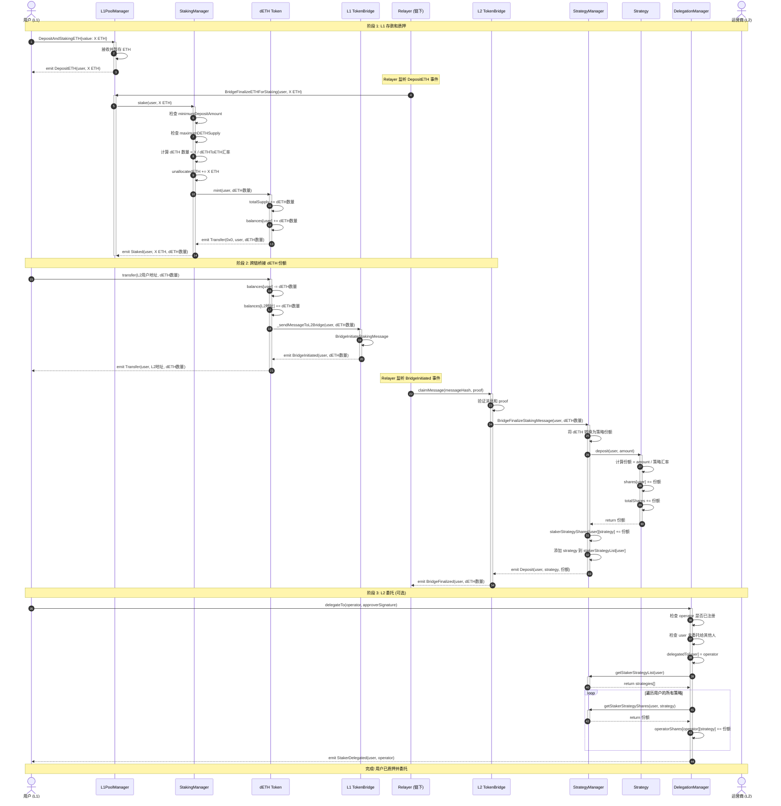

# 流程 1: 用户质押 (L1 → L2)

## 📋 目录

- [流程概述](#流程概述)
- [完整流程图](#完整流程图)
- [详细步骤拆解](#详细步骤拆解)
- [关键函数详解](#关键函数详解)
- [数据流和状态变化](#数据流和状态变化)
- [错误处理和边界情况](#错误处理和边界情况)

---

## 流程概述

**目标**: 用户在 L1 存入 ETH,通过跨链桥获得 L2 份额,并可选择委托给运营商参与质押。

**参与角色**:
- **用户** (User): 在 L1 存入 ETH 的质押者
- **Relayer**: 中继跨链消息的链下服务
- **运营商** (Operator): 可选的委托目标

**关键合约**:
- **L1 层**: L1PoolManager, StakingManager, DETH
- **桥接层**: L1 TokenBridge, L2 TokenBridge
- **L2 层**: StrategyManager, DelegationManager, Strategy

**核心流程**:
1. 用户在 L1 存入 ETH
2. Relayer 触发质押,铸造 dETH
3. 用户转移 dETH 触发跨链消息
4. Relayer 中继消息到 L2
5. L2 更新用户份额
6. 用户可选择在 L2 委托给运营商

---

## 完整流程图



---

## 详细步骤拆解

### 阶段 1: L1 存款和质押

#### 步骤 1: 用户在 L1PoolManager 存入 ETH

**合约**: `L1PoolManager.sol`
**函数**: `DepositAndStakingETH()`
**文件位置**: `src/bridge/core/L1/L1PoolManager.sol`

```solidity
function DepositAndStakingETH() external payable whenNotPaused returns (bool) {
    // 接收用户的 ETH
    payable(address(this)).transfer(msg.value);

    // 触发存款事件
    emit DepositETH(msg.sender, msg.value);

    return true;
}
```

**状态变化**:
- L1PoolManager 合约余额增加 `msg.value` ETH
- 触发 `DepositETH(msg.sender, msg.value)` 事件

**前置条件**:
- 合约未暂停 (`whenNotPaused`)
- 用户发送 ETH (`msg.value > 0`)

---

#### 步骤 2: Relayer 触发质押

**合约**: `L1PoolManager.sol`
**函数**: `BridgeFinalizeETHForStaking(address staker, uint256 amount)`
**调用者**: Relayer (监听 `DepositETH` 事件后触发)

```solidity
function BridgeFinalizeETHForStaking(
    address staker,
    uint256 amount
) external onlyRelayer whenNotPaused returns (bool) {
    // 调用 StakingManager 执行质押
    getStakingManager().stake{value: amount}(staker);

    return true;
}
```

**权限检查**:
- 仅 Relayer 可调用 (`onlyRelayer`)
- 合约未暂停

---

#### 步骤 3: StakingManager 铸造 dETH

**合约**: `StakingManager.sol`
**函数**: `stake(address staker) payable`
**文件位置**: `src/L1/core/StakingManager.sol`

```solidity
function stake(address staker) external payable whenStakingNotPaused nonReentrant {
    // 1. 检查最小质押金额
    if (msg.value < minimumDepositAmount) {
        revert DepositTooSmall(msg.value, minimumDepositAmount);
    }

    // 2. 计算要铸造的 dETH 数量
    uint256 dETHToMint = getDETH().ethToDETH(msg.value);

    // 3. 检查 dETH 供应量上限
    if (getDETH().totalSupply() + dETHToMint > maximumDETHSupply) {
        revert MaximumSupplyReached();
    }

    // 4. 增加未分配的 ETH
    unallocatedETH += msg.value;

    // 5. 铸造 dETH 给质押者
    getDETH().mint(staker, dETHToMint);

    // 6. 触发事件
    emit Staked(staker, msg.value, dETHToMint);
}
```

**状态变化**:
- `StakingManager.unallocatedETH` 增加 `msg.value`
- `DETH.totalSupply` 增加 `dETHToMint`
- `DETH.balances[staker]` 增加 `dETHToMint`

**关键计算 - dETH 数量**:
```solidity
// DETH.sol: ethToDETH()
function ethToDETH(uint256 ethAmount) public view returns (uint256) {
    uint256 totalControlledETH = getTotalControlledETH();  // 协议总控制 ETH
    uint256 supply = totalSupply();                        // dETH 总供应量

    if (supply == 0) {
        return ethAmount;  // 初始汇率 1:1
    }

    // dETH 数量 = ethAmount * (supply / totalControlledETH)
    return (ethAmount * supply) / totalControlledETH;
}
```

**安全检查**:
- ✅ 最小质押金额检查 (`minimumDepositAmount`,默认 32 ETH)
- ✅ 最大供应量检查 (`maximumDETHSupply`,默认 1024 ETH)
- ✅ 重入保护 (`nonReentrant`)
- ✅ 暂停检查 (`whenStakingNotPaused`)

---

### 阶段 2: 跨链桥接 dETH 份额

#### 步骤 4: 用户转移 dETH 触发跨链消息

**合约**: `DETH.sol`
**函数**: `transfer(address to, uint256 amount)`
**文件位置**: `src/L1/core/DETH.sol`

```solidity
function transfer(address to, uint256 amount) public override returns (bool) {
    // 调用父合约的 transfer
    bool success = super.transfer(to, amount);

    if (success) {
        // 转账成功后,发送跨链消息到 L2
        _sendMessageToL2Bridge(msg.sender, amount, to);
    }

    return success;
}

function _sendMessageToL2Bridge(
    address staker,
    uint256 amount,
    address l2Recipient
) internal {
    // 调用 L1 TokenBridge 发起跨链消息
    ITokenBridgeBase(getLocator().dapplinkBridge()).BridgeInitiateStakingMessage(
        staker,
        amount,
        l2Recipient,
        l2Strategy,  // L2 策略地址
        sourceChainId,
        destChainId
    );
}
```

**状态变化**:
- `DETH.balances[user]` 减少 `amount`
- `DETH.balances[to]` 增加 `amount`
- 触发跨链消息

**注意事项**:
- ⚠️ 每次 dETH 转账都会触发跨链消息
- ⚠️ 转账目标地址 `to` 通常是用户在 L2 的地址
- ⚠️ 需要 Relayer 中继消息才能在 L2 生效

---

#### 步骤 5: L1 桥接合约发起消息

**合约**: `TokenBridgeBase.sol`
**函数**: `BridgeInitiateStakingMessage(...)`
**文件位置**: `src/bridge/core/bridge/TokenBridgeBase.sol`

```solidity
function BridgeInitiateStakingMessage(
    address staker,
    uint256 shares,
    address l2Recipient,
    address l2Strategy,
    uint256 sourceChainId,
    uint256 destChainId
) external returns (bool) {
    // 1. 构造消息
    bytes memory message = abi.encode(
        staker,
        shares,
        l2Recipient,
        l2Strategy
    );

    // 2. 发送消息到 MessageManager
    getMessageManager().sendMessage(
        destChainId,
        address(this),  // target: L2 TokenBridge
        message
    );

    // 3. 触发事件
    emit BridgeInitiated(staker, shares, l2Strategy);

    return true;
}
```

**消息内容**:
```solidity
struct StakingMessage {
    address staker;        // 质押者地址
    uint256 shares;        // dETH 数量(将转换为份额)
    address l2Recipient;   // L2 接收者地址
    address l2Strategy;    // L2 策略地址
}
```

---

#### 步骤 6: Relayer 中继消息到 L2

**操作者**: Relayer (链下服务)
**流程**:

1. **监听 L1 事件**:
```javascript
// Relayer 伪代码
l1Bridge.on('BridgeInitiated', async (staker, shares, strategy, event) => {
    const messageHash = event.transactionHash;
    const proof = await generateProof(event);

    // 中继到 L2
    await relayMessageToL2(messageHash, proof);
});
```

2. **在 L2 申领消息**:
```solidity
// Relayer 调用 L2Bridge.claimMessage()
l2Bridge.claimMessage(messageHash, proof);
```

---

#### 步骤 7: L2 桥接合约验证并最终化

**合约**: `TokenBridgeBase.sol` (L2 实例)
**函数**: `BridgeFinalizeStakingMessage(...)`

```solidity
function BridgeFinalizeStakingMessage(
    address staker,
    uint256 shares,
    address l2Recipient,
    address l2Strategy
) external {
    // 1. 验证调用来自 MessageManager
    require(msg.sender == address(messageManager), "Unauthorized");

    // 2. 调用 StrategyManager 存入策略
    IStrategyManager(strategyManager).depositIntoStrategyForStaking(
        l2Recipient,
        l2Strategy,
        shares
    );

    // 3. 触发事件
    emit BridgeFinalized(staker, shares, l2Strategy);
}
```

---

#### 步骤 8: StrategyManager 更新用户份额

**合约**: `StrategyManager.sol`
**函数**: `depositIntoStrategyForStaking(address staker, address strategy, uint256 amount)`
**文件位置**: `src/L2/core/StrategyManager.sol`

```solidity
function depositIntoStrategyForStaking(
    address staker,
    address strategy,
    uint256 amount
) external onlyBridge whenNotPaused returns (uint256 shares) {
    // 1. 调用 Strategy 存入资产
    shares = IStrategy(strategy).deposit(staker, amount);

    // 2. 更新用户在该策略中的份额
    stakerStrategyShares[staker][strategy] += shares;

    // 3. 如果是新策略,添加到用户策略列表
    if (!_hasStrategy(staker, strategy)) {
        stakerStrategyList[staker].push(strategy);
    }

    // 4. 触发事件
    emit Deposit(staker, strategy, shares);

    return shares;
}
```

**状态变化**:
- `Strategy.totalShares` 增加 `shares`
- `Strategy.shares[staker]` 增加 `shares`
- `StrategyManager.stakerStrategyShares[staker][strategy]` 增加 `shares`
- 如果是新策略,添加到 `stakerStrategyList[staker][]`

**份额计算** (在 Strategy 内部):
```solidity
// Strategy.sol: deposit()
function deposit(address staker, uint256 amount) external returns (uint256 shares) {
    uint256 priorTotalShares = totalShares;
    uint256 priorBalance = underlyingToken.balanceOf(address(this));

    if (priorTotalShares == 0) {
        shares = amount;  // 初始汇率 1:1
    } else {
        // 份额 = amount * (总份额 / 合约余额)
        shares = (amount * priorTotalShares) / priorBalance;
    }

    totalShares += shares;
    shares[staker] += shares;

    emit Deposit(staker, amount, shares);
    return shares;
}
```

---

### 阶段 3: L2 委托 (可选)

#### 步骤 9: 用户委托给运营商

**合约**: `DelegationManager.sol`
**函数**: `delegateTo(address operator, SignatureWithExpiry memory approverSignatureAndExpiry, bytes32 approverSalt)`
**文件位置**: `src/L2/core/DelegationManager.sol`

```solidity
function delegateTo(
    address operator,
    SignatureWithExpiry memory approverSignatureAndExpiry,
    bytes32 approverSalt
) external {
    // 1. 检查运营商是否已注册
    require(isOperator(operator), "Operator not registered");

    // 2. 检查质押者未委托给其他人
    require(!isDelegated(msg.sender), "Already delegated");

    // 3. 验证运营商签名(如果需要批准)
    if (operatorDetails[operator].delegationApprover != address(0)) {
        _verifyApproverSignature(
            msg.sender,
            operator,
            approverSignatureAndExpiry,
            approverSalt
        );
    }

    // 4. 设置委托关系
    delegatedTo[msg.sender] = operator;

    // 5. 增加运营商的份额
    _increaseDelegatedShares(msg.sender, operator);

    // 6. 触发事件
    emit StakerDelegated(msg.sender, operator);
}

function _increaseDelegatedShares(
    address staker,
    address operator
) internal {
    // 获取质押者的所有策略
    address[] memory strategies = strategyManager.getStakerStrategyList(staker);

    // 遍历增加运营商份额
    for (uint256 i = 0; i < strategies.length; i++) {
        address strategy = strategies[i];
        uint256 shares = strategyManager.getStakerStrategyShares(staker, strategy);

        operatorShares[operator][strategy] += shares;

        emit OperatorSharesIncreased(operator, staker, strategy, shares);
    }
}
```

**状态变化**:
- `DelegationManager.delegatedTo[staker]` 设置为 `operator`
- 对于质押者的每个策略:
  - `DelegationManager.operatorShares[operator][strategy]` 增加相应份额

**前置条件**:
- ✅ 运营商已调用 `registerAsOperator()` 注册
- ✅ 质押者未委托给其他运营商
- ✅ 如果运营商设置了 `delegationApprover`,需要提供有效签名

---

## 关键函数详解

### 1. dETH 汇率计算

**函数**: `DETH.dETHToETH(uint256 dETHAmount)` 和 `DETH.ethToDETH(uint256 ethAmount)`

```solidity
// 获取协议总控制 ETH
function getTotalControlledETH() public view returns (uint256) {
    return stakingManager.totalDepositedInValidators()  // 已存入验证者的 ETH
         + stakingManager.unallocatedETH()              // StakingManager 未分配的 ETH
         + unstakeRequestsManager.unallocatedETH()      // UnstakeRequestsManager 的 ETH
         + oracleManager.latestRecord().currentTotalValidatorBalance;  // 验证者当前余额
}

// ETH → dETH
function ethToDETH(uint256 ethAmount) public view returns (uint256) {
    uint256 totalETH = getTotalControlledETH();
    uint256 supply = totalSupply();

    if (supply == 0) return ethAmount;  // 初始 1:1

    // dETH 数量 = ethAmount * (supply / totalETH)
    return (ethAmount * supply) / totalETH;
}

// dETH → ETH
function dETHToETH(uint256 dETHAmount) public view returns (uint256) {
    uint256 supply = totalSupply();

    if (supply == 0) return dETHAmount;

    // ETH 数量 = dETHAmount * (totalETH / supply)
    return (dETHAmount * getTotalControlledETH()) / supply;
}
```

**汇率示例**:
```
初始状态:
- totalControlledETH = 0
- dETH totalSupply = 0
- 汇率 = 1:1

用户 A 存入 32 ETH:
- 铸造 32 dETH
- totalControlledETH = 32 ETH
- dETH totalSupply = 32
- 汇率 = 32/32 = 1:1

验证者产生 1 ETH 奖励:
- totalControlledETH = 33 ETH
- dETH totalSupply = 32 (不变)
- 汇率 = 33/32 = 1.03125 ETH per dETH

用户 B 存入 32 ETH:
- 应铸造 dETH = 32 * (32/33) ≈ 31.03 dETH
- totalControlledETH = 65 ETH
- dETH totalSupply ≈ 63.03
```

---

### 2. L2 Strategy 份额计算

**函数**: `Strategy.deposit(address staker, uint256 amount)`

```solidity
function deposit(address staker, uint256 amount)
    external
    onlyStrategyManager
    returns (uint256 shares)
{
    // 1. 记录当前状态
    uint256 priorTotalShares = totalShares;
    uint256 priorBalance = underlyingToken.balanceOf(address(this));

    // 2. 计算份额
    if (priorTotalShares == 0) {
        shares = amount;  // 初始汇率 1:1
    } else {
        // 份额 = 存入金额 * (总份额 / 合约持有的基础资产)
        shares = (amount * priorTotalShares) / priorBalance;
    }

    // 3. 更新状态
    totalShares += shares;
    this.shares[staker] += shares;

    // 4. 转入资产(如果是 ERC20 策略)
    if (address(underlyingToken) != address(0)) {
        underlyingToken.safeTransferFrom(msg.sender, address(this), amount);
    }

    emit Deposit(staker, amount, shares);
    return shares;
}
```

**份额计算示例**:
```
初始状态:
- totalShares = 0
- 合约余额 = 0

用户 A 存入 10 ETH:
- shares = 10 (初始 1:1)
- totalShares = 10
- 合约余额 = 10 ETH

策略产生 2 ETH 收益:
- totalShares = 10 (不变)
- 合约余额 = 12 ETH
- 每份额价值 = 12 / 10 = 1.2 ETH

用户 B 存入 12 ETH:
- shares = 12 * (10 / 12) = 10
- totalShares = 20
- 合约余额 = 24 ETH
- 每份额价值 = 24 / 20 = 1.2 ETH (保持不变)
```

---

## 数据流和状态变化

### 完整数据流图

```mermaid
graph LR
    subgraph "L1 状态变化"
        A[L1PoolManager.balance<br/>+ X ETH]
        B[StakingManager.unallocatedETH<br/>+ X ETH]
        C[DETH.totalSupply<br/>+ dETH数量]
        D[DETH.balances用户<br/>+ dETH数量]
    end

    subgraph "L2 状态变化"
        E[Strategy.totalShares<br/>+ 份额]
        F[Strategy.shares用户<br/>+ 份额]
        G[StrategyManager.stakerStrategyShares<br/>+ 份额]
        H[DelegationManager.operatorShares<br/>+ 份额]
    end

    A -->|Relayer触发| B
    B -->|铸造dETH| C
    C -->|分配给用户| D
    D -->|跨链桥接| E
    E -->|记录用户份额| F
    F -->|StrategyManager记录| G
    G -->|委托| H

    style A fill:#ffe1e1
    style B fill:#ffe1e1
    style C fill:#e1ffe1
    style D fill:#e1ffe1
    style E fill:#e1e1ff
    style F fill:#e1e1ff
    style G fill:#e1e1ff
    style H fill:#ffe1ff
```



### 状态变化表

| 阶段 | 合约 | 状态变量 | 变化 |
|------|------|----------|------|
| L1 存款 | L1PoolManager | `balance` | +X ETH |
| L1 质押 | StakingManager | `unallocatedETH` | +X ETH |
| 铸造 dETH | DETH | `totalSupply` | +dETH数量 |
| 铸造 dETH | DETH | `balances[user]` | +dETH数量 |
| 跨链转移 | DETH | `balances[user]` | -dETH数量 |
| 跨链转移 | DETH | `balances[L2地址]` | +dETH数量 |
| L2 存入策略 | Strategy | `totalShares` | +份额 |
| L2 存入策略 | Strategy | `shares[user]` | +份额 |
| L2 记录份额 | StrategyManager | `stakerStrategyShares[user][strategy]` | +份额 |
| L2 委托 | DelegationManager | `delegatedTo[user]` | =operator |
| L2 委托 | DelegationManager | `operatorShares[operator][strategy]` | +份额 |

---

## 错误处理和边界情况

### 可能的错误和回滚

#### 1. L1 质押阶段错误

```solidity
// StakingManager.stake()

// 错误 1: 存款金额过小
if (msg.value < minimumDepositAmount) {
    revert DepositTooSmall(msg.value, minimumDepositAmount);
}

// 错误 2: dETH 供应量超限
if (getDETH().totalSupply() + dETHToMint > maximumDETHSupply) {
    revert MaximumSupplyReached();
}

// 错误 3: 合约暂停
if (IL1Pauser(getLocator().pauser()).isStakingPaused()) {
    revert Paused();
}
```

**处理方式**: 交易回滚,用户的 ETH 不会被扣除

---

#### 2. 跨链桥接错误

```solidity
// TokenBridgeBase.BridgeInitiateStakingMessage()

// 错误 1: 未授权调用
require(msg.sender == authorizedCaller, "Unauthorized");

// 错误 2: 消息发送失败
require(messageManager.sendMessage(...), "Message send failed");
```

**处理方式**:
- 消息发送失败会回滚整个交易
- 用户的 dETH 转账会成功,但跨链消息不会发送
- ⚠️ 需要 Relayer 重新监听和处理

---

#### 3. L2 Strategy 存款错误

```solidity
// Strategy.deposit()

// 错误 1: 仅 StrategyManager 可调用
require(msg.sender == strategyManager, "Unauthorized");

// 错误 2: 存款金额为 0
require(amount > 0, "Deposit amount must be greater than 0");

// 错误 3: 策略暂停
require(!paused, "Strategy is paused");
```

**处理方式**: 交易回滚,跨链消息需要重新中继

---

#### 4. L2 委托错误

```solidity
// DelegationManager.delegateTo()

// 错误 1: 运营商未注册
require(isOperator(operator), "Operator not registered");

// 错误 2: 已委托给其他运营商
require(!isDelegated(msg.sender), "Already delegated");

// 错误 3: 缺少运营商签名
require(
    _verifyApproverSignature(...),
    "Invalid approver signature"
);

// 错误 4: 质押者无份额
require(
    strategyManager.getStakerStrategyList(msg.sender).length > 0,
    "Staker has no strategies"
);
```

**处理方式**:
- 委托失败,但质押份额已经成功存入
- 用户可以稍后重新尝试委托
- 或者选择不委托,直接持有份额

---

### 边界情况处理

#### 1. 初始质押 (totalSupply = 0)

**情况**: 协议刚启动,还没有任何 dETH

```solidity
// DETH.ethToDETH()
if (totalSupply() == 0) {
    return ethAmount;  // 初始汇率 1:1
}
```

**结果**: 第一个质押者按 1:1 汇率铸造 dETH

---

#### 2. 大额质押

**情况**: 用户质押金额远超 `minimumDepositAmount`

```solidity
// StakingManager.stake()
// 检查 maximumDETHSupply
if (getDETH().totalSupply() + dETHToMint > maximumDETHSupply) {
    revert MaximumSupplyReached();
}
```

**处理**:
- 如果超过最大供应量限制,交易回滚
- 管理员需要提高 `maximumDETHSupply` 或等待其他用户解质押

---

#### 3. 跨链消息延迟

**情况**: Relayer 宕机或网络拥堵,消息长时间未中继

**影响**:
- 用户的 dETH 已转移到 L2 地址
- 但 L2 份额尚未更新
- 用户在 L2 上看不到份额

**解决方案**:
- Relayer 恢复后会继续中继消息
- 消息队列保证消息不会丢失
- 用户可以查询 L1 事件确认质押成功

---

#### 4. 委托给未注册运营商

**情况**: 用户尝试委托给一个未调用 `registerAsOperator()` 的地址

```solidity
// DelegationManager.delegateTo()
require(isOperator(operator), "Operator not registered");
```

**结果**: 交易回滚,用户需要选择已注册的运营商

---

#### 5. 重复委托

**情况**: 用户已委托给运营商 A,再次尝试委托给运营商 B

```solidity
// DelegationManager.delegateTo()
require(!isDelegated(msg.sender), "Already delegated");
```

**处理**:
- 交易回滚
- 用户需要先调用 `undelegate()` 解除委托
- 然后才能委托给新运营商

---

## 总结

### 关键要点

1. **双层汇率系统**:
   - **L1**: dETH/ETH 汇率(反映验证者收益)
   - **L2**: 份额/资产 汇率(反映策略收益)

2. **跨链同步**:
   - dETH 转账自动触发跨链消息
   - Relayer 负责中继消息到 L2
   - L2 收到消息后更新份额

3. **委托机制**:
   - 用户可以选择委托给运营商
   - 运营商份额 = 所有委托者份额之和
   - 委托不转移所有权,只是授权运营商管理

4. **安全检查**:
   - 最小/最大金额限制
   - 暂停机制
   - 重入保护
   - 权限验证

### 相关文档

- [系统架构图](./architecture.md)
- [奖励分发流程](./2-rewards-flow.md)
- [解质押流程](./3-unstaking-flow.md)
- [取款完成流程](./4-withdrawal-flow.md)
