# 流程 1: 用户质押 (L1 → L2)

## 📋 目录

- [流程概述](#流程概述)
- [完整流程图](#完整流程图)
- [详细步骤拆解](#详细步骤拆解)
- [关键函数详解](#关键函数详解)
- [数据流和状态变化](#数据流和状态变化)
- [错误处理和边界情况](#错误处理和边界情况)

---

## 流程概述

**目标**: 用户在 L1 存入 ETH,通过跨链桥获得 L2 份额,并可选择委托给运营商参与质押。

**参与角色**:
- **用户** (User): 在 L1 存入 ETH 的质押者
- **Relayer**: 中继跨链消息的链下服务
- **运营商** (Operator): 可选的委托目标

**关键合约**:
- **L1 层**: L1PoolManager, StakingManager, DETH
- **桥接层**: L1 TokenBridge, L2 TokenBridge
- **L2 层**: StrategyManager, DelegationManager, Strategy

**核心流程**:
1. 用户在 L1 存入 ETH
2. Relayer 触发质押,铸造 dETH
3. 用户转移 dETH 触发跨链消息
4. Relayer 中继消息到 L2
5. L2 更新用户份额
6. 用户可选择在 L2 委托给运营商

---

## 完整流程图

```mermaid
sequenceDiagram
    autonumber
    actor User as 用户 (L1)
    participant L1Pool as L1PoolManager
    participant StakingMgr as StakingManager
    participant DETH as dETH Token
    participant L1Bridge as L1 TokenBridge
    participant Relayer as Relayer (链下)
    participant L2Bridge as L2 TokenBridge
    participant StrategyMgr as StrategyManager
    participant Strategy as Strategy
    participant DelegationMgr as DelegationManager
    actor Operator as 运营商 (L2)

    Note over User,Operator: 阶段 1: L1 存款和质押

    User->>L1Pool: DepositAndStakingETH{value: X ETH}
    activate L1Pool
    L1Pool->>L1Pool: 接收并暂存 ETH
    L1Pool-->>User: emit DepositETH(user, X ETH)
    deactivate L1Pool

    Note over Relayer: Relayer 监听 DepositETH 事件

    Relayer->>L1Pool: BridgeFinalizeETHForStaking(user, X ETH)
    activate L1Pool
    L1Pool->>StakingMgr: stake(user, X ETH)
    activate StakingMgr

    StakingMgr->>StakingMgr: 检查 minimumDepositAmount
    StakingMgr->>StakingMgr: 检查 maximumDETHSupply
    StakingMgr->>StakingMgr: 计算 dETH 数量 = X / dETHToETH汇率
    StakingMgr->>StakingMgr: unallocatedETH += X ETH

    StakingMgr->>DETH: mint(user, dETH数量)
    activate DETH
    DETH->>DETH: totalSupply += dETH数量
    DETH->>DETH: balances[user] += dETH数量
    DETH-->>StakingMgr: emit Transfer(0x0, user, dETH数量)
    deactivate DETH

    StakingMgr-->>L1Pool: emit Staked(user, X ETH, dETH数量)
    deactivate StakingMgr
    deactivate L1Pool

    Note over User,L2Bridge: 阶段 2: 跨链桥接 dETH 份额

    User->>DETH: transfer(L2用户地址, dETH数量)
    activate DETH
    DETH->>DETH: balances[user] -= dETH数量
    DETH->>DETH: balances[L2地址] += dETH数量
    DETH->>L1Bridge: _sendMessageToL2Bridge(user, dETH数量)
    activate L1Bridge
    L1Bridge->>L1Bridge: BridgeInitiateStakingMessage
    L1Bridge-->>DETH: emit BridgeInitiated(user, dETH数量)
    deactivate L1Bridge
    DETH-->>User: emit Transfer(user, L2地址, dETH数量)
    deactivate DETH

    Note over Relayer: Relayer 监听 BridgeInitiated 事件

    Relayer->>L2Bridge: claimMessage(messageHash, proof)
    activate L2Bridge
    L2Bridge->>L2Bridge: 验证消息和 proof
    L2Bridge->>StrategyMgr: BridgeFinalizeStakingMessage(user, dETH数量)
    activate StrategyMgr

    StrategyMgr->>StrategyMgr: 将 dETH 转换为策略份额
    StrategyMgr->>Strategy: deposit(user, amount)
    activate Strategy
    Strategy->>Strategy: 计算份额 = amount / 策略汇率
    Strategy->>Strategy: shares[user] += 份额
    Strategy->>Strategy: totalShares += 份额
    Strategy-->>StrategyMgr: return 份额
    deactivate Strategy

    StrategyMgr->>StrategyMgr: stakerStrategyShares[user][strategy] += 份额
    StrategyMgr->>StrategyMgr: 添加 strategy 到 stakerStrategyList[user]
    StrategyMgr-->>L2Bridge: emit Deposit(user, strategy, 份额)
    deactivate StrategyMgr

    L2Bridge-->>Relayer: emit BridgeFinalized(user, dETH数量)
    deactivate L2Bridge

    Note over User,Operator: 阶段 3: L2 委托 (可选)

    User->>DelegationMgr: delegateTo(operator, approverSignature)
    activate DelegationMgr
    DelegationMgr->>DelegationMgr: 检查 operator 是否已注册
    DelegationMgr->>DelegationMgr: 检查 user 未委托给其他人
    DelegationMgr->>DelegationMgr: delegatedTo[user] = operator

    DelegationMgr->>StrategyMgr: getStakerStrategyList(user)
    activate StrategyMgr
    StrategyMgr-->>DelegationMgr: return strategies[]
    deactivate StrategyMgr

    loop 遍历用户的所有策略
        DelegationMgr->>StrategyMgr: getStakerStrategyShares(user, strategy)
        activate StrategyMgr
        StrategyMgr-->>DelegationMgr: return 份额
        deactivate StrategyMgr
        DelegationMgr->>DelegationMgr: operatorShares[operator][strategy] += 份额
    end

    DelegationMgr-->>User: emit StakerDelegated(user, operator)
    deactivate DelegationMgr

    Note over User,Operator: 完成! 用户已质押并委托
```



---

## 详细步骤拆解

### 阶段 1: L1 存款和质押

#### 步骤 1: 用户在 L1PoolManager 存入 ETH

**合约**: `L1PoolManager.sol`
**函数**: `DepositAndStakingETH()`
**文件位置**: `src/bridge/core/L1/L1PoolManager.sol`

```solidity
function DepositAndStakingETH() external payable whenNotPaused returns (bool) {
    // 接收用户的 ETH
    payable(address(this)).transfer(msg.value);

    // 触发存款事件
    emit DepositETH(msg.sender, msg.value);

    return true;
}
```

**状态变化**:
- L1PoolManager 合约余额增加 `msg.value` ETH
- 触发 `DepositETH(msg.sender, msg.value)` 事件

**前置条件**:
- 合约未暂停 (`whenNotPaused`)
- 用户发送 ETH (`msg.value > 0`)

---

#### 步骤 2: Relayer 触发质押

**合约**: `L1PoolManager.sol`
**函数**: `BridgeFinalizeETHForStaking(address staker, uint256 amount)`
**调用者**: Relayer (监听 `DepositETH` 事件后触发)

```solidity
function BridgeFinalizeETHForStaking(
    address staker,
    uint256 amount
) external onlyRelayer whenNotPaused returns (bool) {
    // 调用 StakingManager 执行质押
    getStakingManager().stake{value: amount}(staker);

    return true;
}
```

**权限检查**:
- 仅 Relayer 可调用 (`onlyRelayer`)
- 合约未暂停

---

#### 步骤 3: StakingManager 批量铸造 dETH

**合约**: `StakingManager.sol`
**函数**: `stake(uint256 stakeAmount, IDETH.BatchMint[] calldata batchMints) payable`
**文件位置**: `src/L1/core/StakingManager.sol:138-157`

```solidity
function stake(uint256 stakeAmount, IDETH.BatchMint[] calldata batchMints) external onlyDappLinkBridge payable {
    // 1. 检查暂停状态
    if (getL1Pauser().isStakingPaused()) {
        revert Paused();
    }

    // 2. 检查最小质押金额
    if (msg.value < minimumDepositAmount || stakeAmount < minimumDepositAmount) {
        revert MinimumDepositAmountNotSatisfied();
    }

    // 3. 计算要铸造的 dETH 数量
    uint256 dETHMintAmount = ethToDETH(stakeAmount);

    // 4. 检查 dETH 供应量上限
    if (dETHMintAmount + getDETH().totalSupply() > maximumDETHSupply) {
        revert MaximumDETHSupplyExceeded();
    }

    // 5. 增加未分配的 ETH
    unallocatedETH += stakeAmount;

    // 6. ⭐ 批量铸造 dETH 给多个接收者
    getDETH().batchMint(batchMints);

    // 7. 触发事件
    emit Staked(getLocator().dapplinkBridge(), stakeAmount, dETHMintAmount);
}
```

**BatchMint 结构体**:
```solidity
// DETH.sol
struct BatchMint {
    address recipient;  // dETH 接收者地址
    uint256 amount;     // 铸造的 dETH 数量
}
```

**状态变化**:
- `StakingManager.unallocatedETH` 增加 `stakeAmount`
- `DETH.totalSupply` 增加 `dETHMintAmount`
- `DETH.balances[recipient]` 根据 `batchMints` 数组批量增加

**关键计算 - dETH 数量**:
```solidity
// StakingManager.sol: ethToDETH()
function ethToDETH(uint256 ethAmount) public returns (uint256) {
    if (getDETH().totalSupply() == 0) {
        return ethAmount;  // 初始汇率 1:1
    }
    // dETH 数量 = ethAmount * totalSupply / totalControlled
    return Math.mulDiv(ethAmount, getDETH().totalSupply(), totalControlled());
}
```

**关键差异**:
- ⭐ **仅限桥接调用**: 使用 `onlyDappLinkBridge` 修饰符,不是公开函数
- ⭐ **批量铸造**: 支持一次性给多个地址铸造 dETH
- ⭐ **两个金额参数**: `msg.value` 和 `stakeAmount` 都需要检查
- ⭐ **事件发送者**: emit 事件时使用 bridge 地址而非 staker

**安全检查**:
- ✅ 最小质押金额检查 (`minimumDepositAmount`)
- ✅ 最大供应量检查 (`maximumDETHSupply`)
- ✅ 暂停检查 (`isStakingPaused()`)
- ✅ 权限检查 (`onlyDappLinkBridge`)

---

### 阶段 2: 跨链桥接 dETH 份额

#### 步骤 4: 用户转移 dETH 触发跨链消息

**合约**: `DETH.sol`
**函数**: `transfer(address to, uint256 value)`
**文件位置**: `src/L1/core/DETH.sol:103-116`

```solidity
function transfer(address to, uint256 value) override(ERC20Upgradeable, IERC20) public returns (bool) {
    address owner = _msgSender();

    // 1. 执行 ERC20 转账
    _transfer(owner, to, value);

    // 2. ⭐ 通过 SafeCall 发送跨链质押消息
    bool success = SafeCall.callWithMinGas(
        bridgeAddress,
        200000,  // gas limit
        0,       // value (不发送 ETH)
        abi.encodeWithSignature("BridgeInitiateStakingMessage(address,address,uint256)", owner, to, value)
    );

    if (!success) {
        revert BridgeStakingMessageInitFailed();
    }

    return true;
}
```

**关键特性**:
- ⭐ **直接调用桥接**: 使用 `SafeCall.callWithMinGas()` 而非内部函数
- ⭐ **3 个参数**: `BridgeInitiateStakingMessage(address from, address to, uint256 shares)`
- ⭐ **包含 from 地址**: 与之前文档描述不同,实际包含转出地址
- ⭐ **Gas 限制**: 固定 200000 gas
- ⭐ **失败回滚**: 如果桥接消息发送失败,整个转账回滚

**TokenBridge.BridgeInitiateStakingMessage()** (TokenBridgeBase.sol:274-291):
```solidity
function BridgeInitiateStakingMessage(
    address from,
    address to,
    uint256 shares
) external returns (bool) {
    // 生成质押消息哈希
    bytes32 stakingMessageHash = keccak256(
        abi.encode(from, to, shares, stakingMessageNumber)
    );

    // 触发事件供 Relayer 监听
    emit InitiateStakingMessage(
        from,
        to,
        shares,
        stakingMessageNumber,
        stakingMessageHash
    );

    stakingMessageNumber++;
    return true;
}
```

**状态变化**:
- `DETH.balances[owner]` 减少 `value`
- `DETH.balances[to]` 增加 `value`
- 生成跨链消息哈希
- `stakingMessageNumber` 递增

**注意事项**:
- ⚠️ 每次 dETH 转账都会触发跨链消息
- ⚠️ 转账目标地址 `to` 通常是用户在 L2 的地址
- ⚠️ 需要 Relayer 中继消息才能在 L2 生效
- ⭐ **不发送实际 ETH**: 只发送消息,ETH 已在 StakingManager 中

---

#### 步骤 5: Relayer 中继消息到 L2

**操作者**: Relayer (链下服务)
**流程**:

1. **监听 L1 事件**:
```javascript
// Relayer 伪代码
l1Bridge.on('InitiateStakingMessage', async (from, to, shares, nonce, messageHash) => {
    const messageHash = event.transactionHash;
    const proof = await generateProof(event);

    // 中继到 L2
    await relayMessageToL2(messageHash, proof);
});
```

2. **在 L2 完成份额转移**:
```javascript
// Relayer 调用 L2Bridge.BridgeFinalizeStakingMessage()
await l2Bridge.BridgeFinalizeStakingMessage(
    shareAddress,  // Strategy 合约地址
    from,
    to,
    shares,
    nonce,
    gasLimit
);
```

---

#### 步骤 6: L2 桥接合约调用 Strategy 转移份额

**合约**: `TokenBridgeBase.sol` (L2 实例)
**函数**: `BridgeFinalizeStakingMessage(address shareAddress, address from, address to, uint256 shares, uint256 stakeMessageNonce, uint256 gasLimit)`
**文件位置**: `src/bridge/core/bridge/TokenBridgeBase.sol:442-478`

```solidity
function BridgeFinalizeStakingMessage(
    address shareAddress,  // Strategy 合约地址
    address from,
    address to,
    uint256 shares,
    uint256 stakeMessageNonce,
    uint256 gasLimit
) external returns (bool) {
    // 1. 验证消息哈希
    bytes32 stakingMessageHash = keccak256(
        abi.encode(from, to, shares, stakeMessageNonce)
    );

    // 2. ⭐ 通过 SafeCall 调用 Strategy.TransferShareTo()
    bool success = SafeCall.callWithMinGas(
        shareAddress,
        gasLimit,
        0,
        abi.encodeWithSignature(
            "TransferShareTo(address,address,uint256,uint256)",
            from,
            to,
            shares,
            stakeMessageNonce
        )
    );

    require(
        success,
        "TokenBridge.BridgeFinalizeStakingMessage: call failed"
    );

    // 3. 触发事件
    emit FinalizeStakingMessage(
        from,
        to,
        shareAddress,
        shares,
        stakeMessageNonce,
        stakingMessageHash
    );

    return true;
}
```

**关键特性**:
- ⭐ **直接调用 Strategy**: 不经过 StrategyManager
- ⭐ **消息哈希验证**: 在 Strategy 内部验证
- ⭐ **防重放**: 使用 `stakeMessageNonce` 确保唯一性

---

#### 步骤 7: Strategy 转移份额

**合约**: `StrategyBase.sol`
**函数**: `TransferShareTo(address from, address to, uint256 shares, uint256 stakeNonce)`
**文件位置**: `src/L2/strategies/StrategyBase.sol:315-320`

```solidity
function TransferShareTo(address from, address to, uint256 shares, uint256 stakeNonce) external {
    // 1. 重新计算消息哈希进行验证
    bytes32 sakeMessageHash = keccak256(abi.encode(from, to, shares, stakeNonce));

    // 2. ⭐ 验证哈希匹配(防止重复执行)
    if (sakeMessageHash == stakeMessageHashRelate[stakeNonce]) {
        // 3. 调用 StrategyManager 转移份额
        strategyManager.transferStakerStrategyShares(address(this), from, to, shares);
    }
}
```

**StrategyManager.transferStakerStrategyShares()** (StrategyManager.sol:531-535):
```solidity
function transferStakerStrategyShares(address strategy, address from, address to, uint256 shares) external returns (bool) {
    stakerStrategyShares[from][strategy] -= shares;
    stakerStrategyShares[to][strategy] += shares;
    return true;
}
```

**状态变化**:
- `stakerStrategyShares[from][strategy]` 减少 `shares`
- `stakerStrategyShares[to][strategy]` 增加 `shares`
- **⭐ 不改变 totalShares**: 只是份额所有权转移

**重要注意**:
- ⭐ **防止套娃**: 注释中提到"防止重复套娃",确保 L1 的 dETH 转账不会在 L2 重复触发转账
- ⭐ **哈希预存储**: Relayer 需要先调用 `updateStakeMessageHash()` 存储消息哈希
- ⭐ **验证后才执行**: 只有消息哈希匹配时才转移份额

---

#### 步骤 8: Relayer 更新消息哈希映射

**合约**: `StrategyBase.sol`
**函数**: `updateStakeMessageHash(uint256 stakeMessageNonce, bytes32 stakeMsgHash)`
**文件位置**: `src/L2/strategies/StrategyBase.sol:309-312`

```solidity
function updateStakeMessageHash(uint256 stakeMessageNonce, bytes32 stakeMsgHash) external onlyRelayer {
    stakeMessageHashRelate[stakeMessageNonce] = stakeMsgHash;
    emit StakeMessageHashRelate(stakeMessageNonce, stakeMsgHash);
}
```

**Relayer 工作流程**:
```javascript
// 1. 监听 L1 事件
l1Bridge.on('InitiateStakingMessage', async (from, to, shares, nonce, messageHash) => {
    // 2. 先在 Strategy 中存储消息哈希
    await l2Strategy.updateStakeMessageHash(nonce, messageHash);

    // 3. 然后调用桥接完成份额转移
    await l2Bridge.BridgeFinalizeStakingMessage(
        l2Strategy,
        from,
        to,
        shares,
        nonce,
        gasLimit
    );
});
```

---

### 阶段 3: L2 策略委托 (可选)

#### 步骤 9: 用户委托给运营商
    uint256 priorBalance = underlyingToken.balanceOf(address(this));

    if (priorTotalShares == 0) {
        shares = amount;  // 初始汇率 1:1
    } else {
        // 份额 = amount * (总份额 / 合约余额)
        shares = (amount * priorTotalShares) / priorBalance;
    }

    totalShares += shares;
    shares[staker] += shares;

    emit Deposit(staker, amount, shares);
    return shares;
}
```

---

### 阶段 3: L2 委托 (可选)

#### 步骤 9: 用户委托给运营商

**合约**: `DelegationManager.sol`
**函数**: `delegateTo(address operator, SignatureWithExpiry memory approverSignatureAndExpiry, bytes32 approverSalt)`
**文件位置**: `src/L2/core/DelegationManager.sol`

```solidity
function delegateTo(
    address operator,
    SignatureWithExpiry memory approverSignatureAndExpiry,
    bytes32 approverSalt
) external {
    // 1. 检查运营商是否已注册
    require(isOperator(operator), "Operator not registered");

    // 2. 检查质押者未委托给其他人
    require(!isDelegated(msg.sender), "Already delegated");

    // 3. 验证运营商签名(如果需要批准)
    if (operatorDetails[operator].delegationApprover != address(0)) {
        _verifyApproverSignature(
            msg.sender,
            operator,
            approverSignatureAndExpiry,
            approverSalt
        );
    }

    // 4. 设置委托关系
    delegatedTo[msg.sender] = operator;

    // 5. 增加运营商的份额
    _increaseDelegatedShares(msg.sender, operator);

    // 6. 触发事件
    emit StakerDelegated(msg.sender, operator);
}

function _increaseDelegatedShares(
    address staker,
    address operator
) internal {
    // 获取质押者的所有策略
    address[] memory strategies = strategyManager.getStakerStrategyList(staker);

    // 遍历增加运营商份额
    for (uint256 i = 0; i < strategies.length; i++) {
        address strategy = strategies[i];
        uint256 shares = strategyManager.getStakerStrategyShares(staker, strategy);

        operatorShares[operator][strategy] += shares;

        emit OperatorSharesIncreased(operator, staker, strategy, shares);
    }
}
```

**状态变化**:
- `DelegationManager.delegatedTo[staker]` 设置为 `operator`
- 对于质押者的每个策略:
  - `DelegationManager.operatorShares[operator][strategy]` 增加相应份额

**前置条件**:
- ✅ 运营商已调用 `registerAsOperator()` 注册
- ✅ 质押者未委托给其他运营商
- ✅ 如果运营商设置了 `delegationApprover`,需要提供有效签名

---

## 关键函数详解

### 1. dETH 汇率计算

**函数**: `DETH.dETHToETH(uint256 dETHAmount)` 和 `DETH.ethToDETH(uint256 ethAmount)`

```solidity
// 获取协议总控制 ETH
function getTotalControlledETH() public view returns (uint256) {
    return stakingManager.totalDepositedInValidators()  // 已存入验证者的 ETH
         + stakingManager.unallocatedETH()              // StakingManager 未分配的 ETH
         + unstakeRequestsManager.unallocatedETH()      // UnstakeRequestsManager 的 ETH
         + oracleManager.latestRecord().currentTotalValidatorBalance;  // 验证者当前余额
}

// ETH → dETH
function ethToDETH(uint256 ethAmount) public view returns (uint256) {
    uint256 totalETH = getTotalControlledETH();
    uint256 supply = totalSupply();

    if (supply == 0) return ethAmount;  // 初始 1:1

    // dETH 数量 = ethAmount * (supply / totalETH)
    return (ethAmount * supply) / totalETH;
}

// dETH → ETH
function dETHToETH(uint256 dETHAmount) public view returns (uint256) {
    uint256 supply = totalSupply();

    if (supply == 0) return dETHAmount;

    // ETH 数量 = dETHAmount * (totalETH / supply)
    return (dETHAmount * getTotalControlledETH()) / supply;
}
```

**汇率示例**:
```
初始状态:
- totalControlledETH = 0
- dETH totalSupply = 0
- 汇率 = 1:1

用户 A 存入 32 ETH:
- 铸造 32 dETH
- totalControlledETH = 32 ETH
- dETH totalSupply = 32
- 汇率 = 32/32 = 1:1

验证者产生 1 ETH 奖励:
- totalControlledETH = 33 ETH
- dETH totalSupply = 32 (不变)
- 汇率 = 33/32 = 1.03125 ETH per dETH

用户 B 存入 32 ETH:
- 应铸造 dETH = 32 * (32/33) ≈ 31.03 dETH
- totalControlledETH = 65 ETH
- dETH totalSupply ≈ 63.03
```

---

### 2. L2 Strategy 份额计算

**函数**: `Strategy.deposit(address staker, uint256 amount)`

```solidity
function deposit(address staker, uint256 amount)
    external
    onlyStrategyManager
    returns (uint256 shares)
{
    // 1. 记录当前状态
    uint256 priorTotalShares = totalShares;
    uint256 priorBalance = underlyingToken.balanceOf(address(this));

    // 2. 计算份额
    if (priorTotalShares == 0) {
        shares = amount;  // 初始汇率 1:1
    } else {
        // 份额 = 存入金额 * (总份额 / 合约持有的基础资产)
        shares = (amount * priorTotalShares) / priorBalance;
    }

    // 3. 更新状态
    totalShares += shares;
    this.shares[staker] += shares;

    // 4. 转入资产(如果是 ERC20 策略)
    if (address(underlyingToken) != address(0)) {
        underlyingToken.safeTransferFrom(msg.sender, address(this), amount);
    }

    emit Deposit(staker, amount, shares);
    return shares;
}
```

**份额计算示例**:
```
初始状态:
- totalShares = 0
- 合约余额 = 0

用户 A 存入 10 ETH:
- shares = 10 (初始 1:1)
- totalShares = 10
- 合约余额 = 10 ETH

策略产生 2 ETH 收益:
- totalShares = 10 (不变)
- 合约余额 = 12 ETH
- 每份额价值 = 12 / 10 = 1.2 ETH

用户 B 存入 12 ETH:
- shares = 12 * (10 / 12) = 10
- totalShares = 20
- 合约余额 = 24 ETH
- 每份额价值 = 24 / 20 = 1.2 ETH (保持不变)
```

---

## 数据流和状态变化

### 完整数据流图

```mermaid
graph LR
    subgraph "L1 状态变化"
        A[L1PoolManager.balance<br/>+ X ETH]
        B[StakingManager.unallocatedETH<br/>+ X ETH]
        C[DETH.totalSupply<br/>+ dETH数量]
        D[DETH.balances用户<br/>+ dETH数量]
    end

    subgraph "L2 状态变化"
        E[Strategy.totalShares<br/>+ 份额]
        F[Strategy.shares用户<br/>+ 份额]
        G[StrategyManager.stakerStrategyShares<br/>+ 份额]
        H[DelegationManager.operatorShares<br/>+ 份额]
    end

    A -->|Relayer触发| B
    B -->|铸造dETH| C
    C -->|分配给用户| D
    D -->|跨链桥接| E
    E -->|记录用户份额| F
    F -->|StrategyManager记录| G
    G -->|委托| H

    style A fill:#ffe1e1
    style B fill:#ffe1e1
    style C fill:#e1ffe1
    style D fill:#e1ffe1
    style E fill:#e1e1ff
    style F fill:#e1e1ff
    style G fill:#e1e1ff
    style H fill:#ffe1ff
```



### 状态变化表

| 阶段 | 合约 | 状态变量 | 变化 |
|------|------|----------|------|
| L1 存款 | L1PoolManager | `balance` | +X ETH |
| L1 质押 | StakingManager | `unallocatedETH` | +X ETH |
| 铸造 dETH | DETH | `totalSupply` | +dETH数量 |
| 铸造 dETH | DETH | `balances[user]` | +dETH数量 |
| 跨链转移 | DETH | `balances[user]` | -dETH数量 |
| 跨链转移 | DETH | `balances[L2地址]` | +dETH数量 |
| L2 存入策略 | Strategy | `totalShares` | +份额 |
| L2 存入策略 | Strategy | `shares[user]` | +份额 |
| L2 记录份额 | StrategyManager | `stakerStrategyShares[user][strategy]` | +份额 |
| L2 委托 | DelegationManager | `delegatedTo[user]` | =operator |
| L2 委托 | DelegationManager | `operatorShares[operator][strategy]` | +份额 |

---

## 错误处理和边界情况

### 可能的错误和回滚

#### 1. L1 质押阶段错误

```solidity
// StakingManager.stake()

// 错误 1: 存款金额过小
if (msg.value < minimumDepositAmount) {
    revert DepositTooSmall(msg.value, minimumDepositAmount);
}

// 错误 2: dETH 供应量超限
if (getDETH().totalSupply() + dETHToMint > maximumDETHSupply) {
    revert MaximumSupplyReached();
}

// 错误 3: 合约暂停
if (IL1Pauser(getLocator().pauser()).isStakingPaused()) {
    revert Paused();
}
```

**处理方式**: 交易回滚,用户的 ETH 不会被扣除

---

#### 2. 跨链桥接错误

```solidity
// TokenBridgeBase.BridgeInitiateStakingMessage()

// 错误 1: 未授权调用
require(msg.sender == authorizedCaller, "Unauthorized");

// 错误 2: 消息发送失败
require(messageManager.sendMessage(...), "Message send failed");
```

**处理方式**:
- 消息发送失败会回滚整个交易
- 用户的 dETH 转账会成功,但跨链消息不会发送
- ⚠️ 需要 Relayer 重新监听和处理

---

#### 3. L2 Strategy 存款错误

```solidity
// Strategy.deposit()

// 错误 1: 仅 StrategyManager 可调用
require(msg.sender == strategyManager, "Unauthorized");

// 错误 2: 存款金额为 0
require(amount > 0, "Deposit amount must be greater than 0");

// 错误 3: 策略暂停
require(!paused, "Strategy is paused");
```

**处理方式**: 交易回滚,跨链消息需要重新中继

---

#### 4. L2 委托错误

```solidity
// DelegationManager.delegateTo()

// 错误 1: 运营商未注册
require(isOperator(operator), "Operator not registered");

// 错误 2: 已委托给其他运营商
require(!isDelegated(msg.sender), "Already delegated");

// 错误 3: 缺少运营商签名
require(
    _verifyApproverSignature(...),
    "Invalid approver signature"
);

// 错误 4: 质押者无份额
require(
    strategyManager.getStakerStrategyList(msg.sender).length > 0,
    "Staker has no strategies"
);
```

**处理方式**:
- 委托失败,但质押份额已经成功存入
- 用户可以稍后重新尝试委托
- 或者选择不委托,直接持有份额

---

### 边界情况处理

#### 1. 初始质押 (totalSupply = 0)

**情况**: 协议刚启动,还没有任何 dETH

```solidity
// DETH.ethToDETH()
if (totalSupply() == 0) {
    return ethAmount;  // 初始汇率 1:1
}
```

**结果**: 第一个质押者按 1:1 汇率铸造 dETH

---

#### 2. 大额质押

**情况**: 用户质押金额远超 `minimumDepositAmount`

```solidity
// StakingManager.stake()
// 检查 maximumDETHSupply
if (getDETH().totalSupply() + dETHToMint > maximumDETHSupply) {
    revert MaximumSupplyReached();
}
```

**处理**:
- 如果超过最大供应量限制,交易回滚
- 管理员需要提高 `maximumDETHSupply` 或等待其他用户解质押

---

#### 3. 跨链消息延迟

**情况**: Relayer 宕机或网络拥堵,消息长时间未中继

**影响**:
- 用户的 dETH 已转移到 L2 地址
- 但 L2 份额尚未更新
- 用户在 L2 上看不到份额

**解决方案**:
- Relayer 恢复后会继续中继消息
- 消息队列保证消息不会丢失
- 用户可以查询 L1 事件确认质押成功

---

#### 4. 委托给未注册运营商

**情况**: 用户尝试委托给一个未调用 `registerAsOperator()` 的地址

```solidity
// DelegationManager.delegateTo()
require(isOperator(operator), "Operator not registered");
```

**结果**: 交易回滚,用户需要选择已注册的运营商

---

#### 5. 重复委托

**情况**: 用户已委托给运营商 A,再次尝试委托给运营商 B

```solidity
// DelegationManager.delegateTo()
require(!isDelegated(msg.sender), "Already delegated");
```

**处理**:
- 交易回滚
- 用户需要先调用 `undelegate()` 解除委托
- 然后才能委托给新运营商

---

## 总结

### 关键要点

1. **双层汇率系统**:
   - **L1**: dETH/ETH 汇率(反映验证者收益)
   - **L2**: 份额/资产 汇率(反映策略收益)

2. **跨链同步**:
   - dETH 转账自动触发跨链消息
   - Relayer 负责中继消息到 L2
   - L2 收到消息后更新份额

3. **委托机制**:
   - 用户可以选择委托给运营商
   - 运营商份额 = 所有委托者份额之和
   - 委托不转移所有权,只是授权运营商管理

4. **安全检查**:
   - 最小/最大金额限制
   - 暂停机制
   - 重入保护
   - 权限验证

### 相关文档

- [系统架构图](./architecture.md)
- [奖励分发流程](./2-rewards-flow.md)
- [解质押流程](./3-unstaking-flow.md)
- [取款完成流程](./4-withdrawal-flow.md)
