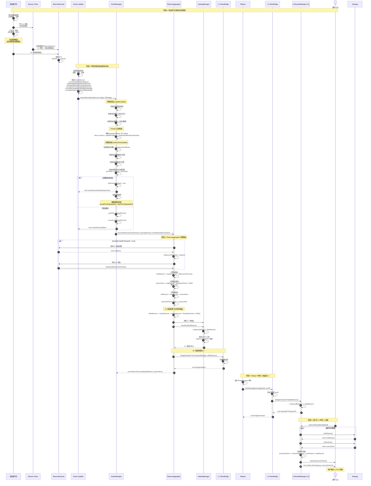
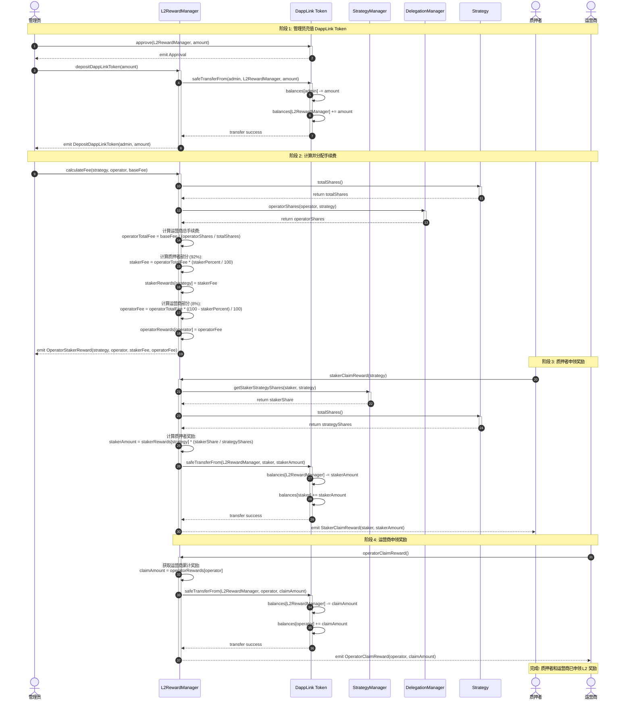

# 流程 2: 质押奖励分发

## 📋 目录

- [流程概述](#流程概述)
- [L1 收益分发流程](#l1-收益分发流程)
- [L2 收益分发流程](#l2-收益分发流程)
- [关键函数详解](#关键函数详解)
- [预言机机制详解](#预言机机制详解)
- [收益计算公式](#收益计算公式)
- [错误处理和边界情况](#错误处理和边界情况)

---

## 流程概述

质押奖励分为**两种类型**:

1. **L1 收益** (ETH): 来自以太坊验证者的质押奖励
   - **共识层奖励 (CL)**: 验证者区块提议、证明奖励
   - **执行层奖励 (EL)**: 优先费用、MEV 收益

2. **L2 收益** (DappLink Token): 来自协议发放的治理代币
   - 质押者获得 **92%**
   - 运营商获得 **8%**

**参与角色**:
- **验证者节点**: 产生 L1 质押奖励
- **Oracle Updater**: 监控并提交验证者状态
- **ReturnsAggregator**: 处理收益并收取协议费用
- **L1RewardManager**: 管理 L1 ETH 奖励(部署在 L2)
- **L2RewardManager**: 管理 L2 代币奖励
- **用户**: 申领奖励

---

## L1 收益分发流程

### 完整流程图



---

### 详细步骤拆解

#### 步骤 1: 验证者产生奖励并自动提款

**验证者奖励来源**:

1. **共识层奖励 (Consensus Layer)**:
   - 区块提议奖励
   - 证明奖励 (Attestation)
   - 同步委员会奖励
   - 举报奖励 (Slashing)

2. **执行层奖励 (Execution Layer)**:
   - 优先费用 (Priority Fees)
   - MEV 收益 (最大可提取价值)

**自动提款机制**:

以太坊信标链支持两种提款:
- **部分提款 (Partial Withdrawal)**: 提取超过 32 ETH 的余额
- **全额提款 (Full Withdrawal)**: 验证者退出后提取全部余额

```solidity
// 提款自动发送到 ReturnsReceiver
address constant RETURNS_RECEIVER = 0x...;

// CL 奖励: 通过信标链自动提款
// EL 奖励: 验证者直接发送
```

**状态变化**:
- `ReturnsReceiver.balance` 增加奖励金额

---

#### 步骤 2-4: 预言机提交验证者状态记录

**合约**: `OracleManager.sol`
**函数**: `receiveRecord(OracleRecord calldata newRecord, ...)`
**文件位置**: `src/L1/core/OracleManager.sol:118`

**OracleRecord 结构体**:

```solidity
struct OracleRecord {
    uint64 updateStartBlock;                      // 记录窗口起始区块
    uint64 updateEndBlock;                        // 记录窗口结束区块
    uint256 currentTotalValidatorBalance;         // 当前验证者总余额
    uint256 cumulativeProcessedDepositAmount;     // 累计已处理的存款金额
    uint32 currentNumValidatorsNotWithdrawable;   // 当前不可提款验证者数量
    uint32 cumulativeNumValidatorsWithdrawable;   // 累计可提款验证者数量
    uint128 windowWithdrawnPrincipalAmount;       // 窗口内提取的本金
    uint128 windowWithdrawnRewardAmount;          // 窗口内提取的奖励
}
```

**验证流程**:

```solidity
function receiveRecord(OracleRecord calldata newRecord, ...) external {
    // 1. 权限检查
    if (msg.sender != oracleUpdater) {
        revert UnauthorizedOracleUpdater(msg.sender, oracleUpdater);
    }

    // 2. 检查是否有待处理更新
    if (hasPendingUpdate) {
        revert CannotUpdateWhileUpdatePending();
    }

    // 3. 完整性验证
    validateUpdate(_records.length - 1, newRecord);

    // 4. Finalize 区块检查
    uint256 updateFinalizingBlock = newRecord.updateEndBlock + finalizationBlockNumberDelta;
    if (block.number < updateFinalizingBlock) {
        revert UpdateEndBlockNumberNotFinal(updateFinalizingBlock);
    }

    // 5. 合理性检查
    (string memory rejectionReason, uint256 value, uint256 bound) = sanityCheckUpdate(latestRecord(), newRecord);

    if (bytes(rejectionReason).length > 0) {
        // 合理性检查失败,标记为待处理
        _pendingUpdate = newRecord;
        hasPendingUpdate = true;
        emit OracleRecordFailedSanityCheck(...);
        IL1Pauser(getLocator().pauser()).pauseAll();  // 触发全局暂停
        return;
    }

    // 6. 验证通过,添加记录并处理收益
    _pushRecord(newRecord, bridge, l2Strategy, sourceChainId, destChainId);
}
```

**validateUpdate (完整性验证)**:

```solidity
function validateUpdate(uint256 prevRecordIndex, OracleRecord calldata newRecord) public view {
    OracleRecord storage prevRecord = _records[prevRecordIndex];

    // 检查 1: 区块范围有效
    if (newRecord.updateEndBlock <= newRecord.updateStartBlock) {
        revert InvalidUpdateEndBeforeStartBlock(...);
    }

    // 检查 2: 区块连续性
    if (newRecord.updateStartBlock != prevRecord.updateEndBlock + 1) {
        revert InvalidUpdateStartBlock(...);
    }

    // 检查 3: 存款金额不能超过协议已存入
    if (newRecord.cumulativeProcessedDepositAmount > getStakingManager().totalDepositedInValidators()) {
        revert InvalidUpdateMoreDepositsProcessedThanSent(...);
    }

    // 检查 4: 验证者数量不能超过已启动数量
    uint256 totalValidators = newRecord.currentNumValidatorsNotWithdrawable + newRecord.cumulativeNumValidatorsWithdrawable;
    if (totalValidators > getStakingManager().numInitiatedValidators()) {
        revert InvalidUpdateMoreValidatorsThanInitiated(...);
    }
}
```

**sanityCheckUpdate (合理性检查)**:

```solidity
function sanityCheckUpdate(
    OracleRecord memory prevRecord,
    OracleRecord calldata newRecord
) public view returns (string memory, uint256, uint256) {
    uint64 reportSize = newRecord.updateEndBlock - newRecord.updateStartBlock + 1;

    // 检查 1: 报告区块数 ≥ 最小值
    if (reportSize < minReportSizeBlocks) {
        return ("Report blocks below minimum bound", reportSize, minReportSizeBlocks);
    }

    // 检查 2: 可提款验证者数量只增不减
    if (newRecord.cumulativeNumValidatorsWithdrawable < prevRecord.cumulativeNumValidatorsWithdrawable) {
        return ("Cumulative number of withdrawable validators decreased", ...);
    }

    // 检查 3: 总验证者数量只增不减
    uint256 prevNumValidators = prevRecord.currentNumValidatorsNotWithdrawable + prevRecord.cumulativeNumValidatorsWithdrawable;
    uint256 newNumValidators = newRecord.currentNumValidatorsNotWithdrawable + newRecord.cumulativeNumValidatorsWithdrawable;
    if (newNumValidators < prevNumValidators) {
        return ("Total number of validators decreased", ...);
    }

    // 检查 4: 已处理存款金额只增不减
    if (newRecord.cumulativeProcessedDepositAmount < prevRecord.cumulativeProcessedDepositAmount) {
        return ("Processed deposit amount decreased", ...);
    }

    // 检查 5: 每个新验证者的存款金额在合理范围 [minDepositPerValidator, maxDepositPerValidator]
    uint256 newDeposits = newRecord.cumulativeProcessedDepositAmount - prevRecord.cumulativeProcessedDepositAmount;
    uint256 newValidators = newNumValidators - prevNumValidators;

    if (newDeposits < newValidators * minDepositPerValidator) {
        return ("New deposits below min deposit per validator", ...);
    }
    if (newDeposits > newValidators * maxDepositPerValidator) {
        return ("New deposits above max deposit per validator", ...);
    }

    // 检查 6: 共识层余额变化在合理范围
    uint256 baselineGrossCLBalance = prevRecord.currentTotalValidatorBalance + newDeposits;
    uint256 newGrossCLBalance = newRecord.currentTotalValidatorBalance + newRecord.windowWithdrawnPrincipalAmount + newRecord.windowWithdrawnRewardAmount;

    // 下限 = 基线 - 最大损失 + 最小增益
    uint256 lowerBound = baselineGrossCLBalance
        - Math.mulDiv(maxConsensusLayerLossPPM, baselineGrossCLBalance, _PPM_DENOMINATOR)
        + Math.mulDiv(minConsensusLayerGainPerBlockPPT * reportSize, baselineGrossCLBalance, _PPT_DENOMINATOR);

    if (newGrossCLBalance < lowerBound) {
        return ("Consensus layer change below min gain or max loss", ...);
    }

    // 上限 = 基线 + 最大增益
    uint256 upperBound = baselineGrossCLBalance + Math.mulDiv(maxConsensusLayerGainPerBlockPPT * reportSize, baselineGrossCLBalance, _PPT_DENOMINATOR);

    if (newGrossCLBalance > upperBound) {
        return ("Consensus layer change above max gain", ...);
    }

    return ("", 0, 0);  // 通过所有检查
}
```

**关键参数**:
- `minReportSizeBlocks = 100`: 最小报告区块数
- `minDepositPerValidator = 32 ether`: 每验证者最小存款
- `maxDepositPerValidator = 32 ether`: 每验证者最大存款
- `minConsensusLayerGainPerBlockPPT = 1903` (0.1x 近似比率)
- `maxConsensusLayerGainPerBlockPPT = 190250` (10x 近似比率)
- `maxConsensusLayerLossPPM = 1000` (0.1% 最大损失)
- `finalizationBlockNumberDelta = 64`: Finalize 等待区块数

---

#### 步骤 5-7: ReturnsAggregator 处理收益

**合约**: `ReturnsAggregator.sol`
**函数**: `processReturns(...)`
**文件位置**: `src/L1/core/ReturnsAggregator.sol`

```solidity
function processReturns(
    uint256 rewardAmount,              // CL 奖励金额
    uint256 principalAmount,           // 本金金额(如果有验证者退出)
    bool shouldIncludeELRewards,       // 是否包含 EL 奖励
    address bridge,                    // 桥接合约地址
    address l2Strategy,                // L2 策略地址
    uint256 sourceChainId,             // 源链 ID
    uint256 destChainId                // 目标链 ID
) external onlyOracleManager {
    uint256 elReturnsToProcess = 0;

    // 1. 处理 EL 奖励(如果需要)
    if (shouldIncludeELRewards) {
        address elReceiver = getLocator().executionLayerReceiver();
        elReturnsToProcess = elReceiver.balance;
        if (elReturnsToProcess > 0) {
            // 转移 EL 奖励到 ReturnsAggregator
            (bool success,) = address(this).call{value: elReturnsToProcess}("");
            require(success, "EL transfer failed");
        }
    }

    // 2. 计算总收益和协议费用
    uint256 totalReturns = rewardAmount + elReturnsToProcess;
    uint256 protocolFee = Math.mulDiv(totalReturns, feesBasisPoints, 10000);  // 默认 10%
    uint256 netReturns = totalReturns - protocolFee;

    protocolFeesAccrued += protocolFee;

    // 3. 计算 CL 净收益和 EL 净收益
    uint256 clFee = Math.mulDiv(rewardAmount, feesBasisPoints, 10000);
    uint256 clNetReturns = rewardAmount - clFee;

    uint256 elFee = Math.mulDiv(elReturnsToProcess, feesBasisPoints, 10000);
    uint256 elNetReturns = elReturnsToProcess - elFee;

    // 4. CL 净收益转入 StakingManager
    if (clNetReturns > 0) {
        address stakingManager = getLocator().stakingManager();
        (bool success,) = stakingManager.call{value: clNetReturns}("");
        require(success, "CL transfer failed");
    }

    // 5. EL 净收益桥接到 L2
    if (elNetReturns > 0) {
        ITokenBridgeBase(bridge).BridgeInitiateETH{value: elNetReturns}(
            getLocator().l1RewardManager(),  // L2 的 L1RewardManager 地址
            elNetReturns,
            sourceChainId,
            destChainId
        );
    }

    // 6. 处理本金(如果有验证者退出)
    if (principalAmount > 0) {
        address stakingManager = getLocator().stakingManager();
        (bool success,) = stakingManager.call{value: principalAmount}("");
        require(success, "Principal transfer failed");
    }

    emit ReturnsProcessed(totalReturns, protocolFee, clNetReturns, elNetReturns);
}
```

**收益分配示例**:

```
假设:
- CL 奖励 (rewardAmount) = 1 ETH
- EL 奖励 (elReturnsToProcess) = 0.5 ETH
- 协议费率 (feesBasisPoints) = 1000 (10%)

计算:
- 总收益 = 1 + 0.5 = 1.5 ETH
- 协议费用 = 1.5 * 10% = 0.15 ETH
- 净收益 = 1.5 - 0.15 = 1.35 ETH

分配:
- CL 费用 = 1 * 10% = 0.1 ETH
- CL 净收益 = 1 - 0.1 = 0.9 ETH → StakingManager
- EL 费用 = 0.5 * 10% = 0.05 ETH
- EL 净收益 = 0.5 - 0.05 = 0.45 ETH → 桥接到 L2

结果:
- 协议费用累计: 0.15 ETH
- StakingManager 收到: 0.9 ETH (提高 dETH 汇率)
- L2 L1RewardManager 收到: 0.45 ETH (用户按份额申领)
```

---

#### 步骤 8-11: EL 收益桥接到 L2

**流程**:
1. `ReturnsAggregator` 调用 `L1Bridge.BridgeInitiateETH(L1RewardManager地址, elNetReturns)`
2. L1 桥接合约存储跨链消息并触发事件
3. Relayer 监听事件,调用 `L2Bridge.claimMessage(messageHash, proof)`
4. L2 桥接合约验证消息,调用 `L1RewardManager.depositETHRewardTo{value: elNetReturns}()`

**状态变化**:
- `L1RewardManager.L1RewardBalance` 增加 `elNetReturns`

---

#### 步骤 12-16: 用户在 L2 申领 L1 奖励

**合约**: `L1RewardManager.sol`
**函数**: `claimL1Reward(address[] calldata _strategies)`
**文件位置**: `src/L2/core/L1RewardManager.sol:69`

```solidity
function claimL1Reward(address[] calldata _strategies) external payable returns (bool) {
    // 1. 计算用户可获得的奖励金额
    uint256 amountToSend = stakerRewardsAmount(_strategies);

    // 2. 转账给用户
    payable(msg.sender).transfer(amountToSend);

    // 3. 触发事件
    emit ClaimL1Reward(msg.sender, amountToSend);

    return true;
}

function stakerRewardsAmount(address[] calldata _strategies) public view returns (uint256) {
    uint256 totalShares = 0;
    uint256 userShares = 0;

    // 遍历所有策略,累加总份额和用户份额
    for (uint256 i = 0; i < _strategies.length; i++) {
        totalShares += getStrategy(_strategies[i]).totalShares();
        userShares += getStrategy(_strategies[i]).shares(msg.sender);
    }

    // 如果总份额或用户份额为 0,返回 0
    if (totalShares == 0 || userShares == 0) {
        return 0;
    }

    // 按比例计算奖励
    return L1RewardBalance * (userShares / totalShares);
}
```

**奖励计算示例**:

```
假设:
- L1RewardBalance = 10 ETH
- Strategy A: totalShares = 100, user shares = 10
- Strategy B: totalShares = 200, user shares = 20

计算:
- totalShares = 100 + 200 = 300
- userShares = 10 + 20 = 30
- 用户奖励 = 10 * (30 / 300) = 1 ETH
```

**注意事项**:
- ⚠️ `stakerRewardsAmount()` 使用整数除法,可能存在精度损失
- ⚠️ 原代码中 `L1RewardBalance * (userShares / totalShares)` 会先计算 `userShares / totalShares`,可能导致结果为 0
- ✅ 建议修改为 `(L1RewardBalance * userShares) / totalShares` 避免精度损失

---

## L2 收益分发流程

### 完整流程图



---

### 详细步骤拆解

#### 步骤 1-2: 管理员充值 DappLink Token

**合约**: `L2RewardManager.sol`
**函数**: `depositDappLinkToken(uint256 amount)`
**文件位置**: `src/L2/core/L2RewardManager.sol:64`

```solidity
function depositDappLinkToken(uint256 amount) external returns (bool) {
    // 从调用者转入 DappLink Token
    getDapplinkToken().safeTransferFrom(msg.sender, address(this), amount);

    emit DepositDappLinkToken(msg.sender, amount);
    return true;
}
```

**前置条件**:
- 调用者已 `approve` L2RewardManager 可以转移相应数量的 DappLink Token

---

#### 步骤 3-8: 计算并分配手续费

**合约**: `L2RewardManager.sol`
**函数**: `calculateFee(address strategy, address operator, uint256 baseFee)`
**文件位置**: `src/L2/core/L2RewardManager.sol:36`

```solidity
function calculateFee(address strategy, address operator, uint256 baseFee) external {
    // 1. 获取策略的总份额
    uint256 totalShares = getStrategy(strategy).totalShares();

    // 2. 获取运营商在该策略中的份额
    uint256 operatorShares = getDelegationManager().operatorShares(operator, strategy);

    // 3. 计算运营商应得的总手续费
    uint256 operatorTotalFee = baseFee / (operatorShares / totalShares);

    // 4. 计算质押者部分的手续费 (92%)
    uint256 stakerFee = operatorTotalFee * (stakerPercent / 100);
    stakerRewards[strategy] = stakerFee;

    // 5. 计算运营商部分的手续费 (8%)
    uint256 operatorFee = operatorTotalFee * ((100 - stakerPercent) / 100);
    operatorRewards[operator] = operatorFee;

    emit OperatorStakerReward(strategy, operator, stakerFee, operatorFee);
}
```

**⚠️ 代码问题分析**:

原代码存在严重的整数除法精度问题:

```solidity
// 问题 1: operatorShares / totalShares 会先计算,结果可能为 0
uint256 operatorTotalFee = baseFee / (operatorShares / totalShares);

// 问题 2: stakerPercent / 100 会先计算,结果为 0 (因为 stakerPercent = 92 < 100)
uint256 stakerFee = operatorTotalFee * (stakerPercent / 100);

// 问题 3: (100 - stakerPercent) / 100 同样为 0
uint256 operatorFee = operatorTotalFee * ((100 - stakerPercent) / 100);
```

**建议修改**:

```solidity
function calculateFee(address strategy, address operator, uint256 baseFee) external {
    uint256 totalShares = getStrategy(strategy).totalShares();
    uint256 operatorShares = getDelegationManager().operatorShares(operator, strategy);

    // 修正: 计算运营商总手续费 = baseFee * (operatorShares / totalShares)
    uint256 operatorTotalFee = (baseFee * operatorShares) / totalShares;

    // 修正: 质押者部分 = operatorTotalFee * 92 / 100
    uint256 stakerFee = (operatorTotalFee * stakerPercent) / 100;
    stakerRewards[strategy] += stakerFee;  // 累加,不是覆盖

    // 修正: 运营商部分 = operatorTotalFee * 8 / 100
    uint256 operatorFee = (operatorTotalFee * (100 - stakerPercent)) / 100;
    operatorRewards[operator] += operatorFee;  // 累加,不是覆盖

    emit OperatorStakerReward(strategy, operator, stakerFee, operatorFee);
}
```

**分配示例** (修正后):

```
假设:
- baseFee = 1000 DappLink Token
- totalShares = 1000
- operatorShares = 100 (运营商管理 10% 的份额)
- stakerPercent = 92

计算:
- operatorTotalFee = 1000 * (100 / 1000) = 100 Token
- stakerFee = 100 * (92 / 100) = 92 Token
- operatorFee = 100 * (8 / 100) = 8 Token

结果:
- 质押者总共获得: 92 Token (按各自份额分配)
- 运营商获得: 8 Token
```

---

#### 步骤 9-14: 质押者申领奖励

**合约**: `L2RewardManager.sol`
**函数**: `stakerClaimReward(address strategy)`
**文件位置**: `src/L2/core/L2RewardManager.sol:87`

```solidity
function stakerClaimReward(address strategy) external returns (bool) {
    // 1. 计算质押者可获得的奖励金额
    uint256 stakerAmount = stakerRewardsAmount(strategy);

    // 2. 转账给质押者
    getDapplinkToken().safeTransferFrom(address(this), msg.sender, stakerAmount);

    // 3. 触发事件
    emit StakerClaimReward(msg.sender, stakerAmount);

    return true;
}

function stakerRewardsAmount(address strategy) public view returns (uint256) {
    // 获取质押者在该策略中的份额
    uint256 stakerShare = getStrategyManager().getStakerStrategyShares(msg.sender, strategy);

    // 获取策略的总份额
    uint256 strategyShares = getStrategy(strategy).totalShares();

    // 如果质押者份额或策略总份额为 0,返回 0
    if (stakerShare == 0 || strategyShares == 0) {
        return 0;
    }

    // 按比例计算奖励
    return stakerRewards[strategy] * (stakerShare / strategyShares);
}
```

**⚠️ 代码问题**:

```solidity
// 问题: stakerShare / strategyShares 会先计算,结果可能为 0
return stakerRewards[strategy] * (stakerShare / strategyShares);
```

**建议修改**:

```solidity
function stakerRewardsAmount(address strategy) public view returns (uint256) {
    uint256 stakerShare = getStrategyManager().getStakerStrategyShares(msg.sender, strategy);
    uint256 strategyShares = getStrategy(strategy).totalShares();

    if (stakerShare == 0 || strategyShares == 0) {
        return 0;
    }

    // 修正: (stakerRewards[strategy] * stakerShare) / strategyShares
    return (stakerRewards[strategy] * stakerShare) / strategyShares;
}
```

**奖励计算示例** (修正后):

```
假设:
- stakerRewards[strategy] = 92 Token
- strategyShares = 1000
- stakerShare = 100

计算:
- 质押者奖励 = (92 * 100) / 1000 = 9.2 Token
- 实际转账 = 9 Token (整数除法)
```

---

#### 步骤 15-18: 运营商申领奖励

**合约**: `L2RewardManager.sol`
**函数**: `operatorClaimReward()`
**文件位置**: `src/L2/core/L2RewardManager.sol:73`

```solidity
function operatorClaimReward() external returns (bool) {
    // 1. 获取运营商累积的奖励
    uint256 claimAmount = operatorRewards[msg.sender];

    // 2. 转账给运营商
    getDapplinkToken().safeTransferFrom(address(this), msg.sender, claimAmount);

    // 3. 触发事件
    emit OperatorClaimReward(msg.sender, claimAmount);

    return true;
}
```

**⚠️ 代码问题**:

原代码没有清零 `operatorRewards[msg.sender]`,可能导致重复申领:

**建议修改**:

```solidity
function operatorClaimReward() external returns (bool) {
    uint256 claimAmount = operatorRewards[msg.sender];

    require(claimAmount > 0, "No rewards to claim");

    // 清零防止重复申领
    operatorRewards[msg.sender] = 0;

    getDapplinkToken().safeTransferFrom(address(this), msg.sender, claimAmount);

    emit OperatorClaimReward(msg.sender, claimAmount);

    return true;
}
```

同样的问题也存在于 `stakerClaimReward()`:

```solidity
function stakerClaimReward(address strategy) external returns (bool) {
    uint256 stakerAmount = stakerRewardsAmount(strategy);

    require(stakerAmount > 0, "No rewards to claim");

    // 需要记录已申领金额,防止重复申领
    // 建议添加 mapping(address => mapping(address => uint256)) public claimedRewards;
    claimedRewards[msg.sender][strategy] += stakerAmount;

    getDapplinkToken().safeTransferFrom(address(this), msg.sender, stakerAmount);

    emit StakerClaimReward(msg.sender, stakerAmount);

    return true;
}
```

---

## 关键函数详解

### 1. 协议费用收取

**合约**: `ReturnsAggregator.sol`
**参数**: `feesBasisPoints = 1000` (默认 10%)

```solidity
// 计算协议费用
uint256 protocolFee = Math.mulDiv(totalReturns, feesBasisPoints, 10000);

// 累计协议费用
protocolFeesAccrued += protocolFee;
```

**费用范围**: 0-10000 basis points (0%-100%)

**提取协议费用**:

```solidity
function claimProtocolFees(address recipient) external onlyAdmin {
    uint256 amount = protocolFeesAccrued;
    protocolFeesAccrued = 0;

    (bool success,) = recipient.call{value: amount}("");
    require(success, "Transfer failed");

    emit ProtocolFeesClaimed(recipient, amount);
}
```

---

### 2. dETH 汇率提升

当 CL 净收益转入 StakingManager 时,`unallocatedETH` 增加,导致 `getTotalControlledETH()` 增加,从而提高 dETH 汇率:

```solidity
// DETH.sol
function getTotalControlledETH() public view returns (uint256) {
    return stakingManager.totalDepositedInValidators()
         + stakingManager.unallocatedETH()  // 这里增加了
         + unstakeRequestsManager.unallocatedETH()
         + oracleManager.latestRecord().currentTotalValidatorBalance;
}

// dETH 汇率 = getTotalControlledETH() / totalSupply()
```

**示例**:

```
初始状态:
- totalControlledETH = 100 ETH
- dETH totalSupply = 100
- 汇率 = 1.0 ETH per dETH

CL 收益 0.9 ETH 转入 StakingManager:
- totalControlledETH = 100.9 ETH
- dETH totalSupply = 100 (不变)
- 新汇率 = 1.009 ETH per dETH

用户持有 10 dETH 的价值:
- 之前: 10 * 1.0 = 10 ETH
- 现在: 10 * 1.009 = 10.09 ETH
- 收益: 0.09 ETH
```

---

## 预言机机制详解

### 预言机记录窗口

预言机记录以**区块范围**为窗口,记录该窗口内的验证者状态变化:

```
窗口 1: [block 1000, block 1100]
- 起始验证者余额: 100 ETH
- 新增存款: 32 ETH
- 提款: 2 ETH (奖励 1.5 ETH + 本金 0.5 ETH)
- 结束验证者余额: 129.5 ETH

窗口 2: [block 1101, block 1200]
- 起始验证者余额: 129.5 ETH
- ...
```

### Finalize 检查

为了防止提款被回滚(reorg),预言机记录对应的区块必须已经 Finalize:

```solidity
// OracleManager.sol:133
uint256 updateFinalizingBlock = newRecord.updateEndBlock + finalizationBlockNumberDelta;
if (block.number < updateFinalizingBlock) {
    revert UpdateEndBlockNumberNotFinal(updateFinalizingBlock);
}
```

**参数**: `finalizationBlockNumberDelta = 64` blocks (约 12.8 分钟)

**原理**: 以太坊 PoS 的 Finality 大约需要 2 个 epoch (64 个 slot),即 64 个区块。

---

### 待处理更新机制

当合理性检查失败时,预言机记录不会立即回滚,而是标记为**待处理**:

```solidity
// OracleManager.sol:139
if (bytes(rejectionReason).length > 0) {
    _pendingUpdate = newRecord;
    hasPendingUpdate = true;
    emit OracleRecordFailedSanityCheck(...);
    IL1Pauser(getLocator().pauser()).pauseAll();  // 触发全局暂停
    return;
}
```

**管理员操作**:

1. **接受更新**: 调用 `acceptPendingUpdate()`,将待处理记录添加到 `_records[]`
2. **拒绝更新**: 调用 `rejectPendingUpdate()`,丢弃待处理记录

```solidity
// 接受待处理更新
function acceptPendingUpdate(address bridge, address l2Strategy, uint256 sourceChainId, uint256 destChainId)
    external
    onlyRole(ORACLE_PENDING_UPDATE_RESOLVER_ROLE)
{
    if (!hasPendingUpdate) {
        revert NoUpdatePending();
    }

    _pushRecord(_pendingUpdate, bridge, l2Strategy, sourceChainId, destChainId);
    _resetPending();
}

// 拒绝待处理更新
function rejectPendingUpdate() external onlyRole(ORACLE_PENDING_UPDATE_RESOLVER_ROLE) {
    if (!hasPendingUpdate) {
        revert NoUpdatePending();
    }

    emit OraclePendingUpdateRejected(_pendingUpdate);
    _resetPending();
}
```

---

## 收益计算公式

### L1 收益计算

#### 1. 协议费用

```
protocolFee = totalReturns * feesBasisPoints / 10000

其中:
- totalReturns = CL奖励 + EL奖励
- feesBasisPoints = 1000 (10%)
```

#### 2. CL 净收益

```
clNetReturns = clRewardAmount - (clRewardAmount * feesBasisPoints / 10000)
             = clRewardAmount * (10000 - feesBasisPoints) / 10000
             = clRewardAmount * 0.9
```

#### 3. EL 净收益

```
elNetReturns = elRewardAmount - (elRewardAmount * feesBasisPoints / 10000)
             = elRewardAmount * 0.9
```

#### 4. 用户 L1 奖励 (EL 部分)

```
userReward = L1RewardBalance * (用户总份额 / 策略总份额)

其中:
- 用户总份额 = Σ Strategy.shares(user) (所有策略)
- 策略总份额 = Σ Strategy.totalShares() (所有策略)
```

**⚠️ 注意**: 用户的 CL 奖励体现在 dETH 汇率提升上,不需要申领。

---

### L2 收益计算

#### 1. 运营商总手续费

```
operatorTotalFee = baseFee * (operatorShares / totalShares)

其中:
- operatorShares = DelegationManager.operatorShares[operator][strategy]
- totalShares = Strategy.totalShares()
```

#### 2. 质押者部分 (92%)

```
stakerFee = operatorTotalFee * stakerPercent / 100
          = operatorTotalFee * 0.92
```

#### 3. 运营商部分 (8%)

```
operatorFee = operatorTotalFee * (100 - stakerPercent) / 100
            = operatorTotalFee * 0.08
```

#### 4. 单个质押者奖励

```
stakerReward = stakerFee * (stakerShare / strategyShares)

其中:
- stakerShare = StrategyManager.stakerStrategyShares[staker][strategy]
- strategyShares = Strategy.totalShares()
```

---

### 完整收益分配示例

**场景**:
- 协议有 2 个验证者,总存款 64 ETH
- 产生 CL 奖励 2 ETH,EL 奖励 1 ETH
- 协议费率 10%
- L2 有 1 个策略,2 个质押者,1 个运营商
- 质押者 A: 60% 份额,质押者 B: 40% 份额
- 运营商管理 100% 份额
- L2 奖励 100 DappLink Token

**L1 收益分配**:

```
1. 总收益:
   - CL 奖励: 2 ETH
   - EL 奖励: 1 ETH
   - 总收益: 3 ETH

2. 协议费用:
   - 协议费用 = 3 * 10% = 0.3 ETH

3. 净收益:
   - CL 净收益 = 2 * 90% = 1.8 ETH → StakingManager (提高 dETH 汇率)
   - EL 净收益 = 1 * 90% = 0.9 ETH → 桥接到 L2

4. 用户申领 (EL 部分):
   - 质押者 A: 0.9 * 60% = 0.54 ETH
   - 质押者 B: 0.9 * 40% = 0.36 ETH

5. dETH 汇率提升 (CL 部分):
   - 原 totalControlledETH = 64 ETH
   - 新 totalControlledETH = 64 + 1.8 = 65.8 ETH
   - 假设 dETH 总供应量 = 64
   - 原汇率 = 64 / 64 = 1.0
   - 新汇率 = 65.8 / 64 = 1.028125
   - 质押者 A (持有 38.4 dETH): 价值从 38.4 ETH 增加到 39.48 ETH (+1.08 ETH)
   - 质押者 B (持有 25.6 dETH): 价值从 25.6 ETH 增加到 26.32 ETH (+0.72 ETH)
```

**L2 收益分配**:

```
1. 管理员充值: 100 DappLink Token

2. 计算分配:
   - 运营商总手续费 = 100 * (100% / 100%) = 100 Token
   - 质押者部分 = 100 * 92% = 92 Token
   - 运营商部分 = 100 * 8% = 8 Token

3. 质押者申领:
   - 质押者 A: 92 * 60% = 55.2 Token
   - 质押者 B: 92 * 40% = 36.8 Token

4. 运营商申领: 8 Token
```

**总结**:
- 质押者 A 总收益: 0.54 ETH (EL) + 1.08 ETH (CL,汇率提升) + 55.2 Token (L2)
- 质押者 B 总收益: 0.36 ETH (EL) + 0.72 ETH (CL,汇率提升) + 36.8 Token (L2)
- 运营商收益: 8 Token (L2)
- 协议收益: 0.3 ETH (L1 费用)

---

## 错误处理和边界情况

### 预言机相关错误

#### 1. 未授权的预言机更新者

```solidity
// OracleManager.sol:123
if (msg.sender != oracleUpdater) {
    revert UnauthorizedOracleUpdater(msg.sender, oracleUpdater);
}
```

**处理**: 交易回滚,只有授权的 Oracle Updater 可以提交记录

---

#### 2. 有待处理的更新

```solidity
// OracleManager.sol:127
if (hasPendingUpdate) {
    revert CannotUpdateWhileUpdatePending();
}
```

**处理**: 必须先由管理员接受或拒绝待处理的更新,才能提交新记录

---

#### 3. 区块未 Finalize

```solidity
// OracleManager.sol:134
if (block.number < updateFinalizingBlock) {
    revert UpdateEndBlockNumberNotFinal(updateFinalizingBlock);
}
```

**处理**: Oracle Updater 需要等待足够的区块确认后再提交

---

#### 4. 完整性验证失败

```solidity
// OracleManager.sol:131
validateUpdate(_records.length - 1, newRecord);
```

**可能的错误**:
- `InvalidUpdateEndBeforeStartBlock`: 结束区块 ≤ 起始区块
- `InvalidUpdateStartBlock`: 起始区块不连续
- `InvalidUpdateMoreDepositsProcessedThanSent`: 处理的存款超过协议已存入
- `InvalidUpdateMoreValidatorsThanInitiated`: 验证者数量超过已启动数量

**处理**: 交易回滚,Oracle Updater 需要修正数据

---

#### 5. 合理性检查失败

```solidity
// OracleManager.sol:138
(string memory rejectionReason, uint256 value, uint256 bound) = sanityCheckUpdate(latestRecord(), newRecord);
if (bytes(rejectionReason).length > 0) {
    _pendingUpdate = newRecord;
    hasPendingUpdate = true;
    emit OracleRecordFailedSanityCheck(...);
    IL1Pauser(getLocator().pauser()).pauseAll();
    return;
}
```

**可能的原因**:
- 报告区块数过少
- 验证者数量异常减少
- 存款金额异常减少
- 每验证者存款金额超出范围 [32 ETH, 32 ETH]
- 余额变化超出合理范围

**处理**:
1. 标记为待处理
2. 触发全局暂停
3. 等待管理员审核

---

### 收益处理相关错误

#### 6. 协议费率无效

```solidity
// ReturnsAggregator.sol (假设有设置函数)
function setFeesBasisPoints(uint256 newFees) external onlyAdmin {
    require(newFees <= 10000, "Fees too high");
    feesBasisPoints = newFees;
}
```

**限制**: 0-10000 basis points (0%-100%)

---

#### 7. 转账失败

```solidity
// ReturnsAggregator.sol
(bool success,) = stakingManager.call{value: clNetReturns}("");
require(success, "CL transfer failed");

(bool success,) = stakingManager.call{value: principalAmount}("");
require(success, "Principal transfer failed");
```

**原因**:
- 目标合约没有 `receive()` 或 `fallback()` 函数
- 目标合约执行失败 (revert)
- Gas 不足

**处理**: 交易回滚,整个收益处理流程失败

---

### L2 奖励相关错误

#### 8. 重复申领

原代码没有防止重复申领的机制,可能导致:

```solidity
// L2RewardManager.sol
function operatorClaimReward() external returns (bool) {
    uint256 claimAmount = operatorRewards[msg.sender];
    // ⚠️ 没有清零,可以重复申领
    getDapplinkToken().safeTransferFrom(address(this), msg.sender, claimAmount);
    return true;
}
```

**建议修改**: 在转账前清零累计奖励

---

#### 9. 精度损失

整数除法导致精度损失:

```solidity
// 错误示例
return L1RewardBalance * (userShares / totalShares);
// 如果 userShares < totalShares,则 userShares / totalShares = 0

// 正确示例
return (L1RewardBalance * userShares) / totalShares;
```

**影响**: 小额奖励可能被四舍五入为 0

---

### 边界情况

#### 10. 初始预言机记录

协议启动时需要初始化第一条记录:

```solidity
// OracleManager.sol:103
function initRecord() external onlyRole(ORACLE_PENDING_UPDATE_RESOLVER_ROLE) {
    _pushRecord(
        OracleRecord(
            0,  // currentTotalValidatorBalance
            uint64(getStakingManager().initializationBlockNumber()),  // updateStartBlock = updateEndBlock
            0,  // cumulativeProcessedDepositAmount
            0,  // currentNumValidatorsNotWithdrawable
            0,  // cumulativeNumValidatorsWithdrawable
            0,  // windowWithdrawnPrincipalAmount
            0,  // windowWithdrawnRewardAmount
            0   // 其他字段
        ),
        msg.sender,
        msg.sender,
        0,
        0
    );
}
```

---

#### 11. 没有验证者奖励

如果验证者还未产生奖励,预言机记录中 `windowWithdrawnRewardAmount = 0`:

```solidity
// ReturnsAggregator.processReturns()
uint256 totalReturns = rewardAmount + elReturnsToProcess;
// 如果两者都为 0,则 totalReturns = 0,protocolFee = 0,不会分配任何收益
```

**处理**: 不会报错,只是不分配收益

---

#### 12. 所有质押者都解质押

如果所有质押者都解质押,`Strategy.totalShares() = 0`:

```solidity
// L1RewardManager.stakerRewardsAmount()
if (totalShares == 0 || userShares == 0) {
    return 0;
}
```

**处理**: 返回 0 奖励,不会报错

**问题**: L1RewardBalance 中的 ETH 会被锁定,无法申领

**建议**: 添加管理员提取未申领奖励的功能

---

#### 13. 验证者被罚没 (Slashing)

如果验证者被罚没,余额会大幅下降:

```solidity
// sanityCheckUpdate() 会检查余额变化
uint256 lowerBound = baselineGrossCLBalance
    - Math.mulDiv(maxConsensusLayerLossPPM, baselineGrossCLBalance, _PPM_DENOMINATOR)
    + ...;

if (newGrossCLBalance < lowerBound) {
    return ("Consensus layer change below min gain or max loss", ...);
}
```

**参数**: `maxConsensusLayerLossPPM = 1000` (0.1% 最大损失)

**处理**:
- 如果损失超过 0.1%,合理性检查失败
- 标记为待处理,触发全局暂停
- 管理员审核后可以接受更新

---

## 总结

### L1 收益流程关键点

1. **双层收益**: CL 奖励提高 dETH 汇率,EL 奖励桥接到 L2 按份额申领
2. **协议费用**: 从总收益中收取 10%,不影响本金
3. **预言机验证**: 完整性检查(硬性) + 合理性检查(软性) + Finalize 检查
4. **待处理机制**: 异常记录不会立即回滚,而是暂停等待人工审核
5. **自动提款**: 验证者奖励自动提款到 ReturnsReceiver

### L2 收益流程关键点

1. **92/8 分配**: 质押者获得 92%,运营商获得 8%
2. **按份额分配**: 根据用户在策略中的份额比例计算奖励
3. **手动充值**: 管理员需要定期向 L2RewardManager 充值 DappLink Token
4. **需要优化**: 原代码存在整数除法精度问题和重复申领漏洞

### 代码问题汇总

| 问题 | 位置 | 严重性 | 影响 |
|------|------|--------|------|
| 整数除法精度损失 | L1RewardManager.stakerRewardsAmount | 高 | 小额奖励被四舍五入为 0 |
| 整数除法精度损失 | L2RewardManager.calculateFee | 高 | 手续费计算错误,可能全部为 0 |
| 整数除法精度损失 | L2RewardManager.stakerRewardsAmount | 高 | 小额奖励被四舍五入为 0 |
| 缺少重复申领保护 | L2RewardManager.operatorClaimReward | 高 | 运营商可以重复申领奖励 |
| 缺少申领记录 | L2RewardManager.stakerClaimReward | 高 | 质押者可以重复申领奖励 |
| 未申领奖励锁定 | L1RewardManager | 中 | 如果所有用户解质押,ETH 被锁定 |

### 相关文档

- [系统架构图](./architecture.md)
- [质押流程详解](./1-staking-flow.md)
- [解质押流程详解](./3-unstaking-flow.md)

