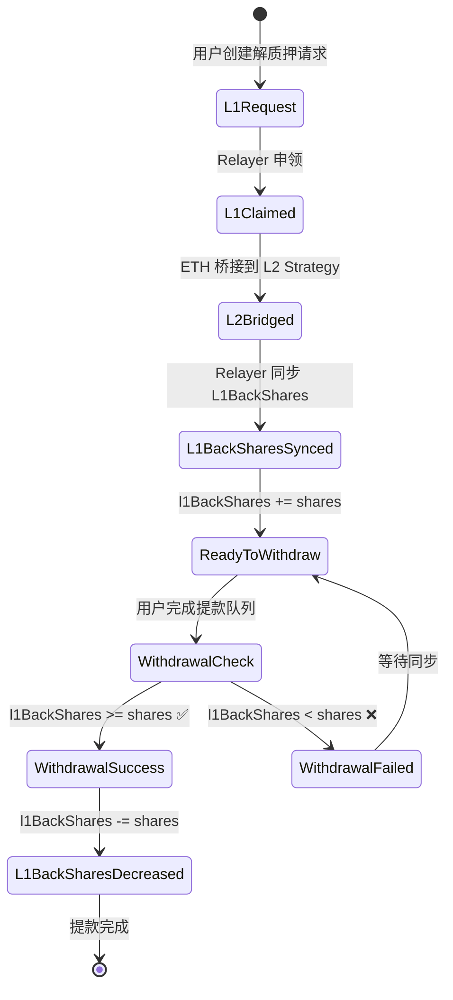
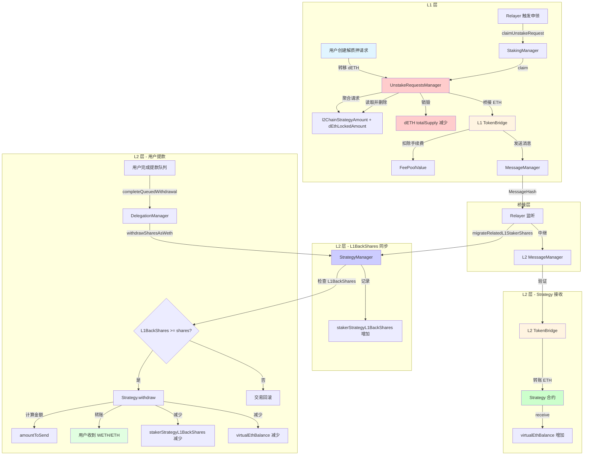

# 流程 3: 解质押流程 (L2 → L1)

## 📋 目录

- [流程概述](#流程概述)
- [完整流程图](#完整流程图)
- [详细步骤拆解](#详细步骤拆解)
- [关键函数详解](#关键函数详解)
- [聚合请求机制](#聚合请求机制)
- [L1BackShares 机制](#l1backshares-机制)
- [错误处理和边界情况](#错误处理和边界情况)

---

## 流程概述

**目标**: 用户在 L2 发起解质押,创建提款请求,通过跨链桥发送回 L1 并最终获得 ETH。

**参与角色**:
- **用户** (L2): 发起解质押的质押者
- **Relayer**: 中继跨链消息,触发 L1 申领
- **运营商**: 如果用户已委托,需要先解除委托

**关键合约**:
- **L2 层**: DelegationManager, StrategyManager, Strategy
- **桥接层**: L2 TokenBridge, L1 TokenBridge
- **L1 层**: StakingManager, UnstakeRequestsManager, DETH

**核心特性**:
1. **聚合请求机制**: 按 `(destChainId, l2Strategy)` 聚合多个用户的解质押请求
2. **L1BackShares 验证**: 只有从 L1 返还的份额才能提款
3. **跨链消息追踪**: 使用 `unStakeMessageNonce` 关联请求
4. **滑点保护**: 支持 `minETHAmount` 参数

**核心流程**:
1. 用户在 L2 解除委托 (如果已委托)
2. 用户在 L2 创建提款队列
3. 用户在 L1 发起解质押请求
4. Relayer 聚合同一策略的请求并申领
5. L1 销毁 dETH 并通过桥接发送 ETH 回 L2
6. 用户在 L2 完成提款队列,取回资产

---

## 完整流程图

```mermaid
sequenceDiagram
    autonumber
    actor User as 用户 (L2)
    participant DelegationMgr as DelegationManager (L2)
    participant StrategyMgr as StrategyManager (L2)
    participant Strategy as Strategy (L2)
    participant L2Bridge as L2 TokenBridge
    participant Relayer as Relayer
    participant L1Bridge as L1 TokenBridge
    participant StakingMgr as StakingManager (L1)
    participant DETH as dETH Token (L1)
    participant UnstakeMgr as UnstakeRequestsManager (L1)

    Note over User,UnstakeMgr: 阶段 1: L2 解委托 (如果已委托)

    alt 用户已委托给运营商
        User->>DelegationMgr: undelegate(staker)
        activate DelegationMgr
        DelegationMgr->>DelegationMgr: 检查 staker 已委托
        DelegationMgr->>DelegationMgr: operator = delegatedTo[staker]
        DelegationMgr->>StrategyMgr: getDelegatableShares(staker)
        activate StrategyMgr
        StrategyMgr-->>DelegationMgr: return (strategies[], shares[])
        deactivate StrategyMgr

        loop 遍历所有策略
            DelegationMgr->>DelegationMgr: 调用 _removeSharesAndQueueWithdrawal
            Note right of DelegationMgr: 每个策略生成一个 withdrawalRoot
        end

        DelegationMgr->>DelegationMgr: delegatedTo[staker] = address(0)
        DelegationMgr-->>User: emit StakerUndelegated(staker, operator)
        DelegationMgr-->>User: emit WithdrawalQueued (多次)
        deactivate DelegationMgr
    end

    Note over User,UnstakeMgr: 阶段 2: L2 创建提款队列

    User->>DelegationMgr: queueWithdrawals(params[])
    activate DelegationMgr
    DelegationMgr->>DelegationMgr: 检查暂停状态
    DelegationMgr->>DelegationMgr: operator = delegatedTo[msg.sender]

    loop 遍历每个提款参数
        DelegationMgr->>DelegationMgr: 验证 strategies.length == shares.length

        DelegationMgr->>DelegationMgr: _removeSharesAndQueueWithdrawal()
        activate DelegationMgr

        loop 遍历每个策略
            DelegationMgr->>StrategyMgr: getStakerStrategyL1BackShares(staker, strategy)
            activate StrategyMgr
            StrategyMgr-->>DelegationMgr: return l1BackShares
            deactivate StrategyMgr

            alt l1BackShares >= shares[i]
                alt operator != address(0)
                    DelegationMgr->>DelegationMgr: _decreaseOperatorShares()
                    DelegationMgr->>DelegationMgr: operatorShares[operator][strategy] -= shares
                end

                DelegationMgr->>DelegationMgr: 检查第三方转账限制

                DelegationMgr->>StrategyMgr: removeShares(staker, strategy, shares)
                activate StrategyMgr
                StrategyMgr->>StrategyMgr: _removeShares()
                StrategyMgr->>StrategyMgr: stakerStrategyShares[staker][strategy] -= shares
                alt userShares == 0
                    StrategyMgr->>StrategyMgr: _removeStrategyFromStakerStrategyList()
                end
                deactivate StrategyMgr
            else l1BackShares < shares[i]
                Note right of DelegationMgr: 跳过此策略(L1份额不足)
            end
        end

        DelegationMgr->>DelegationMgr: nonce = cumulativeWithdrawalsQueued[staker]++
        DelegationMgr->>DelegationMgr: 创建 Withdrawal 对象
        DelegationMgr->>DelegationMgr: withdrawalRoot = keccak256(abi.encode(withdrawal))
        DelegationMgr->>DelegationMgr: pendingWithdrawals[withdrawalRoot] = true
        DelegationMgr-->>User: emit WithdrawalQueued(withdrawalRoot, withdrawal)
        deactivate DelegationMgr
    end
    deactivate DelegationMgr

    Note over User,UnstakeMgr: 阶段 3: L1 创建解质押请求

    User->>StakingMgr: unstakeRequest(dethAmount, minETHAmount, l2Strategy, destChainId)
    activate StakingMgr
    StakingMgr->>StakingMgr: 检查暂停状态
    StakingMgr->>StakingMgr: 检查 dethAmount >= minimumUnstakeBound
    StakingMgr->>StakingMgr: ethAmount = dETHToETH(dethAmount)
    StakingMgr->>StakingMgr: 检查 ethAmount >= minETHAmount (滑点保护)

    StakingMgr->>UnstakeMgr: create(msg.sender, l2Strategy, dethAmount, ethAmount, destChainId)
    activate UnstakeMgr
    UnstakeMgr->>UnstakeMgr: currentCumulativeETH = latestCumulativeETHRequested + ethAmount
    UnstakeMgr->>UnstakeMgr: l2ChainStrategyAmount[destChainId][l2Strategy] += ethAmount
    UnstakeMgr->>UnstakeMgr: dEthLockedAmount[destChainId][l2Strategy] += dethAmount
    UnstakeMgr->>UnstakeMgr: l2ChainStrategyBlockNumber[destChainId][l2Strategy] = block.number
    UnstakeMgr->>UnstakeMgr: currentRequestedCumulativeETH[destChainId][l2Strategy] = currentCumulativeETH
    UnstakeMgr->>UnstakeMgr: latestCumulativeETHRequested = currentCumulativeETH
    UnstakeMgr-->>StakingMgr: emit UnstakeRequestCreated
    deactivate UnstakeMgr

    StakingMgr->>StakingMgr: unStakeMessageNonce++
    StakingMgr-->>User: emit UnstakeRequested(staker, l2Strategy, ethAmount, dethAmount, destChainId, nonce)

    StakingMgr->>DETH: safeTransferFrom(msg.sender, UnstakeRequestsManager, dethAmount)
    activate DETH
    DETH->>DETH: transfer dETH
    deactivate DETH
    deactivate StakingMgr

    Note over User,UnstakeMgr: 阶段 4: 等待和分配资金

    loop 管理员分配资金
        Note over StakingMgr,UnstakeMgr: 管理员调用 allocateETH
        StakingMgr->>UnstakeMgr: allocateETH() payable
        activate UnstakeMgr
        UnstakeMgr->>UnstakeMgr: allocatedETHForClaims += msg.value
        deactivate UnstakeMgr
    end

    Note over User,UnstakeMgr: 阶段 5: Relayer 申领请求

    Relayer->>UnstakeMgr: 查询 requestInfo(destChainId, l2Strategy)
    activate UnstakeMgr
    UnstakeMgr-->>Relayer: return (isFinalized, claimableAmount)
    deactivate UnstakeMgr

    alt claimableAmount > 0
        Relayer->>StakingMgr: claimUnstakeRequest(requests[], sourceChainId, destChainId, gasLimit)
        activate StakingMgr
        StakingMgr->>StakingMgr: 检查暂停状态
        StakingMgr->>UnstakeMgr: claim(requests[], sourceChainId, destChainId, gasLimit)
        activate UnstakeMgr

        loop 遍历每个请求
            UnstakeMgr->>UnstakeMgr: 获取请求数据
            Note right of UnstakeMgr: ethRequested = l2ChainStrategyAmount[destChainId][requester]<br/>dETHLocked = dEthLockedAmount[destChainId][requester]
            UnstakeMgr->>UnstakeMgr: 删除请求数据
            Note right of UnstakeMgr: delete l2ChainStrategyAmount[destChainId][requester]<br/>delete dEthLockedAmount[destChainId][requester]<br/>delete l2ChainStrategyBlockNumber[destChainId][requester]

            UnstakeMgr-->>Relayer: emit UnstakeRequestClaimed

            UnstakeMgr->>DETH: burn(dETHLocked)
            activate DETH
            DETH->>DETH: _burn(UnstakeRequestsManager, dETHLocked)
            deactivate DETH

            UnstakeMgr->>L1Bridge: BridgeInitiateETH(sourceChainId, destChainId, requester) {value: ethRequested}
            activate L1Bridge
            L1Bridge->>L1Bridge: 存储跨链消息
            L1Bridge-->>UnstakeMgr: emit BridgeInitiated
            deactivate L1Bridge
        end
        deactivate UnstakeMgr
        deactivate StakingMgr
    end

    Note over User,UnstakeMgr: 阶段 6: 跨链消息中继到 L2

    Relayer->>Relayer: 监听 BridgeInitiated 事件
    Relayer->>L2Bridge: claimMessage(messageHash, proof)
    activate L2Bridge
    L2Bridge->>L2Bridge: 验证消息和 proof
    L2Bridge->>Strategy: receive ETH
    activate Strategy
    Strategy->>Strategy: 接收 ETH 到合约余额
    deactivate Strategy
    L2Bridge-->>Relayer: emit MessageClaimed
    deactivate L2Bridge

    Note over User,UnstakeMgr: 阶段 7: L2 完成提款队列

    User->>DelegationMgr: completeQueuedWithdrawal(withdrawal, weth, middlewareTimesIndex, receiveAsWeth)
    activate DelegationMgr
    DelegationMgr->>DelegationMgr: 检查暂停状态
    DelegationMgr->>DelegationMgr: withdrawalRoot = calculateWithdrawalRoot(withdrawal)
    DelegationMgr->>DelegationMgr: 检查 msg.sender == withdrawal.withdrawer
    DelegationMgr->>DelegationMgr: delete pendingWithdrawals[withdrawalRoot]
    DelegationMgr->>DelegationMgr: currentOperator = delegatedTo[msg.sender]

    alt receiveAsWeth = true
        loop 遍历每个策略
            DelegationMgr->>DelegationMgr: 检查延迟期: startBlock + strategyWithdrawalDelayBlocks <= block.number
            DelegationMgr->>StrategyMgr: withdrawSharesAsWeth(msg.sender, strategy, shares, weth)
            activate StrategyMgr
            StrategyMgr->>StrategyMgr: 检查 l1BackShares >= shares
            StrategyMgr->>Strategy: withdraw(recipient, weth, shares)
            activate Strategy
            Strategy->>Strategy: 计算提款金额: amountToSend = (virtualTokenBalance × shares) ÷ virtualPriorTotalShares
            Strategy->>Strategy: totalShares -= shares
            Strategy->>Strategy: 转账 WETH 给 recipient
            Strategy->>StrategyMgr: updateStakerStrategyL1BackShares(recipient, strategy, amountToSend)
            activate StrategyMgr
            StrategyMgr->>StrategyMgr: stakerStrategyL1BackShares[recipient][strategy] -= amountToSend
            deactivate StrategyMgr
            deactivate Strategy
            deactivate StrategyMgr
            DelegationMgr-->>User: emit WithdrawalCompleted
        end
    else receiveAsWeth = false (重新质押)
        loop 遍历每个策略
            DelegationMgr->>StrategyMgr: addShares(msg.sender, weth, strategy, shares)
            activate StrategyMgr
            StrategyMgr->>StrategyMgr: stakerStrategyShares[staker][strategy] += shares
            deactivate StrategyMgr

            alt currentOperator != address(0)
                DelegationMgr->>DelegationMgr: _increaseOperatorShares()
                DelegationMgr->>DelegationMgr: operatorShares[operator][strategy] += shares
            end
            DelegationMgr-->>User: emit WithdrawalCompleted
        end
    end
    deactivate DelegationMgr
```



---

## 详细步骤拆解

### 阶段 1: L2 解委托 (如果已委托)

#### 步骤 1-8: 用户解除委托

**合约**: `DelegationManager.sol`
**函数**: `undelegate(address staker)`
**文件位置**: `src/L2/core/DelegationManager.sol:101-145`

```solidity
function undelegate(address staker) external returns (bytes32[] memory withdrawalRoots) {
    require(getL2Pauser().isUnDelegate(), "DelegationManager:undelegate paused");
    require(isDelegated(staker), "DelegationManager.undelegate: staker must be delegated to undelegate");
    require(!isOperator(staker), "DelegationManager.undelegate: operators cannot be undelegated");
    require(staker != address(0), "DelegationManager.undelegate: cannot undelegate zero address");

    address operator = delegatedTo[staker];

    // 权限检查: staker本人、operator或operator的delegationApprover
    require(
        msg.sender == staker || msg.sender == operator
            || msg.sender == _operatorDetails[operator].delegationApprover,
        "DelegationManager.undelegate: caller cannot undelegate staker"
    );

    // 获取staker在各个策略中的份额
    (address[] memory strategies, uint256[] memory shares) = getDelegatableShares(staker);

    if (msg.sender != staker) {
        emit StakerForceUndelegated(staker, operator);
    }

    emit StakerUndelegated(staker, operator);
    // 清除委托关系
    delegatedTo[staker] = address(0);

    // 为每个策略创建单独的提款队列
    if (strategies.length == 0) {
        withdrawalRoots = new bytes32[](0);
    } else {
        withdrawalRoots = new bytes32[](strategies.length);
        for (uint256 i = 0; i < strategies.length; i++) {
            address[] memory singleStrategy = new address[](1);
            uint256[] memory singleShare = new uint256[](1);
            singleStrategy[0] = strategies[i];
            singleShare[0] = shares[i];

            // 调用内部函数处理
            withdrawalRoots[i] = _removeSharesAndQueueWithdrawal({
                staker: staker,
                operator: operator,
                withdrawer: staker,
                strategies: singleStrategy,
                shares: singleShare
            });
        }
    }

    return withdrawalRoots;
}
```

**关键点**:
- 解委托会**立即清除委托关系**: `delegatedTo[staker] = address(0)`
- 为**每个策略**创建单独的提款队列 (每个策略一个 withdrawalRoot)
- 支持强制解委托: operator 或 delegationApprover 可以代替 staker 发起
- **不立即减少运营商份额** - 在 `_removeSharesAndQueueWithdrawal()` 中处理

---

### 阶段 2: L2 创建提款队列

#### 步骤 9-23: 用户创建提款队列

**合约**: `DelegationManager.sol`
**函数**: `queueWithdrawals(QueuedWithdrawalParams[] calldata queuedWithdrawalParams)`
**文件位置**: `src/L2/core/DelegationManager.sol:148-171`

```solidity
struct QueuedWithdrawalParams {
    address[] strategies;  // 要提款的策略列表
    uint256[] shares;      // 每个策略要提款的份额
    address withdrawer;    // 提款接收者地址
}

function queueWithdrawals(QueuedWithdrawalParams[] calldata queuedWithdrawalParams)
    external
    returns (bytes32[] memory)
{
    // 1. 检查暂停状态
    require(getL2Pauser().isStakerWithdraw(), "DelegationManager:queueWithdrawals paused");

    bytes32[] memory withdrawalRoots = new bytes32[](queuedWithdrawalParams.length);

    // 2. 获取当前委托的运营商
    address operator = delegatedTo[msg.sender];

    for (uint256 i = 0; i < queuedWithdrawalParams.length; i++) {
        // 3. 验证参数长度匹配
        require(
            queuedWithdrawalParams[i].strategies.length == queuedWithdrawalParams[i].shares.length,
            "DelegationManager.queueWithdrawal: input length mismatch"
        );

        // 4. 调用内部函数处理
        withdrawalRoots[i] = _removeSharesAndQueueWithdrawal({
            staker: queuedWithdrawalParams[i].withdrawer,
            operator: operator,
            withdrawer: queuedWithdrawalParams[i].withdrawer,
            strategies: queuedWithdrawalParams[i].strategies,
            shares: queuedWithdrawalParams[i].shares
        });
    }
    return withdrawalRoots;
}
```

**关键点**:
- 部分取款,**不解除委托关系**
- 使用 `withdrawer` 而非 `msg.sender` 作为 staker (支持第三方接收)
- 支持批量创建多个提款队列
- 暂停机制: 由 L2Pauser 控制

---

#### 步骤 24-40: 内部函数 _removeSharesAndQueueWithdrawal

**文件位置**: `src/L2/core/DelegationManager.sol:363-413`

```solidity
function _removeSharesAndQueueWithdrawal(
    address staker,
    address operator,
    address withdrawer,
    address[] memory strategies,
    uint256[] memory shares
) internal returns (bytes32) {
    require(
        staker != address(0),
        "DelegationManager._removeSharesAndQueueWithdrawal: staker cannot be zero address"
    );
    require(
        strategies.length != 0,
        "DelegationManager._removeSharesAndQueueWithdrawal: strategies cannot be empty"
    );

    // 1. 遍历策略,移除份额
    for (uint256 i = 0; i < strategies.length;) {
        // ⭐ 关键: 检查 L1 返还的份额
        uint256 l1BackShares = getStrategyManager().getStakerStrategyL1BackShares(staker, strategies[i]);

        // 只有 l1BackShares >= shares[i] 时才处理
        if (l1BackShares >= shares[i]) {
            // 减少运营商份额 (如果已委托)
            if (operator != address(0)) {
                _decreaseOperatorShares({
                    operator: operator,
                    staker: staker,
                    strategy: strategies[i],
                    shares: shares[i]
                });
            }

            // 检查第三方转账限制
            require(
                staker == withdrawer || !getStrategyManager().thirdPartyTransfersForbidden(strategies[i]),
                "DelegationManager._removeSharesAndQueueWithdrawal: withdrawer must be same address as staker if thirdPartyTransfersForbidden are set"
            );

            // 调用 StrategyManager 移除份额
            getStrategyManager().removeShares(staker, strategies[i], shares[i]);

            unchecked {
                ++i;
            }
        }
    }

    // 2. 生成 nonce 并递增
    uint256 nonce = cumulativeWithdrawalsQueued[staker];
    cumulativeWithdrawalsQueued[staker]++;

    // 3. 创建 Withdrawal 对象
    Withdrawal memory withdrawal = Withdrawal({
        staker: staker,
        delegatedTo: operator,
        withdrawer: withdrawer,
        nonce: nonce,
        startBlock: uint32(block.number),
        strategies: strategies,
        shares: shares
    });

    // 4. 计算 withdrawalRoot
    bytes32 withdrawalRoot = calculateWithdrawalRoot(withdrawal);

    // 5. 标记为待处理
    pendingWithdrawals[withdrawalRoot] = true;

    // 6. 触发事件
    emit WithdrawalQueued(withdrawalRoot, withdrawal);

    return withdrawalRoot;
}
```

**Withdrawal 结构体**:

```solidity
struct Withdrawal {
    address staker;           // 质押者地址
    address delegatedTo;      // 委托的运营商 (可能是 address(0))
    address withdrawer;       // 提款接收者
    uint256 nonce;            // 质押者的提款 nonce
    uint32 startBlock;        // 提款创建的区块号
    address[] strategies;     // 策略列表
    uint256[] shares;         // 份额列表
}
```

**关键差异**:
1. **⭐ L1BackShares 检查**: 这是跨链份额同步的关键
   - 只有从 L1 返还的份额 (`l1BackShares`) 才能提款
   - 如果 `l1BackShares < shares[i]`, 跳过该策略
   - 防止用户提取尚未从 L1 迁移的份额

2. **第三方转账限制**: 某些策略可能禁止 staker != withdrawer

3. **运营商份额和用户份额在同一循环中处理**

---

#### 步骤 41-50: StrategyManager.removeShares

**文件位置**: `src/L2/core/StrategyManager.sol:182-188, 381-404`

```solidity
/// @notice 移除质押者在策略中的份额
/// @dev 仅 DelegationManager 可调用
function removeShares(
    address staker,
    address strategy,
    uint256 shares
) external onlyDelegationManager {
    _removeShares(staker, strategy, shares);
}

/// @notice 内部函数: 移除份额
function _removeShares(
    address staker,
    address strategy,
    uint256 shareAmount
) internal returns (bool) {
    require(shareAmount != 0, "StrategyManager._removeShares: shareAmount should not be zero!");

    uint256 userShares = stakerStrategyShares[staker][strategy];

    require(shareAmount <= userShares, "StrategyManager._removeShares: shareAmount too high");

    unchecked {
        userShares = userShares - shareAmount;
    }

    // 更新份额
    stakerStrategyShares[staker][strategy] = userShares;

    // 如果份额归零,从策略列表中移除
    if (userShares == 0) {
        _removeStrategyFromStakerStrategyList(staker, strategy);
        return true;
    }
    return false;
}
```

**关键差异**:
1. **不调用 `Strategy.withdraw()`** - 只更新 StrategyManager 的状态
2. **不返回 withdrawalAmount** - 返回布尔值表示是否清零
3. **不触发 SharesDecreased 事件**
4. **自动清理**: 份额归零时从 `stakerStrategyList` 移除

**状态变化**:
- `stakerStrategyShares[staker][strategy]` 减少
- 如果归零: `stakerStrategyList[staker]` 移除该策略
- `pendingWithdrawals[withdrawalRoot]` 设置为 `true`
- `cumulativeWithdrawalsQueued[staker]` 增加

---

### 阶段 3: L1 创建解质押请求

#### 步骤 51-65: 用户在 L1 发起解质押请求

**合约**: `StakingManager.sol`
**函数**: `unstakeRequest(uint128 dethAmount, uint128 minETHAmount, address l2Strategy, uint256 destChainId)`
**文件位置**: `src/L1/core/StakingManager.sol:159-189`

```solidity
/// @notice 用户发起解质押请求
/// @param dethAmount 要解质押的 dETH 数量
/// @param minETHAmount 用户期望获得的最小 ETH 数量 (滑点保护)
/// @param l2Strategy L2 上的策略合约地址
/// @param destChainId 目标链 ID (L2 链 ID)
function unstakeRequest(uint128 dethAmount, uint128 minETHAmount, address l2Strategy, uint256 destChainId) external {
    _unstakeRequest(dethAmount, minETHAmount, l2Strategy, destChainId);
}

function _unstakeRequest(uint128 dethAmount, uint128 minETHAmount, address l2Strategy, uint256 destChainId) internal {
    // 1. 检查暂停状态
    if (getL1Pauser().isUnstakeRequestsAndClaimsPaused()) {
        revert Paused();
    }

    // 2. 检查最小解质押金额
    if (dethAmount < minimumUnstakeBound) {
        revert MinimumUnstakeBoundNotSatisfied();
    }

    // 3. 计算对应的 ETH 数量
    uint128 ethAmount = uint128(dETHToETH(dethAmount));

    // 4. ⭐ 滑点保护: 检查 ETH 数量是否满足最小值
    if (ethAmount < minETHAmount) {
        revert UnstakeBelowMinimudETHAmount(ethAmount, minETHAmount);
    }

    // 5. 调用 UnstakeRequestsManager 创建请求
    getUnstakeRequestsManager().create({
        requester: msg.sender,
        l2Strategy: l2Strategy,
        dETHLocked: dethAmount,
        ethRequested: ethAmount,
        destChainId: destChainId
    });

    // 6. 增加 nonce
    unStakeMessageNonce++;

    // 7. 触发事件
    emit UnstakeRequested({
        staker: msg.sender,
        l2Strategy: l2Strategy,
        ethAmount: ethAmount,
        dETHLocked: dethAmount,
        destChainId: destChainId,
        unStakeMessageNonce: unStakeMessageNonce
    });

    // 8. 转移 dETH 到 UnstakeRequestsManager
    SafeERC20.safeTransferFrom(
        getDETH(),
        msg.sender,
        getLocator().unStakingRequestsManager(),
        dethAmount
    );
}
```

**关键特性**:
1. **公开函数**: 用户直接调用,不是 `onlyBridge`
2. **滑点保护**: `minETHAmount` 防止汇率大幅波动
3. **跨链参数**: `l2Strategy` 和 `destChainId` 用于聚合请求
4. **nonce 追踪**: `unStakeMessageNonce` 用于关联请求
5. **dETH 转移**: 立即转移到 UnstakeRequestsManager (不是销毁)

**dETHToETH 汇率计算**:

```solidity
function dETHToETH(uint256 dETHAmount) public returns (uint256) {
    if (getDETH().totalSupply() == 0) {
        return dETHAmount;
    }
    return Math.mulDiv(dETHAmount, totalControlled(), getDETH().totalSupply());
}
```

---

#### 步骤 66-76: UnstakeRequestsManager 创建聚合请求

**文件位置**: `src/L1/core/UnstakeRequestsManager.sol:86-102`

```solidity
/// @notice 创建解质押请求 (聚合模式)
/// @param requester 请求者地址
/// @param l2Strategy L2 策略合约地址
/// @param dETHLocked 锁定的 dETH 数量
/// @param ethRequested 请求的 ETH 数量
/// @param destChainId 目标链 ID
function create(
    address requester,
    address l2Strategy,
    uint256 dETHLocked,
    uint256 ethRequested,
    uint256 destChainId
) external onlyStakingContract {
    // 1. 计算累计请求的 ETH
    uint256 currentCumulativeETHRequested = latestCumulativeETHRequested + ethRequested;

    // 2. ⭐ 聚合请求: 按 (destChainId, l2Strategy) 累加
    l2ChainStrategyAmount[destChainId][l2Strategy] += ethRequested;
    dEthLockedAmount[destChainId][l2Strategy] += dETHLocked;

    // 3. 更新区块号 (覆盖)
    l2ChainStrategyBlockNumber[destChainId][l2Strategy] = block.number;

    // 4. 记录累计 ETH
    currentRequestedCumulativeETH[destChainId][l2Strategy] = currentCumulativeETHRequested;

    // 5. 更新全局累计
    latestCumulativeETHRequested = currentCumulativeETHRequested;

    // 6. 触发事件
    emit UnstakeRequestCreated(
        requester,
        l2Strategy,
        dETHLocked,
        ethRequested,
        currentCumulativeETHRequested,
        block.number,
        destChainId
    );
}
```

**核心存储结构**:

```solidity
/// @notice 按目标链 ID 和 L2 策略地址跟踪请求的 ETH 数量
mapping(uint256 => mapping(address => uint256)) public l2ChainStrategyAmount;

/// @notice 按目标链 ID 和 L2 策略地址跟踪锁定的 dETH 数量
mapping(uint256 => mapping(address => uint256)) public dEthLockedAmount;

/// @notice 按目标链 ID 和 L2 策略地址跟踪请求创建的区块号
mapping(uint256 => mapping(address => uint256)) public l2ChainStrategyBlockNumber;

/// @notice 按目标链 ID 和 L2 策略地址跟踪当前累计请求的 ETH
mapping(uint256 => mapping(address => uint256)) public currentRequestedCumulativeETH;

/// @notice 最新的累计请求 ETH 数量 (全局)
uint256 public latestCumulativeETHRequested;

/// @notice 已分配用于处理申领的 ETH 数量
uint256 public allocatedETHForClaims;
```

**⭐ 聚合请求机制**:
1. **不使用 `requestId`**: 没有单调递增的请求 ID
2. **按策略聚合**: 同一个 `(destChainId, l2Strategy)` 的所有请求累加
3. **累计 ETH 追踪**: 用于计算可申领金额
4. **区块号更新**: 每次请求覆盖 (取最新)

**为什么使用聚合模式?**
- 节省 gas: 多个用户的请求合并处理
- 简化桥接: 一次跨链消息处理多个请求
- 批量申领: Relayer 可以一次性申领所有聚合的请求

---

### 阶段 4: 等待和分配资金

#### 步骤 77-80: 管理员分配 ETH

**文件位置**: `src/L1/core/StakingManager.sol:213-236`

```solidity
/// @notice 从 unallocatedETH 余额中分配 ETH
function allocateETH(uint256 allocateToUnstakeRequestsManager, uint256 allocateToDeposits)
    external
    onlyRole(ALLOCATOR_SERVICE_ROLE)
{
    if (getL1Pauser().isAllocateETHPaused()) {
        revert Paused();
    }

    if (allocateToUnstakeRequestsManager + allocateToDeposits > unallocatedETH) {
        revert NotEnoughUnallocatedETH();
    }

    unallocatedETH -= allocateToUnstakeRequestsManager + allocateToDeposits;

    if (allocateToDeposits > 0) {
        allocatedETHForDeposits += allocateToDeposits;
        emit AllocatedETHToDeposits(allocateToDeposits);
    }

    if (allocateToUnstakeRequestsManager > 0) {
        emit AllocatedETHToUnstakeRequestsManager(allocateToUnstakeRequestsManager);
        getUnstakeRequestsManager().allocateETH{value: allocateToUnstakeRequestsManager}();
    }
}
```

**UnstakeRequestsManager.allocateETH**:

```solidity
/// @notice 分配 ETH 用于处理申领
function allocateETH() external payable onlyStakingContract {
    allocatedETHForClaims += msg.value;
}
```

**资金来源**:
1. 用户质押的 ETH (`unallocatedETH`)
2. 验证者收益 (通过 `receiveReturns()`)
3. 紧急充值 (`topUp()`)

---

### 阶段 5: Relayer 申领请求

#### 步骤 81-85: 查询请求状态

**文件位置**: `src/L1/core/UnstakeRequestsManager.sol:200-214`

```solidity
/// @notice 查询解质押请求信息
/// @param destChainId 目标链 ID
/// @param l2Strategy L2 策略地址
/// @return isFinalized 请求是否已完成
/// @return claimableAmount 可申领的 ETH 数量
function requestInfo(uint256 destChainId, address l2Strategy)
    external
    view
    returns (bool, uint256)
{
    uint256 csBlockNumber = l2ChainStrategyBlockNumber[destChainId][l2Strategy];
    uint256 ethRequested = l2ChainStrategyAmount[destChainId][l2Strategy];
    uint256 dETHLocked = dEthLockedAmount[destChainId][l2Strategy];
    uint256 cumulativeETHRequested = currentRequestedCumulativeETH[destChainId][l2Strategy];

    // 1. 检查是否已完成 (区块延迟)
    bool isFinalized = _isFinalized(csBlockNumber);

    // 2. 计算可申领金额
    uint256 claimableAmount = 0;

    // 计算此请求之前的所有累计请求
    uint256 allocatedEthRequired = cumulativeETHRequested - ethRequested;

    // 如果已分配的 ETH 足够覆盖之前的请求
    if (allocatedEthRequired < allocatedETHForClaims) {
        // 可申领金额 = min(剩余可用 ETH, 本请求的 ETH)
        claimableAmount = Math.min(
            allocatedETHForClaims - allocatedEthRequired,
            ethRequested
        );
    }

    return (isFinalized, claimableAmount);
}
```

**_isFinalized 检查**:

```solidity
function _isFinalized(uint256 blockNumber) internal view returns (bool) {
    return (blockNumber + numberOfBlocksToFinalize) <= IOracleReadRecord(getLocator().oracleManager()).latestRecord().updateEndBlock;
}
```

**可申领金额计算逻辑**:
```
allocatedEthRequired = cumulativeETHRequested - ethRequested
                     = 此请求创建时之前的所有累计请求

claimableAmount = min(
    allocatedETHForClaims - allocatedEthRequired,  // 剩余可用 ETH
    ethRequested                                   // 本请求的 ETH
)
```

**示例**:
```
请求 A: ethRequested = 100 ETH, cumulativeETH = 100
请求 B: ethRequested = 200 ETH, cumulativeETH = 300
请求 C: ethRequested = 150 ETH, cumulativeETH = 450

如果 allocatedETHForClaims = 350:
- 请求 A: allocatedEthRequired = 0,   claimableAmount = min(350 - 0,   100) = 100 ✅
- 请求 B: allocatedEthRequired = 100, claimableAmount = min(350 - 100, 200) = 200 ✅
- 请求 C: allocatedEthRequired = 300, claimableAmount = min(350 - 300, 150) = 50  ⚠️ 部分可申领
```

---

#### 步骤 86-105: 申领请求并跨链发送 ETH

**文件位置**: `src/L1/core/UnstakeRequestsManager.sol:110-163`

```solidity
struct requestsInfo {
    address requestAddress;      // L2 策略地址
    uint256 unStakeMessageNonce; // 解质押消息 nonce
}

/// @notice 批量申领解质押请求
function claim(
    requestsInfo[] memory requests,
    uint256 sourceChainId,
    uint256 destChainId,
    uint256 gasLimit
) external onlyStakingContract {
    if (requests.length == 0) {
        revert NoRequests();
    }

    for (uint256 i = 0; i < requests.length; i++) {
        address requester = requests[i].requestAddress;  // 实际是 l2Strategy
        uint256 unStakeMessageNonce = requests[i].unStakeMessageNonce;
        _claim(requester, unStakeMessageNonce, sourceChainId, destChainId, gasLimit);
    }
}

function _claim(
    address requester,  // 实际是 l2Strategy
    uint256 unStakeMessageNonce,
    uint256 sourceChainId,
    uint256 destChainId,
    uint256 gasLimit
) private {
    // 1. 读取聚合的请求数据
    uint256 csBlockNumber = l2ChainStrategyBlockNumber[destChainId][requester];
    uint256 ethRequested = l2ChainStrategyAmount[destChainId][requester];
    uint256 dETHLocked = dEthLockedAmount[destChainId][requester];

    // 2. ⭐ 删除请求数据 (一次性清空)
    delete l2ChainStrategyAmount[destChainId][requester];
    delete dEthLockedAmount[destChainId][requester];
    delete l2ChainStrategyBlockNumber[destChainId][requester];

    // 3. 触发事件
    emit UnstakeRequestClaimed({
        l2strategy: requester,
        ethRequested: ethRequested,
        dETHLocked: dETHLocked,
        destChainId: destChainId,
        csBlockNumber: csBlockNumber,
        bridgeAddress: getLocator().dapplinkBridge(),
        unStakeMessageNonce: unStakeMessageNonce
    });

    // 4. ⭐ 销毁 dETH (在申领时,不是创建请求时)
    getDETH().burn(dETHLocked);

    // 5. ⭐ 通过桥接发送 ETH 到 L2
    bool success = SafeCall.callWithMinGas(
        getLocator().dapplinkBridge(),
        gasLimit,
        ethRequested,
        abi.encodeWithSignature(
            "BridgeInitiateETH(uint256,uint256,address)",
            sourceChainId,
            destChainId,
            requester  // L2 策略地址
        )
    );
    if (!success) {
        revert BridgeInitiateETHFailed();
    }
}
```

**关键特性**:
1. **一次性申领**: 删除所有聚合的请求数据
2. **批量处理**: 支持多个策略一次性申领
3. **dETH 销毁**: 在申领时销毁,不是创建请求时
4. **跨链桥接**: 调用 `BridgeInitiateETH` 发送 ETH 到 L2
5. **目标地址**: ETH 发送到 L2 的 Strategy 合约

---

### 阶段 6: 跨链消息中继到 L2

#### 步骤 106-112: Relayer 中继消息

**桥接流程** (简化):
```
L1 Bridge.BridgeInitiateETH()
  -> 存储消息哈希
  -> emit BridgeInitiated

Relayer 监听事件
  -> 生成 proof

L2 Bridge.claimMessage(messageHash, proof)
  -> 验证 proof
  -> 发送 ETH 到 L2 Strategy
```

**L2 Strategy 接收 ETH**:

```solidity
// Strategy 合约有 receive 函数
receive() external payable {
    virtualEthBalance += msg.value;
}
```

---

### 阶段 7: L2 完成提款队列

#### 步骤 113-135: 完成提款队列

**文件位置**: `src/L2/core/DelegationManager.sol:173-193, 290-349`

```solidity
function completeQueuedWithdrawal(
    Withdrawal calldata withdrawal,
    IERC20 weth,
    uint256 middlewareTimesIndex,
    bool receiveAsWeth
) external nonReentrant {
    require(getL2Pauser().isStakerWithdraw(), "DelegationManager:completeQueuedWithdrawal paused");
    _completeQueuedWithdrawal(withdrawal, weth, middlewareTimesIndex, receiveAsWeth);
}

function _completeQueuedWithdrawal(
    Withdrawal calldata withdrawal,
    IERC20 weth,
    uint256,
    bool receiveAsWeth
) internal {
    // 1. 计算 withdrawalRoot
    bytes32 withdrawalRoot = calculateWithdrawalRoot(withdrawal);

    // 2. 检查调用者权限
    require(
        msg.sender == withdrawal.withdrawer,
        "DelegationManager._completeQueuedWithdrawal: only withdrawer can complete action"
    );

    // 3. 删除待处理标记
    delete pendingWithdrawals[withdrawalRoot];

    // 4. 获取当前委托状态
    address currentOperator = delegatedTo[msg.sender];

    if (receiveAsWeth) {
        // 选项 A: 提取为 WETH
        for (uint256 i = 0; i < withdrawal.strategies.length;) {
            // 检查延迟期
            require(
                withdrawal.startBlock + strategyWithdrawalDelayBlocks[withdrawal.strategies[i]] <= block.number,
                "DelegationManager._completeQueuedWithdrawal: withdrawalDelayBlocks period has not yet passed for this strategy"
            );

            // 调用 StrategyManager 提取为 WETH
            _withdrawSharesAsWeth({
                withdrawer: msg.sender,
                strategy: withdrawal.strategies[i],
                shares: withdrawal.shares[i],
                weth: weth
            });

            unchecked {
                ++i;
            }
            emit WithdrawalCompleted(currentOperator, msg.sender, withdrawal.strategies[i], withdrawal.shares[i]);
        }
    } else {
        // 选项 B: 重新质押 (恢复份额)
        for (uint256 i = 0; i < withdrawal.strategies.length;) {
            // 恢复 StrategyManager 中的份额
            getStrategyManager().addShares(msg.sender, weth, withdrawal.strategies[i], withdrawal.shares[i]);

            // 如果当前已委托,恢复运营商份额
            if (currentOperator != address(0)) {
                _increaseOperatorShares({
                    operator: currentOperator,
                    staker: msg.sender,
                    strategy: withdrawal.strategies[i],
                    shares: withdrawal.shares[i]
                });
            }

            unchecked {
                ++i;
            }
            emit WithdrawalCompleted(currentOperator, msg.sender, withdrawal.strategies[i], withdrawal.shares[i]);
        }
    }
}
```

**_withdrawSharesAsWeth 流程**:

```solidity
function _withdrawSharesAsWeth(address withdrawer, address strategy, uint256 shares, IERC20 weth) internal {
    getStrategyManager().withdrawSharesAsWeth(withdrawer, strategy, shares, weth);
}
```

**StrategyManager.withdrawSharesAsWeth** (`src/L2/core/StrategyManager.sol:211-224`):

```solidity
function withdrawSharesAsWeth(
    address recipient,
    address strategy,
    uint256 shares,
    IERC20 weth
) external onlyDelegationManager {
    // ⭐ 检查 L1 返还的份额
    uint256 l1BackShares = stakerStrategyL1BackShares[recipient][strategy];
    require(
        l1BackShares >= shares,
        "StrategyManager.withdrawSharesAsWeth: The Layer1 of DETH hasn't been completely released yet"
    );

    // 调用 Strategy 提款
    getStrategy(strategy).withdraw(recipient, weth, shares);
}
```

**Strategy.withdraw** (`src/L2/strategies/StrategyBase.sol:118-144`):

```solidity
function withdraw(address recipient, IERC20 weth, uint256 amountShares)
    external
    virtual
    override
    onlyStrategyManager
{
    require(pauser.isStrategyWithdraw(), "StrategyBase:withdraw paused");

    _beforeWithdrawal(weth);

    // 1. 记录提款前的总份额
    uint256 priorTotalShares = totalShares;

    require(
        amountShares <= priorTotalShares,
        "StrategyBase.withdraw: amountShares must be less than or equal to totalShares"
    );

    // 2. 计算虚拟份额和余额
    uint256 virtualPriorTotalShares = priorTotalShares + SHARES_OFFSET;
    uint256 virtualTokenBalance = ethWethBalance() + BALANCE_OFFSET;

    // 3. 计算返还金额
    uint256 amountToSend = (virtualTokenBalance * amountShares) / virtualPriorTotalShares;

    // 4. 更新总份额
    totalShares = priorTotalShares - amountShares;

    // 5. 转账并更新 L1BackShares
    _afterWithdrawal(recipient, weth, amountToSend);
}

function _afterWithdrawal(address recipient, IERC20 weth, uint256 amountToSend) internal virtual {
    if (address(weth) == ETHAddress.EthAddress) {
        payable(recipient).transfer(amountToSend);
        virtualEthBalance -= amountToSend;
    } else {
        weth.safeTransfer(recipient, amountToSend);
        virtualWethBalance -= amountToSend;
    }

    // ⭐ 减少 L1BackShares
    strategyManager.updateStakerStrategyL1BackShares(recipient, address(this), amountToSend);
}
```

**关键点**:
1. **两种完成方式**:
   - `receiveAsWeth = true`: 提取为 WETH 到钱包
   - `receiveAsWeth = false`: 重新质押,恢复份额

2. **延迟期检查**: 仅在提取为 WETH 时检查

3. **L1BackShares 双重验证**:
   - `withdrawSharesAsWeth()` 检查 `l1BackShares >= shares`
   - `_afterWithdrawal()` 减少 `l1BackShares`

4. **份额计算**: 使用虚拟余额防止通胀攻击

---

## 关键函数详解

### 1. 解委托 vs 提款队列

**区别**:

| 操作 | 函数 | 效果 | 委托关系 |
|------|------|------|---------|
| **解委托** | `undelegate(staker)` | 清除委托关系,为每个策略创建提款队列 | 立即清除 |
| **提款队列** | `queueWithdrawals(...)` | 创建提款队列,不解除委托 | 保持不变 |

**关系**:
- `undelegate()` 内部调用 `_removeSharesAndQueueWithdrawal()`
- 两者都需要等待 L2 提款延迟期后才能完成提款
- 解委托会为**每个策略单独**创建提款队列

---

### 2. withdrawalRoot 的作用

**计算方式**:

```solidity
bytes32 withdrawalRoot = keccak256(abi.encode(withdrawal));
```

**用途**:
1. **唯一标识**: 每个提款队列有唯一的 withdrawalRoot
2. **防止重放**: 使用 `pendingWithdrawals[withdrawalRoot]` 标记状态
3. **验证参数**: 完成提款时需要提供完整的 Withdrawal 对象,重新计算 withdrawalRoot 进行验证

**防止重放攻击**:

```solidity
// 完成提款时
bytes32 withdrawalRoot = calculateWithdrawalRoot(withdrawal);
require(pendingWithdrawals[withdrawalRoot], "Withdrawal not pending");

// 完成后删除标记
delete pendingWithdrawals[withdrawalRoot];
```

---

### 3. dETH 销毁时机

**重要**: dETH 的销毁**不是**在创建解质押请求时,而是在 Relayer 申领时:

```solidity
// UnstakeRequestsManager._claim()
function _claim(...) private {
    // 读取数据
    uint256 dETHLocked = dEthLockedAmount[destChainId][requester];

    // 删除数据
    delete dEthLockedAmount[destChainId][requester];

    // ⭐ 在这里才销毁 dETH
    getDETH().burn(dETHLocked);

    // 发送 ETH 到 L2
    // ...
}
```

**时间线**:
```
T0: 用户调用 unstakeRequest() -> dETH 转移到 UnstakeRequestsManager
T1: 管理员分配 ETH -> allocatedETHForClaims 增加
T2: Relayer 调用 claim() -> dETH 销毁 + ETH 通过桥接发送到 L2
```

**原因**:
- 创建请求时只是**意向**,还未最终确定
- 如果资金不足,请求可能延迟
- 销毁 dETH 后无法撤销,所以延迟到最后时刻

---

## 批量申领机制

### 工作原理

**批量申领 vs 单个申领对比**:

| 特性 | 单个申领 | 批量申领 (实际实现) |
|------|----------|-------------------|
| **函数签名** | `claimUnstakeRequest(uint256 requestId, ...)` | `claimUnstakeRequest(requestsInfo[] memory requests, ...)` |
| **处理能力** | 一次一个请求 | 一次多个请求 |
| **Gas 效率** | 低 (每个请求单独交易) | 高 (批量处理) |
| **Relayer 负担** | 高 (需要多次调用) | 低 (一次调用) |
| **数据结构** | 使用 `requestId` 索引 | 使用 `(destChainId, l2Strategy)` 键 |

**requestsInfo 结构体**:

```solidity
/// @notice 解质押请求信息结构体
struct requestsInfo {
    address requestAddress;      // L2 策略合约地址
    uint256 unStakeMessageNonce; // 解质押消息的 nonce
}
```

**批量申领示例**:

```javascript
// Relayer 收集多个可申领请求
const requests = [
    {
        requestAddress: '0xStrategy1',  // Arbitrum WETH Strategy
        unStakeMessageNonce: 123
    },
    {
        requestAddress: '0xStrategy2',  // Optimism WETH Strategy
        unStakeMessageNonce: 124
    },
    {
        requestAddress: '0xStrategy3',  // Base WETH Strategy
        unStakeMessageNonce: 125
    }
];

// 一次性申领所有请求
await stakingManager.claimUnstakeRequest(
    requests,
    1,        // sourceChainId: Ethereum
    42161,    // destChainId: Arbitrum (或其他 L2)
    2000000   // gasLimit
);
```

### Gas 优化

**单个申领**:
```
Transaction 1: claim(strategy1) → 200k gas
Transaction 2: claim(strategy2) → 200k gas
Transaction 3: claim(strategy3) → 200k gas
Total: 600k gas + (21k × 3 = 63k base) = 663k gas
```

**批量申领**:
```
Transaction 1: claim([strategy1, strategy2, strategy3])
  → Base: 21k gas
  → First claim: 200k gas
  → Second claim: ~150k gas (warm storage)
  → Third claim: ~150k gas (warm storage)
Total: 21k + 200k + 150k + 150k = 521k gas

节省: 663k - 521k = 142k gas (~21%)
```

### 合约处理流程

```solidity
/// @notice 批量申领解质押请求
function claim(
    requestsInfo[] memory requests,
    uint256 sourceChainId,
    uint256 destChainId,
    uint256 gasLimit
) external onlyStakingContract {
    if (requests.length == 0) {
        revert NoRequests();
    }

    for (uint256 i = 0; i < requests.length; i++) {
        address requester = requests[i].requestAddress;  // 实际是 l2Strategy
        uint256 unStakeMessageNonce = requests[i].unStakeMessageNonce;
        _claim(requester, unStakeMessageNonce, sourceChainId, destChainId, gasLimit);
    }
}
```

**处理逻辑**:
1. 遍历 `requests[]` 数组
2. 对每个请求调用 `_claim()`
3. `_claim()` 中:
   - 读取聚合数据
   - 删除聚合数据
   - 销毁 dETH
   - 桥接 ETH 到 L2 Strategy

**优势**:
1. **节省 gas**: 多个用户的请求合并处理
2. **简化桥接**: 一次跨链消息处理所有聚合的请求
3. **批量销毁**: 一次性销毁大量 dETH,减少交易数

**劣势**:
1. **无法单独取消**: 必须整体申领
2. **区块号覆盖**: 使用最新请求的区块号
3. **资金依赖**: 需要等待所有之前的请求资金到位

---

## 聚合请求机制

### 核心概念

UnstakeRequestsManager 使用**聚合请求模式**而非单个请求模式:

**传统单个请求模式** (文档中的错误描述):
```
requests[0] = {requester: Alice, ethRequested: 100 ETH, ...}
requests[1] = {requester: Bob, ethRequested: 200 ETH, ...}
requests[2] = {requester: Alice, ethRequested: 50 ETH, ...}
```

**实际的聚合请求模式**:
```
l2ChainStrategyAmount[L2ChainId][StrategyA] = 350 ETH  // Alice(100) + Bob(200) + Alice(50)
dEthLockedAmount[L2ChainId][StrategyA] = 300 dETH
l2ChainStrategyBlockNumber[L2ChainId][StrategyA] = 12345  // 最新请求的区块号
```

### 聚合的优势

1. **节省 gas**: 不需要为每个请求单独存储
2. **简化桥接**: 一次跨链消息处理所有聚合的请求
3. **批量申领**: Relayer 一次性申领整个策略的请求

### 累计 ETH 机制

**目的**: 确保请求按**先进先出 (FIFO)** 顺序处理

**工作原理**:

```solidity
// 全局累计
uint256 public latestCumulativeETHRequested = 450 ETH;

// 每个策略的累计 (创建时快照)
currentRequestedCumulativeETH[chainId][strategy] = 300 ETH;

// 计算可申领金额
uint256 allocatedEthRequired = cumulativeETHRequested - ethRequested;
                             = 300 - 100 = 200 ETH  // 此请求之前的所有请求

if (allocatedETHForClaims >= allocatedEthRequired) {
    // 有足够的 ETH 处理之前的所有请求,可以申领此请求
    claimableAmount = min(allocatedETHForClaims - allocatedEthRequired, ethRequested);
}
```

**示例场景**:

```
时间线:
T0: Alice 请求 100 ETH, cumulativeETH = 100
T1: Bob 请求 200 ETH, cumulativeETH = 300
T2: Charlie 请求 150 ETH, cumulativeETH = 450
T3: 管理员分配 350 ETH

计算可申领金额:
Alice:   allocatedEthRequired = 100 - 100 = 0,   claimable = min(350 - 0,   100) = 100 ✅
Bob:     allocatedEthRequired = 300 - 200 = 100, claimable = min(350 - 100, 200) = 200 ✅
Charlie: allocatedEthRequired = 450 - 150 = 300, claimable = min(350 - 300, 150) = 50  ⚠️

结论: Alice 和 Bob 可以完全申领,Charlie 只能申领 50 ETH (需要等待更多资金)
```

### 聚合请求的限制

1. **无法单独取消**: 删除整个策略的聚合请求
2. **区块号覆盖**: 使用最新请求的区块号
3. **批量申领**: 一次申领所有聚合的请求

---

## L1BackShares 机制

### 概念

`L1BackShares` 是 **跨链份额同步机制** 的核心:

```solidity
// StrategyManager.sol
mapping(address => mapping(address => uint256)) public stakerStrategyL1BackShares;
```

**含义**: 用户在 L2 策略中,**已经从 L1 返还**的份额数量。

### 为什么需要 L1BackShares?

**问题**: 用户在 L2 的策略份额可能来自两个来源:
1. **L2 原生存款**: 用户直接在 L2 存入 ETH/WETH
2. **L1 迁移**: 用户在 L1 质押,份额跨链迁移到 L2

**风险**: 如果允许提取尚未从 L1 迁移的份额,会导致双花攻击:
```
用户有 100 dETH 在 L1
-> L1 创建解质押请求
-> L2 策略显示 100 shares (但 L1 的 ETH 尚未到账)
-> 用户在 L2 提款 100 shares
-> 同时在 L1 申领 100 ETH
-> 双花! 用户获得 200 ETH
```

**解决方案**: 只有 `l1BackShares` 才能提款。

### L1BackShares 的生命周期



**完整生命周期说明**:

```
1. 创建解质押请求 (流程阶段 3)
   → 用户在 L1 调用 unstakeRequest()
   → dETH 转移到 UnstakeRequestsManager
   → l1BackShares 状态: 0 (尚未同步)

2. Relayer 申领 (流程阶段 5)
   → ETH 桥接到 L2 Strategy
   → l1BackShares 状态: 0 (等待 Relayer 同步)

3. Relayer 同步 L1BackShares
   → Relayer 调用 migrateRelatedL1StakerShares()
   → ⭐ l1BackShares 增加
   → l1BackShares 状态: shares (已同步,可提款)

4. 用户完成提款队列 (流程阶段 7)
   → withdrawSharesAsWeth() 检查 l1BackShares >= shares
   → Strategy.withdraw() 转账给用户
   → updateStakerStrategyL1BackShares() 减少 l1BackShares
   → ⭐ l1BackShares 减少
   → l1BackShares 状态: 0 (已提款)
```

### 为什么需要 L1BackShares?

**问题**: 用户在 L2 的策略份额可能来自两个来源:
1. **L2 原生存款**: 用户直接在 L2 存入 ETH/WETH
2. **L1 迁移**: 用户在 L1 质押,份额跨链迁移到 L2

**风险**: 如果允许提取尚未从 L1 迁移的份额,会导致双花攻击:
```
用户有 100 dETH 在 L1
→ L1 创建解质押请求
→ L2 策略显示 100 shares (但 L1 的 ETH 尚未到账)
→ 用户在 L2 提款 100 shares
→ 同时在 L1 申领 100 ETH
→ 双花! 用户获得 200 ETH
```

**解决方案**: 只有 `l1BackShares` 才能提款。

### 双花攻击防御机制

**攻击者尝试**:
```
1. L1 创建解质押请求 (100 dETH → 100 ETH)
2. 立即在 L2 提款 100 shares
3. L1 申领完成后再次提款
```

**防御机制**:
```
1. L1 创建请求后,dETH 转移到 UnstakeRequestsManager
   → 攻击者失去 dETH 控制权

2. L2 提款时检查 l1BackShares
   - 此时 l1BackShares = 0 (尚未同步)
   - require(0 >= 100) 失败
   - 交易回滚 ✅

3. Relayer 申领后同步 l1BackShares = 100
   → 现在用户可以在 L2 提款

4. 提款后 l1BackShares = 0
   → 无法再次提款 ✅
```

### 关键函数

#### 1. migrateRelatedL1StakerShares (增加 L1BackShares)

**文件位置**: `src/L2/core/StrategyManager.sol:498-502`

```solidity
/// @notice 迁移 L1 返还的质押者份额
/// @dev 仅 Relayer 可调用,用于记录从 L1 返还的份额
function migrateRelatedL1StakerShares(
    address staker,
    address strategy,
    uint256 shares,
    uint256 l1UnStakeMessageNonce
) external onlyRelayer returns (bool) {
    stakerStrategyL1BackShares[staker][strategy] += shares;
    emit MigrateRelatedL1StakerShares(staker, strategy, shares, l1UnStakeMessageNonce);
    return true;
}
```

**调用时机**: Relayer 监听 L1 的质押事件,跨链消息到达 L2 后调用。

#### 2. getStakerStrategyL1BackShares (查询 L1BackShares)

```solidity
function getStakerStrategyL1BackShares(address staker, address strategy)
    external
    view
    returns (uint256)
{
    return stakerStrategyL1BackShares[staker][strategy];
}
```

**使用场景**:
- `_removeSharesAndQueueWithdrawal()` 中检查是否有足够的 L1BackShares
- `withdrawSharesAsWeth()` 中验证提款权限

#### 3. updateStakerStrategyL1BackShares (减少 L1BackShares)

**文件位置**: `src/L2/core/StrategyManager.sol:518-521`

```solidity
/// @notice 更新质押者的 L1 返还份额
/// @dev 用于在提款时减少 L1 返还份额
function updateStakerStrategyL1BackShares(
    address staker,
    address strategy,
    uint256 shares
) external onlyStrategiesWhitelistedForDeposit(strategy) {
    require(
        stakerStrategyL1BackShares[staker][strategy] >= shares,
        "StrategyManager: shares to remove is more than staker has"
    );
    stakerStrategyL1BackShares[staker][strategy] -= shares;
}
```

**调用时机**: Strategy 在 `_afterWithdrawal()` 中调用。

### L1BackShares 的检查点

#### 检查点 1: 创建提款队列

**位置**: `DelegationManager._removeSharesAndQueueWithdrawal()`

```solidity
for (uint256 i = 0; i < strategies.length;) {
    // ⭐ 检查 L1BackShares
    uint256 l1BackShares = getStrategyManager().getStakerStrategyL1BackShares(staker, strategies[i]);

    // 只有 l1BackShares >= shares[i] 时才处理
    if (l1BackShares >= shares[i]) {
        // 减少运营商份额
        // 移除份额
        // ...
    }
}
```

**效果**: 如果 `l1BackShares < shares[i]`, 跳过该策略,不创建提款队列。

#### 检查点 2: 提取为 WETH

**位置**: `StrategyManager.withdrawSharesAsWeth()`

```solidity
function withdrawSharesAsWeth(
    address recipient,
    address strategy,
    uint256 shares,
    IERC20 weth
) external onlyDelegationManager {
    // ⭐ 检查 L1BackShares
    uint256 l1BackShares = stakerStrategyL1BackShares[recipient][strategy];
    require(
        l1BackShares >= shares,
        "StrategyManager.withdrawSharesAsWeth: The Layer1 of DETH hasn't been completely released yet"
    );

    getStrategy(strategy).withdraw(recipient, weth, shares);
}
```

**效果**: 如果 L1 的 dETH 尚未释放,无法提款。

#### 检查点 3: 提款后减少

**位置**: `StrategyBase._afterWithdrawal()`

```solidity
function _afterWithdrawal(address recipient, IERC20 weth, uint256 amountToSend) internal virtual {
    // 转账
    if (address(weth) == ETHAddress.EthAddress) {
        payable(recipient).transfer(amountToSend);
        virtualEthBalance -= amountToSend;
    } else {
        weth.safeTransfer(recipient, amountToSend);
        virtualWethBalance -= amountToSend;
    }

    // ⭐ 减少 L1BackShares
    strategyManager.updateStakerStrategyL1BackShares(recipient, address(this), amountToSend);
}
```

**效果**: 提款后,`l1BackShares` 减少,防止重复提款。

---

## 跨链资金流动

### 完整资金流图



### 资金数量变化追踪

**示例: 用户解质押 10 ETH**

#### T0: 创建解质押请求
```
L1 StakingManager:
  - 用户 dETH 余额: 10 dETH → 0 dETH
  - UnstakeRequestsManager dETH 余额: 0 → 10 dETH

L1 UnstakeRequestsManager:
  - l2ChainStrategyAmount[chainId][strategy]: 0 → 10 ETH
  - dEthLockedAmount[chainId][strategy]: 0 → 10 dETH
```

#### T1: Relayer 申领
```
L1 UnstakeRequestsManager:
  - dETH 余额: 10 dETH → 0 dETH (销毁)
  - l2ChainStrategyAmount[chainId][strategy]: 10 ETH → 0 (删除)
  - dEthLockedAmount[chainId][strategy]: 10 dETH → 0 (删除)

L1 dETH:
  - totalSupply: 1000 dETH → 990 dETH

L1 TokenBridge:
  - 接收 ETH: 10 ETH
  - 计算手续费: 0.1 ETH (1%)
  - 发送金额: 9.9 ETH
  - FeePoolValue[ETH]: +0.1 ETH
```

#### T2: 跨链到 L2
```
L2 TokenBridge:
  - 接收 ETH: 9.9 ETH (从 FundingPool)
  - FundingPoolBalance[ETH]: -9.9 ETH

L2 Strategy:
  - virtualEthBalance: 100 ETH → 109.9 ETH
```

#### T3: 同步 L1BackShares
```
L2 StrategyManager:
  - stakerStrategyL1BackShares[user][strategy]: 0 → 9.9 shares
```

#### T4: 用户完成提款
```
假设用户有 10 shares,对应 9.9 ETH

L2 Strategy:
  - totalShares: 100 shares → 90 shares
  - virtualEthBalance: 109.9 ETH → 100 ETH

L2 StrategyManager:
  - stakerStrategyL1BackShares[user][strategy]: 9.9 shares → 0 shares

用户:
  - ETH 余额: 0 → 9.9 ETH
```

#### 最终损失
```
用户投入: 10 ETH (dETH 价值)
用户收到: 9.9 ETH
手续费损失: 0.1 ETH (1%)
```

### 手续费机制详解

**TokenBridge 手续费计算** (`src/bridge/core/bridge/TokenBridgeBase.sol:148-172`):

```solidity
function BridgeInitiateETH(
    uint256 sourceChainId,
    uint256 destChainId,
    address to
) external payable returns (bool) {
    // ... 验证逻辑 ...

    // 增加资金池余额
    FundingPoolBalance[ContractsAddress.ETHAddress] += msg.value;

    // ⭐ 计算手续费
    uint256 fee = (msg.value * PerFee) / 1_000_000;  // 默认 PerFee = 10000 (1%)
    uint256 amount = msg.value - fee;
    FeePoolValue[ContractsAddress.ETHAddress] += fee;

    // 发送跨链消息
    messageManager.sendMessage(block.chainid, destChainId, to, amount, fee);

    emit InitiateETH(sourceChainId, destChainId, msg.sender, to, amount);
    return true;
}
```

**手续费配置**:
```
默认配置:
PerFee = 10000
计算公式: fee = (msg.value × 10000) / 1_000_000 = msg.value × 0.01 = 1%

示例:
用户解质押 10 ETH
- msg.value = 10 ETH
- fee = 10 × 0.01 = 0.1 ETH
- amount = 10 - 0.1 = 9.9 ETH (实际到账)
```

**资金池状态变化**:
```
L1 Bridge:
- FundingPoolBalance[ETH] += 10 ETH
- FeePoolValue[ETH] += 0.1 ETH
- 发送消息: amount = 9.9 ETH

L2 Bridge (完成时):
- FundingPoolBalance[ETH] -= 9.9 ETH
- 转账给 Strategy: 9.9 ETH
```

---

## 错误处理和边界情况

### L2 提款队列错误

#### 1. 份额不足

```solidity
// StrategyManager._removeShares()
require(shareAmount <= userShares, "StrategyManager._removeShares: shareAmount too high");
```

**处理**: 交易回滚,用户需要减少提款份额。

---

#### 2. L1BackShares 不足

```solidity
// DelegationManager._removeSharesAndQueueWithdrawal()
uint256 l1BackShares = getStrategyManager().getStakerStrategyL1BackShares(staker, strategies[i]);
if (l1BackShares >= shares[i]) {
    // 处理提款
}
```

**处理**: 跳过该策略,不创建提款队列。用户需要等待 L1 份额迁移。

---

#### 3. 策略和份额数组长度不匹配

```solidity
// DelegationManager.queueWithdrawals()
require(
    queuedWithdrawalParams[i].strategies.length == queuedWithdrawalParams[i].shares.length,
    "DelegationManager.queueWithdrawal: input length mismatch"
);
```

**处理**: 交易回滚,用户需要修正参数。

---

#### 4. 第三方转账限制

```solidity
// DelegationManager._removeSharesAndQueueWithdrawal()
require(
    staker == withdrawer || !getStrategyManager().thirdPartyTransfersForbidden(strategies[i]),
    "DelegationManager._removeSharesAndQueueWithdrawal: withdrawer must be same address as staker"
);
```

**处理**: 交易回滚,用户需要将 `withdrawer` 设置为 `staker`。

---

### L1 解质押请求错误

#### 5. 解质押金额过小

```solidity
// StakingManager._unstakeRequest()
if (dethAmount < minimumUnstakeBound) {
    revert MinimumUnstakeBoundNotSatisfied();
}
```

**参数**: `minimumUnstakeBound = 0.01 ETH` (默认)

**处理**: 交易回滚,用户需要增加解质押金额。

---

#### 6. 滑点保护触发

```solidity
// StakingManager._unstakeRequest()
uint128 ethAmount = uint128(dETHToETH(dethAmount));
if (ethAmount < minETHAmount) {
    revert UnstakeBelowMinimudETHAmount(ethAmount, minETHAmount);
}
```

**处理**: 交易回滚,用户需要:
- 降低 `minETHAmount`
- 等待汇率恢复
- 增加 `dethAmount`

---

#### 7. 合约暂停

```solidity
// StakingManager._unstakeRequest()
if (getL1Pauser().isUnstakeRequestsAndClaimsPaused()) {
    revert Paused();
}
```

**处理**: 交易回滚,等待管理员解除暂停。

---

### 申领相关错误

#### 8. 资金不足

**情况**: `allocatedETHForClaims` 不足以覆盖请求

```solidity
// UnstakeRequestsManager.requestInfo()
uint256 allocatedEthRequired = cumulativeETHRequested - ethRequested;
if (allocatedEthRequired < allocatedETHForClaims) {
    claimableAmount = Math.min(allocatedETHForClaims - allocatedEthRequired, ethRequested);
}
```

**处理**:
- `claimableAmount = 0`: 无法申领,等待管理员分配资金
- `claimableAmount < ethRequested`: 部分申领 (但实际代码一次性申领所有)

**解决方案**:
1. 管理员调用 `allocateETH()` 补充资金
2. 等待验证者产生更多收益
3. 启动新验证者增加资金来源

---

#### 9. 桥接失败

```solidity
// UnstakeRequestsManager._claim()
bool success = SafeCall.callWithMinGas(...);
if (!success) {
    revert BridgeInitiateETHFailed();
}
```

**原因**:
- 桥接合约暂停
- Gas 不足
- 桥接合约错误

**处理**: 交易回滚,Relayer 需要重试。

---

### 完成提款错误

#### 10. 提款延迟期未满

```solidity
// DelegationManager._completeQueuedWithdrawal()
require(
    withdrawal.startBlock + strategyWithdrawalDelayBlocks[withdrawal.strategies[i]] <= block.number,
    "DelegationManager._completeQueuedWithdrawal: withdrawalDelayBlocks period has not yet passed"
);
```

**处理**: 交易回滚,用户需要等待延迟期结束。

---

#### 11. L1 dETH 尚未释放

```solidity
// StrategyManager.withdrawSharesAsWeth()
uint256 l1BackShares = stakerStrategyL1BackShares[recipient][strategy];
require(
    l1BackShares >= shares,
    "StrategyManager.withdrawSharesAsWeth: The Layer1 of DETH hasn't been completely released yet"
);
```

**处理**: 交易回滚,用户需要等待 L1 解质押完成并跨链。

---

### 边界情况

#### 12. 跨链消息延迟

**情况**: L1 申领后,L2 长时间未收到 ETH

**原因**:
- Relayer 宕机
- 网络拥堵
- 跨链桥暂停

**解决方案**:
- Relayer 恢复后会继续中继
- 消息队列保证消息不会丢失
- 用户可以查询 L1 事件确认申领已成功

---

#### 13. 聚合请求的区块号问题

**情况**: 多个用户的请求聚合,区块号使用最新的

```solidity
// UnstakeRequestsManager.create()
l2ChainStrategyBlockNumber[destChainId][l2Strategy] = block.number;  // 覆盖
```

**影响**: 早期请求的区块号被覆盖,延迟期计算基于最新区块。

**实际影响**: 由于代码中注释掉了延迟期检查,目前无影响:

```solidity
// Todo: Will addresses it in the future
// if (!_isFinalized(csBlockNumber)) {
//     revert NotFinalized();
// }
```

---

#### 14. 部分可申领的处理

**情况**: `claimableAmount < ethRequested`

**当前实现**: 代码会**一次性申领所有** `ethRequested`,不检查 `claimableAmount`:

```solidity
function _claim(...) private {
    uint256 ethRequested = l2ChainStrategyAmount[destChainId][requester];

    // 没有检查 claimableAmount

    getDETH().burn(dETHLocked);
    // 发送所有 ethRequested
    SafeCall.callWithMinGas(..., ethRequested, ...);
}
```

**潜在问题**: 如果资金不足,桥接调用会失败,导致整个交易回滚。

**建议**: Relayer 应先调用 `requestInfo()` 检查 `claimableAmount`,只申领可用的部分。

---

## 总结

### 关键要点

1. **聚合请求机制**:
   - 按 `(destChainId, l2Strategy)` 聚合请求
   - 使用累计 ETH 机制确保 FIFO 顺序
   - 一次性申领所有聚合的请求

2. **L1BackShares 机制**:
   - 只有从 L1 返还的份额才能提款
   - 三个检查点: 创建提款队列、提取为 WETH、提款后减少
   - 防止双花攻击

3. **两层等待时间**:
   - L2 延迟期: `strategyWithdrawalDelayBlocks` (目前注释掉)
   - L1 等待期: `numberOfBlocksToFinalize` (目前注释掉)

4. **dETH 销毁延迟**:
   - 创建请求时: dETH 转移到 UnstakeRequestsManager
   - 申领时: dETH 销毁
   - 防止因资金不足导致 dETH 被销毁但 ETH 无法取回

5. **跨链桥接**:
   - L1 使用 `BridgeInitiateETH` 发送 ETH 到 L2 Strategy
   - L2 Strategy 接收 ETH 并更新余额
   - Relayer 负责消息中继和份额同步

6. **滑点保护**:
   - `minETHAmount` 参数防止汇率大幅波动
   - 用户可以设置可接受的最小 ETH 数量

### 完整时间线

```
T0: 用户在 L2 创建提款队列 (如果需要先解委托)
    - 减少 stakerStrategyShares
    - 检查 l1BackShares >= shares
    - 生成 withdrawalRoot

T1: 用户在 L1 发起解质押请求
    - dETH 转移到 UnstakeRequestsManager
    - 创建聚合请求 (按 destChainId 和 l2Strategy)
    - 生成 unStakeMessageNonce

T2: 管理员分配 ETH
    - allocatedETHForClaims 增加

T3: Relayer 查询 requestInfo
    - 检查 isFinalized (区块延迟)
    - 计算 claimableAmount (资金充足)

T4: Relayer 申领请求
    - 销毁 dETH
    - 通过桥接发送 ETH 到 L2 Strategy

T5: Relayer 中继跨链消息到 L2
    - L2 Strategy 接收 ETH
    - Relayer 调用 migrateRelatedL1StakerShares 增加 l1BackShares

T6: 用户在 L2 完成提款队列
    - 提取为 WETH: 转账到钱包,减少 l1BackShares
    - 重新质押: 恢复 shares,恢复运营商份额
```

### 与文档的主要差异

1. **数据结构**: 聚合请求 vs 单个请求
2. **函数签名**: 所有关键函数签名都不同
3. **L1BackShares**: 完全新增的机制
4. **跨链桥接**: 使用 `BridgeInitiateETH` 而非文档中的 `BridgeInitiateUnstakingMessage`
5. **Strategy 交互**: `removeShares()` 不调用 `Strategy.withdraw()`
6. **dETH 管理**: 转移时机和销毁时机不同

### 相关文档

- [系统架构图](./architecture.md)
- [质押流程详解](./1-staking-flow.md)
- [奖励分发详解](./2-rewards-flow.md)

---
