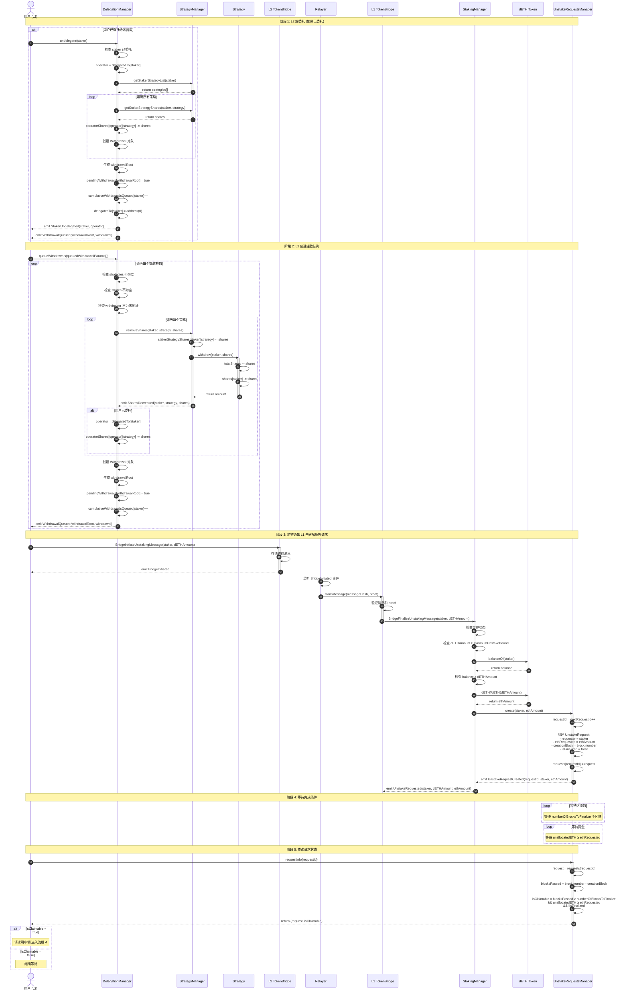
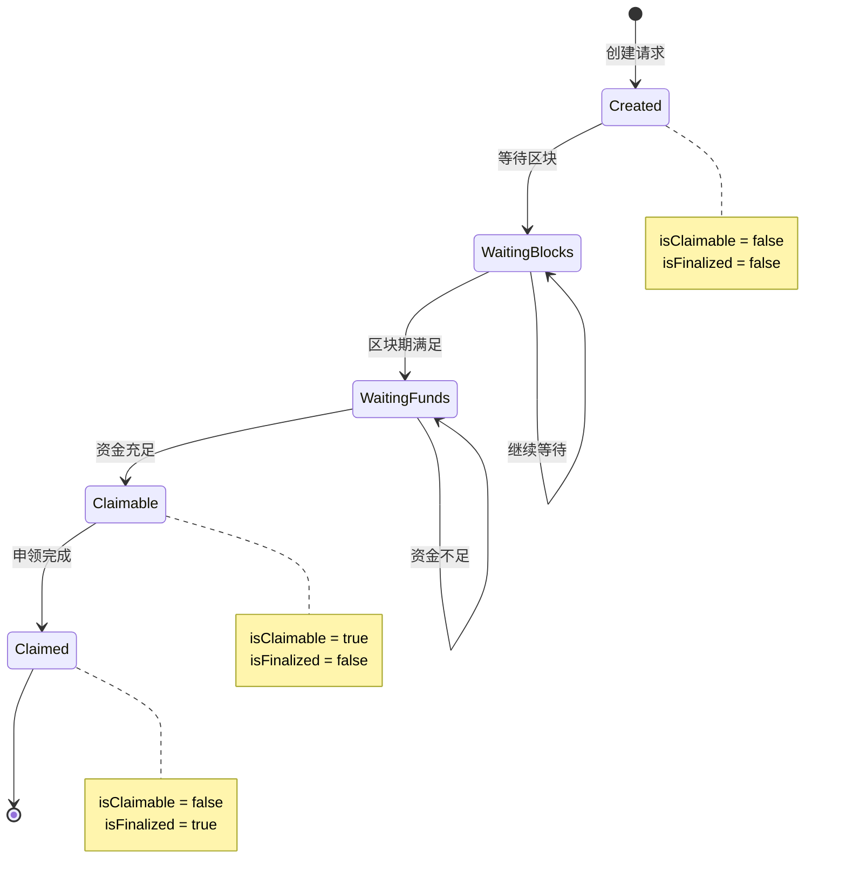

# 流程 3: 排队取款 (L2 → L1)

## 📋 目录

- [流程概述](#流程概述)
- [完整流程图](#完整流程图)
- [详细步骤拆解](#详细步骤拆解)
- [关键函数详解](#关键函数详解)
- [请求状态管理](#请求状态管理)
- [错误处理和边界情况](#错误处理和边界情况)

---

## 流程概述

**目标**: 用户在 L2 发起解质押,创建提款请求,等待完成条件满足后才能申领 ETH。

**参与角色**:
- **用户** (L2): 发起解质押和解委托的质押者
- **Relayer**: 中继跨链消息
- **运营商**: 如果用户已委托,需要先解除委托

**关键合约**:
- **L2 层**: DelegationManager, StrategyManager, Strategy
- **桥接层**: L2 TokenBridge, L1 TokenBridge
- **L1 层**: StakingManager, UnstakeRequestsManager, DETH

**核心流程**:
1. 用户在 L2 解除委托 (如果已委托)
2. 用户在 L2 创建提款队列
3. 跨链消息通知 L1 创建解质押请求
4. 等待完成条件: 区块等待期 + 资金充足
5. 查询请求状态,等待可申领

---

## 完整流程图



---

## 详细步骤拆解

### 阶段 1: L2 解委托 (如果已委托)

#### 步骤 1-8: 用户解除委托

**合约**: `DelegationManager.sol`
**函数**: `undelegate(address staker)`
**文件位置**: `src/L2/core/DelegationManager.sol`

```solidity
function undelegate(address staker) external returns (bytes32[] memory withdrawalRoots) {
    // 1. 检查调用权限 (只有 staker 本人或委托批准者可以调用)
    require(
        msg.sender == staker || msg.sender == delegationApprover[staker],
        "DelegationManager.undelegate: caller cannot undelegate staker"
    );

    // 2. 检查 staker 已委托
    require(isDelegated(staker), "DelegationManager.undelegate: staker is not delegated");

    address operator = delegatedTo[staker];

    // 3. 获取 staker 的所有策略
    address[] memory strategies = strategyManager.getStakerStrategyList(staker);

    // 4. 构造提款参数
    QueuedWithdrawalParams[] memory queuedWithdrawalParams = new QueuedWithdrawalParams[](1);
    uint256[] memory shares = new uint256[](strategies.length);

    // 获取每个策略的份额
    for (uint256 i = 0; i < strategies.length; i++) {
        shares[i] = strategyManager.getStakerStrategyShares(staker, strategies[i]);
    }

    queuedWithdrawalParams[0] = QueuedWithdrawalParams({
        strategies: strategies,
        shares: shares,
        withdrawer: staker
    });

    // 5. 创建提款队列
    withdrawalRoots = _queueWithdrawals(staker, queuedWithdrawalParams);

    // 6. 减少运营商份额
    for (uint256 i = 0; i < strategies.length; i++) {
        _decreaseOperatorShares(operator, strategies[i], shares[i]);
    }

    // 7. 清除委托关系
    delegatedTo[staker] = address(0);

    // 8. 触发事件
    emit StakerUndelegated(staker, operator);

    return withdrawalRoots;
}
```

**关键点**:
- 解委托会自动创建提款队列
- 运营商的 `operatorShares` 会立即减少
- 委托关系立即清除,但资产仍在提款队列中

**状态变化**:
- `delegatedTo[staker]` 设置为 `address(0)`
- `operatorShares[operator][strategy]` 减少相应份额
- 创建 Withdrawal 对象并加入待处理提款队列

---

### 阶段 2: L2 创建提款队列

#### 步骤 9-18: 用户创建提款队列

**合约**: `DelegationManager.sol`
**函数**: `queueWithdrawals(QueuedWithdrawalParams[] calldata queuedWithdrawalParams)`
**文件位置**: `src/L2/core/DelegationManager.sol`

```solidity
struct QueuedWithdrawalParams {
    address[] strategies;  // 要提款的策略列表
    uint256[] shares;      // 每个策略要提款的份额
    address withdrawer;    // 提款接收者地址
}

function queueWithdrawals(
    QueuedWithdrawalParams[] calldata queuedWithdrawalParams
) external returns (bytes32[] memory) {
    bytes32[] memory withdrawalRoots = new bytes32[](queuedWithdrawalParams.length);

    for (uint256 i = 0; i < queuedWithdrawalParams.length; i++) {
        // 验证参数
        require(
            queuedWithdrawalParams[i].strategies.length == queuedWithdrawalParams[i].shares.length,
            "DelegationManager.queueWithdrawal: input length mismatch"
        );
        require(
            queuedWithdrawalParams[i].strategies.length != 0,
            "DelegationManager.queueWithdrawal: strategies cannot be empty"
        );

        // 调用内部函数
        withdrawalRoots[i] = _queueWithdrawal(
            msg.sender,
            queuedWithdrawalParams[i]
        );
    }

    return withdrawalRoots;
}

function _queueWithdrawal(
    address staker,
    QueuedWithdrawalParams memory queuedWithdrawalParams
) internal returns (bytes32) {
    // 1. 从每个策略中移除份额
    uint256[] memory withdrawalAmounts = new uint256[](queuedWithdrawalParams.strategies.length);

    for (uint256 i = 0; i < queuedWithdrawalParams.strategies.length; i++) {
        // 调用 StrategyManager 减少份额
        withdrawalAmounts[i] = strategyManager.removeShares(
            staker,
            queuedWithdrawalParams.strategies[i],
            queuedWithdrawalParams.shares[i]
        );

        // 如果 staker 已委托,减少运营商份额
        if (isDelegated(staker)) {
            address operator = delegatedTo[staker];
            _decreaseOperatorShares(
                operator,
                queuedWithdrawalParams.strategies[i],
                queuedWithdrawalParams.shares[i]
            );
        }
    }

    // 2. 创建 Withdrawal 对象
    Withdrawal memory withdrawal = Withdrawal({
        staker: staker,
        delegatedTo: delegatedTo[staker],  // 可能是 address(0)
        withdrawer: queuedWithdrawalParams.withdrawer,
        nonce: cumulativeWithdrawalsQueued[staker],
        startBlock: uint32(block.number),
        strategies: queuedWithdrawalParams.strategies,
        shares: queuedWithdrawalParams.shares
    });

    // 3. 计算 withdrawalRoot
    bytes32 withdrawalRoot = calculateWithdrawalRoot(withdrawal);

    // 4. 标记为待处理
    pendingWithdrawals[withdrawalRoot] = true;

    // 5. 增加 nonce
    cumulativeWithdrawalsQueued[staker]++;

    // 6. 触发事件
    emit WithdrawalQueued(withdrawalRoot, withdrawal);

    return withdrawalRoot;
}
```

**Withdrawal 结构体**:

```solidity
struct Withdrawal {
    address staker;           // 质押者地址
    address delegatedTo;      // 委托的运营商 (可能是 address(0))
    address withdrawer;       // 提款接收者
    uint256 nonce;            // 质押者的提款 nonce
    uint32 startBlock;        // 提款创建的区块号
    address[] strategies;     // 策略列表
    uint256[] shares;         // 份额列表
}
```

**withdrawalRoot 计算**:

```solidity
function calculateWithdrawalRoot(Withdrawal memory withdrawal) public pure returns (bytes32) {
    return keccak256(abi.encode(withdrawal));
}
```

**状态变化**:
- `Strategy.totalShares` 减少
- `Strategy.shares[staker]` 减少
- `StrategyManager.stakerStrategyShares[staker][strategy]` 减少
- `DelegationManager.operatorShares[operator][strategy]` 减少 (如果已委托)
- `pendingWithdrawals[withdrawalRoot]` 设置为 `true`
- `cumulativeWithdrawalsQueued[staker]` 增加

**StrategyManager.removeShares**:

```solidity
function removeShares(
    address staker,
    address strategy,
    uint256 shares
) external onlyDelegationManager returns (uint256) {
    // 1. 检查份额充足
    require(
        stakerStrategyShares[staker][strategy] >= shares,
        "StrategyManager.removeShares: insufficient shares"
    );

    // 2. 减少 StrategyManager 记录的份额
    stakerStrategyShares[staker][strategy] -= shares;

    // 3. 调用 Strategy 提款
    uint256 withdrawalAmount = IStrategy(strategy).withdraw(staker, shares);

    // 4. 触发事件
    emit SharesDecreased(staker, strategy, shares, withdrawalAmount);

    return withdrawalAmount;
}
```

**Strategy.withdraw**:

```solidity
function withdraw(address staker, uint256 shares)
    external
    onlyStrategyManager
    returns (uint256)
{
    // 1. 检查份额充足
    require(
        this.shares[staker] >= shares,
        "Strategy.withdraw: insufficient shares"
    );

    // 2. 计算对应的资产数量
    uint256 priorTotalShares = totalShares;
    uint256 priorBalance = underlyingToken.balanceOf(address(this));
    uint256 amountToWithdraw = (shares * priorBalance) / priorTotalShares;

    // 3. 更新状态
    totalShares -= shares;
    this.shares[staker] -= shares;

    // 4. 触发事件
    emit Withdraw(staker, shares, amountToWithdraw);

    return amountToWithdraw;
}
```

**注意**:
- ⚠️ `Strategy.withdraw()` 只更新状态,不实际转移资产
- ⚠️ 资产转移在 `DelegationManager.completeQueuedWithdrawal()` 中完成

---

### 阶段 3: 跨链通知 L1 创建解质押请求

#### 步骤 19-21: 跨链消息发送

**合约**: `TokenBridgeBase.sol` (L2 实例)
**函数**: `BridgeInitiateUnstakingMessage(...)`

```solidity
function BridgeInitiateUnstakingMessage(
    address staker,
    uint256 dETHAmount,
    uint256 sourceChainId,
    uint256 destChainId
) external returns (bool) {
    // 1. 构造消息
    bytes memory message = abi.encode(staker, dETHAmount);

    // 2. 发送消息
    getMessageManager().sendMessage(
        destChainId,
        address(this),  // target: L1 TokenBridge
        message
    );

    // 3. 触发事件
    emit BridgeInitiatedUnstaking(staker, dETHAmount);

    return true;
}
```

---

#### 步骤 22-25: Relayer 中继消息

Relayer 监听 `BridgeInitiatedUnstaking` 事件,调用 L1Bridge 的 `claimMessage()`:

```javascript
// Relayer 伪代码
l2Bridge.on('BridgeInitiatedUnstaking', async (staker, dETHAmount, event) => {
    const messageHash = event.transactionHash;
    const proof = await generateProof(event);

    // 中继到 L1
    await l1Bridge.claimMessage(messageHash, proof);
});
```

---

#### 步骤 26-35: L1 创建解质押请求

**合约**: `StakingManager.sol`
**函数**: `unstakeRequest(address staker, uint256 dETHAmount)`
**文件位置**: `src/L1/core/StakingManager.sol`

```solidity
function unstakeRequest(address staker, uint256 dETHAmount) external onlyBridge {
    // 1. 检查暂停状态
    if (IL1Pauser(getLocator().pauser()).isUnstakingPaused()) {
        revert Paused();
    }

    // 2. 检查最小解质押金额
    if (dETHAmount < minimumUnstakeBound) {
        revert UnstakeAmountTooSmall(dETHAmount, minimumUnstakeBound);
    }

    // 3. 检查 staker 的 dETH 余额
    if (getDETH().balanceOf(staker) < dETHAmount) {
        revert InsufficientBalance(getDETH().balanceOf(staker), dETHAmount);
    }

    // 4. 计算对应的 ETH 数量
    uint256 ethAmount = getDETH().dETHToETH(dETHAmount);

    // 5. 调用 UnstakeRequestsManager 创建请求
    getUnstakeRequestsManager().create(staker, ethAmount);

    // 6. 触发事件
    emit UnstakeRequested(staker, dETHAmount, ethAmount);
}
```

**UnstakeRequestsManager.create**:

```solidity
// UnstakeRequestsManager.sol
function create(address requester, uint256 ethAmount) external onlyStakingManager {
    // 1. 生成请求 ID
    uint256 requestId = nextRequestId;
    nextRequestId++;

    // 2. 创建请求对象
    UnstakeRequest memory request = UnstakeRequest({
        requester: requester,
        ethRequested: ethAmount,
        creationBlock: block.number,
        isFinalized: false
    });

    // 3. 存储请求
    requests[requestId] = request;

    // 4. 触发事件
    emit UnstakeRequestCreated(requestId, requester, ethAmount, block.number);
}
```

**UnstakeRequest 结构体**:

```solidity
struct UnstakeRequest {
    address requester;        // 请求者地址
    uint256 ethRequested;     // 请求的 ETH 数量
    uint256 creationBlock;    // 创建区块号
    bool isFinalized;         // 是否已完成
}
```

**状态变化**:
- `UnstakeRequestsManager.requests[requestId]` 存储新请求
- `UnstakeRequestsManager.nextRequestId` 增加
- **注意**: 此时 dETH 尚未销毁,用户余额不变

---

### 阶段 4: 等待完成条件

解质押请求创建后,需要满足以下条件才能申领:

#### 条件 1: 区块等待期

```solidity
// 等待指定数量的区块
uint256 blocksPassed = block.number - request.creationBlock;
require(blocksPassed >= numberOfBlocksToFinalize, "Waiting period not met");
```

**参数**: `numberOfBlocksToFinalize` (可配置,例如 100 区块)

**目的**: 防止用户立即提款,给协议时间准备资金

---

#### 条件 2: 资金充足

```solidity
// UnstakeRequestsManager 必须有足够的 ETH
require(unallocatedETH >= request.ethRequested, "Insufficient unallocated ETH");
```

**资金来源**:
- 管理员调用 `UnstakeRequestsManager.allocateETH()` 分配资金
- 预言机触发收益处理时,部分收益可能分配给 UnstakeRequestsManager

**allocateETH 函数**:

```solidity
// UnstakeRequestsManager.sol
function allocateETH() external payable onlyAllocator {
    unallocatedETH += msg.value;
    emit ETHAllocated(msg.sender, msg.value, unallocatedETH);
}
```

---

#### 条件 3: 请求未完成

```solidity
require(!request.isFinalized, "Request already finalized");
```

**目的**: 防止重复申领

---

### 阶段 5: 查询请求状态

#### 步骤 36-40: 查询请求信息

**合约**: `UnstakeRequestsManager.sol`
**函数**: `requestInfo(uint256 requestId)`
**文件位置**: `src/L1/core/UnstakeRequestsManager.sol`

```solidity
function requestInfo(uint256 requestId)
    external
    view
    returns (UnstakeRequest memory request, bool isClaimable)
{
    // 1. 获取请求对象
    request = requests[requestId];

    // 2. 检查请求是否存在
    require(request.requester != address(0), "Request does not exist");

    // 3. 计算是否可申领
    uint256 blocksPassed = block.number - request.creationBlock;

    isClaimable = 
        blocksPassed >= numberOfBlocksToFinalize &&  // 区块等待期满足
        unallocatedETH >= request.ethRequested &&    // 资金充足
        !request.isFinalized;                        // 请求未完成

    return (request, isClaimable);
}
```

**返回值**:
- `request`: 请求详情
- `isClaimable`: 是否可以立即申领

**用户查询示例**:

```javascript
// 前端代码示例
const [request, isClaimable] = await unstakeRequestsManager.requestInfo(requestId);

if (isClaimable) {
    console.log("可以申领!");
    // 进入流程 4: 取款完成
} else {
    const blocksPassed = currentBlock - request.creationBlock;
    const blocksRemaining = numberOfBlocksToFinalize - blocksPassed;
    console.log(`还需等待 ${blocksRemaining} 个区块`);
    console.log(`需要资金: ${request.ethRequested} ETH`);
    console.log(`可用资金: ${unallocatedETH} ETH`);
}
```

---

## 关键函数详解

### 1. 解委托 vs 提款队列

**区别**:

| 操作 | 函数 | 效果 | 是否需要等待 |
|------|------|------|-------------|
| **解委托** | `undelegate(staker)` | 清除委托关系,减少运营商份额,自动创建提款队列 | 需要 |
| **提款队列** | `queueWithdrawals(...)` | 减少份额,创建提款队列 | 需要 |

**关系**:
- `undelegate()` 内部会调用 `_queueWithdrawals()`
- 如果用户未委托,直接调用 `queueWithdrawals()`
- 两者都需要等待 L2 提款延迟期后才能在 L2 完成提款

---

### 2. withdrawalRoot 的作用

**计算方式**:

```solidity
bytes32 withdrawalRoot = keccak256(abi.encode(withdrawal));
```

**用途**:
1. **唯一标识**: 每个提款队列有唯一的 withdrawalRoot
2. **防止重放**: 使用 `pendingWithdrawals[withdrawalRoot]` 标记状态
3. **验证参数**: 完成提款时需要提供完整的 Withdrawal 对象,重新计算 withdrawalRoot 进行验证

**防止重放攻击**:

```solidity
// DelegationManager.completeQueuedWithdrawal()
bytes32 withdrawalRoot = calculateWithdrawalRoot(withdrawal);
require(pendingWithdrawals[withdrawalRoot], "Withdrawal not pending");

// 完成后删除标记
delete pendingWithdrawals[withdrawalRoot];
```

---

### 3. 两层等待机制

| 层级 | 等待类型 | 参数 | 目的 |
|------|---------|------|------|
| **L2** | 提款延迟期 | `withdrawalDelayBlocks` | 防止闪电贷攻击,给用户时间取消 |
| **L1** | 解质押等待期 | `numberOfBlocksToFinalize` | 给协议时间准备资金 |

**总等待时间** = L2 延迟期 + 跨链消息时间 + L1 等待期

---

### 4. dETH 销毁时机

**重要**: dETH 的销毁**不是**在创建解质押请求时,而是在申领完成时:

```solidity
// StakingManager.claimUnstakeRequest()
function claimUnstakeRequest(uint256 requestId, address bridge, uint256 destChainId) external {
    // ... 验证和转账 ...

    // 在这里才销毁 dETH
    getDETH().burn(request.requester, dETHAmount);

    // ...
}
```

**原因**:
- 创建请求时只是**意向**,还未最终确定
- 如果资金不足,请求可能被取消或延迟
- 销毁 dETH 后无法撤销,所以延迟到最后时刻

---

## 请求状态管理

### 状态图



### 状态查询

**查询函数**:

```solidity
function requestInfo(uint256 requestId)
    external
    view
    returns (UnstakeRequest memory request, bool isClaimable);

function requests(uint256 requestId)
    external
    view
    returns (UnstakeRequest memory);

function nextRequestId() external view returns (uint256);
```

**示例**:

```javascript
// 查询用户的所有请求
async function getUserRequests(userAddress) {
    const events = await unstakeRequestsManager.queryFilter(
        unstakeRequestsManager.filters.UnstakeRequestCreated(null, userAddress)
    );

    const requests = await Promise.all(
        events.map(async (event) => {
            const requestId = event.args.requestId;
            const [request, isClaimable] = await unstakeRequestsManager.requestInfo(requestId);
            return { requestId, request, isClaimable };
        })
    );

    return requests;
}
```

---

## 错误处理和边界情况

### L2 提款队列错误

#### 1. 份额不足

```solidity
// StrategyManager.removeShares()
require(
    stakerStrategyShares[staker][strategy] >= shares,
    "StrategyManager.removeShares: insufficient shares"
);
```

**处理**: 交易回滚,用户需要减少提款份额

---

#### 2. 策略和份额数组长度不匹配

```solidity
// DelegationManager.queueWithdrawals()
require(
    queuedWithdrawalParams[i].strategies.length == queuedWithdrawalParams[i].shares.length,
    "DelegationManager.queueWithdrawal: input length mismatch"
);
```

**处理**: 交易回滚,用户需要修正参数

---

#### 3. 提款者地址为零

```solidity
require(
    queuedWithdrawalParams[i].withdrawer != address(0),
    "DelegationManager.queueWithdrawal: withdrawer cannot be zero address"
);
```

**处理**: 交易回滚,用户需要指定有效的提款接收者

---

### L1 解质押请求错误

#### 4. 解质押金额过小

```solidity
// StakingManager.unstakeRequest()
if (dETHAmount < minimumUnstakeBound) {
    revert UnstakeAmountTooSmall(dETHAmount, minimumUnstakeBound);
}
```

**参数**: `minimumUnstakeBound = 0.01 ETH` (默认)

**处理**: 交易回滚,用户需要增加解质押金额

---

#### 5. dETH 余额不足

```solidity
// StakingManager.unstakeRequest()
if (getDETH().balanceOf(staker) < dETHAmount) {
    revert InsufficientBalance(getDETH().balanceOf(staker), dETHAmount);
}
```

**处理**: 交易回滚,用户需要减少解质押金额

---

#### 6. 合约暂停

```solidity
// StakingManager.unstakeRequest()
if (IL1Pauser(getLocator().pauser()).isUnstakingPaused()) {
    revert Paused();
}
```

**处理**: 交易回滚,等待管理员解除暂停

---

### 查询相关错误

#### 7. 请求不存在

```solidity
// UnstakeRequestsManager.requestInfo()
require(request.requester != address(0), "Request does not exist");
```

**处理**: 用户输入了无效的 requestId

---

### 边界情况

#### 8. 资金长期不足

**情况**: `UnstakeRequestsManager.unallocatedETH` 一直小于 `request.ethRequested`

**原因**:
- 管理员未及时分配资金
- 大量用户同时解质押,资金不足
- 验证者产生的收益不足以覆盖解质押需求

**解决方案**:
1. 管理员调用 `allocateETH()` 补充资金
2. 等待验证者产生更多收益
3. 启动新验证者增加资金来源

---

#### 9. 跨链消息延迟

**情况**: L2 创建提款队列后,L1 长时间未收到消息

**原因**:
- Relayer 宕机
- 网络拥堵
- 跨链桥暂停

**解决方案**:
- Relayer 恢复后会继续中继
- 消息队列保证消息不会丢失
- 用户可以查询 L2 事件确认提款队列已创建

---

#### 10. 用户在等待期间转移 dETH

**情况**: 用户创建解质押请求后,将 dETH 转给他人

**影响**:
- 申领时会检查 `balanceOf(requester) >= dETHAmount`
- 如果余额不足,申领失败

**后果**:
- 请求无法完成
- 占用 UnstakeRequestsManager 的资金
- 需要管理员介入取消请求

**建议**: 添加 dETH 锁定机制,创建请求时临时锁定相应的 dETH

---

#### 11. 多个请求竞争资金

**情况**: 多个用户的请求都满足区块等待期,但 `unallocatedETH` 只够满足部分请求

**处理**: 先到先得 (First-Come-First-Served)

```solidity
// Relayer 按照 requestId 顺序处理
for (let requestId = 0; requestId < nextRequestId; requestId++) {
    const [request, isClaimable] = await unstakeRequestsManager.requestInfo(requestId);
    if (isClaimable) {
        await stakingManager.claimUnstakeRequest(requestId, ...);
    }
}
```

---

## 总结

### 关键要点

1. **两层提款机制**:
   - **L2 提款队列**: 从策略中移除份额,等待 L2 延迟期
   - **L1 解质押请求**: 等待区块期 + 资金充足

2. **委托与提款**:
   - 解委托会自动创建提款队列
   - 提款时运营商份额立即减少
   - 资产仍在合约中,需要完成提款才能取回

3. **两层等待时间**:
   - L2 延迟期: 防止闪电贷攻击
   - L1 等待期: 给协议时间准备资金

4. **dETH 销毁延迟**:
   - 创建请求时不销毁 dETH
   - 申领完成时才销毁
   - 防止因资金不足导致 dETH 被销毁但 ETH 无法取回

5. **状态查询**:
   - 用户需要主动查询 `requestInfo()` 了解请求状态
   - `isClaimable` 表示是否可以立即申领
   - 可以通过事件查询用户的所有请求

### 完整时间线

```
T0: 用户在 L2 创建提款队列
↓
T1: 等待 L2 延迟期 (例如 50400 区块 = 7 天)
↓
T2: 跨链消息发送到 L1
↓
T3: Relayer 中继消息,L1 创建解质押请求
↓
T4: 等待 L1 区块期 (例如 100 区块)
↓
T5: 等待资金充足 (unallocatedETH ≥ ethRequested)
↓
T6: 请求可申领 (isClaimable = true)
↓
T7: 进入流程 4: 取款完成
```

### 相关文档

- [系统架构图](./architecture.md)
- [质押流程详解](./1-staking-flow.md)
- [奖励分发详解](./2-rewards-flow.md)
- [取款完成详解](./4-withdrawal-flow.md)
