# 流程 4: 取款完成

## 📋 目录

- [流程概述](#流程概述)
- [完整流程图](#完整流程图)
- [详细步骤拆解](#详细步骤拆解)
- [关键函数详解](#关键函数详解)
- [跨链资金流动](#跨链资金流动)
- [错误处理和边界情况](#错误处理和边界情况)

---

## 流程概述

**目标**: 当解质押请求满足完成条件后,Relayer 触发申领,销毁 dETH,桥接 ETH 到 L2,用户完成提款。

**参与角色**:
- **Relayer**: 监控并触发申领流程
- **用户** (L1/L2): 最终接收 ETH 的地址

**关键合约**:
- **L1 层**: StakingManager, UnstakeRequestsManager, DETH, L1 TokenBridge
- **桥接层**: MessageManager, Relayer
- **L2 层**: L2 TokenBridge, DelegationManager, StrategyManager

**核心流程**:
1. Relayer 触发 L1 申领
2. StakingManager 销毁 dETH
3. UnstakeRequestsManager 转移 ETH
4. ETH 桥接到 L2
5. 同步 L1 返还份额到 L2
6. L2 完成提款队列
7. 用户收到 WETH/ETH

---

## 完整流程图

```mermaid
sequenceDiagram
    autonumber
    participant Relayer as Relayer (链下)
    participant StakingMgr as StakingManager
    participant UnstakeMgr as UnstakeRequestsManager
    participant DETH as dETH Token
    participant L1Bridge as L1 TokenBridge
    participant MessageMgr as MessageManager
    participant L2Bridge as L2 TokenBridge
    participant StrategyMgr as StrategyManager
    participant DelegationMgr as DelegationManager
    participant Strategy as Strategy
    actor User as 用户 (L2)

    Note over Relayer,User: 前提: 解质押请求已可申领 (isClaimable = true)

    Note over Relayer,UnstakeMgr: 阶段 1: Relayer 触发 L1 申领

    Relayer->>Relayer: 监控 UnstakeRequestsManager<br/>查询可申领请求
    
    loop 遍历所有待处理请求
        Relayer->>UnstakeMgr: requestInfo(requestId)
        activate UnstakeMgr
        UnstakeMgr-->>Relayer: return (request, isClaimable)
        deactivate UnstakeMgr

        alt isClaimable = true
            Relayer->>StakingMgr: claimUnstakeRequest(requestId, bridge, l2Strategy, destChainId)
        end
    end

    activate StakingMgr

    Note over StakingMgr,UnstakeMgr: 阶段 2: 验证和准备

    StakingMgr->>UnstakeMgr: getRequest(requestId)
    activate UnstakeMgr
    UnstakeMgr-->>StakingMgr: return request
    deactivate UnstakeMgr

    StakingMgr->>StakingMgr: 检查 request.requester != address(0)
    StakingMgr->>StakingMgr: 检查 !request.isFinalized

    StakingMgr->>UnstakeMgr: checkClaimable(requestId)
    activate UnstakeMgr
    UnstakeMgr->>UnstakeMgr: 检查区块等待期满足
    UnstakeMgr->>UnstakeMgr: 检查资金充足
    UnstakeMgr-->>StakingMgr: require(isClaimable)
    deactivate UnstakeMgr

    Note over StakingMgr,DETH: 阶段 3: 销毁 dETH

    StakingMgr->>DETH: ethToDETH(request.ethRequested)
    activate DETH
    DETH-->>StakingMgr: return dETHAmount
    deactivate DETH

    StakingMgr->>DETH: balanceOf(request.requester)
    activate DETH
    DETH-->>StakingMgr: return balance
    deactivate DETH

    StakingMgr->>StakingMgr: 检查 balance ≥ dETHAmount

    StakingMgr->>DETH: burn(request.requester, dETHAmount)
    activate DETH
    DETH->>DETH: totalSupply -= dETHAmount
    DETH->>DETH: balances[requester] -= dETHAmount
    DETH-->>StakingMgr: emit Transfer(requester, 0x0, dETHAmount)
    deactivate DETH

    Note over StakingMgr,L1Bridge: 阶段 4: 桥接 ETH 到 L2

    StakingMgr->>L1Bridge: BridgeInitiateETH(l2Recipient, ethAmount)
    activate L1Bridge
    L1Bridge->>L1Bridge: 接收 ETH
    L1Bridge->>MessageMgr: sendMessage(destChainId, target, message)
    activate MessageMgr
    MessageMgr->>MessageMgr: 存储消息
    MessageMgr->>MessageMgr: messageHash = hash(message)
    MessageMgr-->>L1Bridge: return messageHash
    deactivate MessageMgr
    L1Bridge-->>StakingMgr: emit BridgeInitiated(l2Recipient, ethAmount)
    deactivate L1Bridge

    Note over StakingMgr,UnstakeMgr: 阶段 5: 标记请求已完成

    StakingMgr->>UnstakeMgr: finalize(requestId)
    activate UnstakeMgr
    UnstakeMgr->>UnstakeMgr: requests[requestId].isFinalized = true
    UnstakeMgr->>UnstakeMgr: unallocatedETH -= request.ethRequested
    UnstakeMgr-->>StakingMgr: emit UnstakeRequestFinalized(requestId)
    deactivate UnstakeMgr

    StakingMgr-->>Relayer: emit UnstakeClaimed(requestId, requester, ethAmount)
    deactivate StakingMgr

    Note over Relayer,L2Bridge: 阶段 6: Relayer 中继 ETH 到 L2

    Relayer->>Relayer: 监听 BridgeInitiated 事件
    Relayer->>L2Bridge: claimMessage(messageHash, proof)
    activate L2Bridge
    L2Bridge->>MessageMgr: verifyMessage(messageHash, proof)
    activate MessageMgr
    MessageMgr->>MessageMgr: 验证 proof
    MessageMgr-->>L2Bridge: return verified
    deactivate MessageMgr

    L2Bridge->>L2Bridge: BridgeFinalizeETH(l2Recipient, ethAmount)
    L2Bridge->>User: transfer(ethAmount) 或 deposit to WETH
    L2Bridge-->>Relayer: emit BridgeFinalized(l2Recipient, ethAmount)
    deactivate L2Bridge

    Note over Relayer,DelegationMgr: 阶段 7: 同步 L1 返还份额 (可选)

    alt L2 有待完成的提款队列
        Relayer->>StrategyMgr: migrateRelatedL1StakerShares(staker, dETHAmount)
        activate StrategyMgr
        StrategyMgr->>StrategyMgr: 将 dETH 转换为策略份额
        StrategyMgr->>Strategy: deposit(staker, amount)
        activate Strategy
        Strategy->>Strategy: 计算份额
        Strategy->>Strategy: shares[staker] += 份额
        Strategy->>Strategy: totalShares += 份额
        Strategy-->>StrategyMgr: return 份额
        deactivate Strategy
        StrategyMgr->>StrategyMgr: stakerStrategyShares[staker][strategy] += 份额
        StrategyMgr-->>Relayer: emit SharesIncreased(staker, strategy, 份额)
        deactivate StrategyMgr

        Note over User,DelegationMgr: 阶段 8: L2 完成提款队列

        User->>DelegationMgr: completeQueuedWithdrawal(withdrawal, receiveAsTokens)
        activate DelegationMgr

        DelegationMgr->>DelegationMgr: 计算 withdrawalRoot
        DelegationMgr->>DelegationMgr: 检查 pendingWithdrawals[withdrawalRoot] = true

        DelegationMgr->>DelegationMgr: 检查 msg.sender = withdrawal.withdrawer
        DelegationMgr->>DelegationMgr: 检查提款延迟期满足

        alt receiveAsTokens = true
            loop 遍历每个策略
                DelegationMgr->>StrategyMgr: addShares(withdrawer, strategy, shares)
                activate StrategyMgr
                StrategyMgr->>StrategyMgr: stakerStrategyShares[withdrawer][strategy] += shares
                StrategyMgr->>Strategy: deposit(withdrawer, amount)
                activate Strategy
                Strategy->>Strategy: shares[withdrawer] += shares
                Strategy->>Strategy: totalShares += shares
                Strategy-->>StrategyMgr: return shares
                deactivate Strategy
                StrategyMgr-->>DelegationMgr: emit SharesIncreased
                deactivate StrategyMgr
            end
        else receiveAsTokens = false
            loop 遍历每个策略
                DelegationMgr->>Strategy: withdraw(withdrawer, shares)
                activate Strategy
                Strategy->>Strategy: 计算提款金额
                Strategy->>Strategy: totalShares -= shares
                Strategy->>User: transfer(token, amount)
                Strategy-->>DelegationMgr: return amount
                deactivate Strategy
            end
        end

        DelegationMgr->>DelegationMgr: delete pendingWithdrawals[withdrawalRoot]
        DelegationMgr-->>User: emit WithdrawalCompleted(withdrawalRoot)
        deactivate DelegationMgr
    end

    Note over User: 完成! 用户收到 ETH/WETH
```



---

## 详细步骤拆解

### 阶段 1: Relayer 触发 L1 申领

#### 步骤 1-5: Relayer 监控和触发

**Relayer 职责**:
1. 定期查询 `UnstakeRequestsManager` 的所有待处理请求
2. 调用 `requestInfo()` 检查 `isClaimable`
3. 对于可申领的请求,调用 `StakingManager.claimUnstakeRequest()`

**Relayer 伪代码**:

```javascript
// Relayer 主循环
async function processUnstakeRequests() {
    const nextRequestId = await unstakeRequestsManager.nextRequestId();

    for (let requestId = 0; requestId < nextRequestId; requestId++) {
        const [request, isClaimable] = await unstakeRequestsManager.requestInfo(requestId);

        if (!isClaimable || request.isFinalized) {
            continue;  // 跳过不可申领或已完成的请求
        }

        console.log(`Processing request ${requestId} for ${request.requester}`);

        try {
            const tx = await stakingManager.claimUnstakeRequest(
                requestId,
                l1BridgeAddress,
                l2StrategyAddress,
                destChainId
            );
            await tx.wait();
            console.log(`✅ Request ${requestId} claimed successfully`);
        } catch (error) {
            console.error(`❌ Failed to claim request ${requestId}:`, error);
        }
    }
}

// 每 12 秒执行一次 (1 个以太坊区块)
setInterval(processUnstakeRequests, 12000);
```

---

### 阶段 2-3: 验证和销毁 dETH

#### 步骤 6-17: StakingManager 处理申领

**合约**: `StakingManager.sol`
**函数**: `claimUnstakeRequest(uint256 requestId, address bridge, address l2Strategy, uint256 destChainId)`
**文件位置**: `src/L1/core/StakingManager.sol`

```solidity
function claimUnstakeRequest(
    uint256 requestId,
    address bridge,
    address l2Strategy,
    uint256 destChainId
) external onlyRelayer {
    // 1. 获取请求
    IUnstakeRequestsManager unstakeManager = getUnstakeRequestsManager();
    IUnstakeRequestsManager.UnstakeRequest memory request = unstakeManager.getRequest(requestId);

    // 2. 验证请求
    require(request.requester != address(0), "Request does not exist");
    require(!request.isFinalized, "Request already finalized");

    // 3. 检查可申领性
    unstakeManager.checkClaimable(requestId);  // revert if not claimable

    // 4. 计算要销毁的 dETH 数量
    uint256 dETHAmount = getDETH().ethToDETH(request.ethRequested);

    // 5. 检查用户 dETH 余额
    require(
        getDETH().balanceOf(request.requester) >= dETHAmount,
        "Insufficient dETH balance"
    );

    // 6. 销毁 dETH
    getDETH().burn(request.requester, dETHAmount);

    // 7. 桥接 ETH 到 L2
    ITokenBridgeBase(bridge).BridgeInitiateETH{value: request.ethRequested}(
        request.requester,  // L2 接收者地址
        request.ethRequested,
        block.chainid,  // sourceChainId
        destChainId
    );

    // 8. 标记请求已完成
    unstakeManager.finalize(requestId);

    // 9. 触发事件
    emit UnstakeClaimed(requestId, request.requester, request.ethRequested, dETHAmount);
}
```

**UnstakeRequestsManager.checkClaimable**:

```solidity
function checkClaimable(uint256 requestId) external view {
    UnstakeRequest memory request = requests[requestId];

    // 1. 检查区块等待期
    uint256 blocksPassed = block.number - request.creationBlock;
    require(
        blocksPassed >= numberOfBlocksToFinalize,
        "Waiting period not met"
    );

    // 2. 检查资金充足
    require(
        unallocatedETH >= request.ethRequested,
        "Insufficient unallocated ETH"
    );

    // 3. 检查未完成
    require(!request.isFinalized, "Request already finalized");
}
```

**UnstakeRequestsManager.finalize**:

```solidity
function finalize(uint256 requestId) external onlyStakingManager {
    UnstakeRequest storage request = requests[requestId];

    // 1. 标记已完成
    request.isFinalized = true;

    // 2. 减少未分配的 ETH
    unallocatedETH -= request.ethRequested;

    // 3. 触发事件
    emit UnstakeRequestFinalized(requestId, request.requester, request.ethRequested);
}
```

**状态变化**:
- `DETH.totalSupply` 减少 `dETHAmount`
- `DETH.balances[requester]` 减少 `dETHAmount`
- `UnstakeRequestsManager.requests[requestId].isFinalized` 设置为 `true`
- `UnstakeRequestsManager.unallocatedETH` 减少 `ethRequested`
- ETH 转移到 L1 TokenBridge

---

### 阶段 4: 桥接 ETH 到 L2

#### 步骤 18-25: L1 桥接合约发起 ETH 转移

**合约**: `TokenBridgeBase.sol` (L1 实例)
**函数**: `BridgeInitiateETH(address to, uint256 amount, uint256 sourceChainId, uint256 destChainId)`
**文件位置**: `src/bridge/core/bridge/TokenBridgeBase.sol`

```solidity
function BridgeInitiateETH(
    address to,
    uint256 amount,
    uint256 sourceChainId,
    uint256 destChainId
) external payable returns (bool) {
    // 1. 验证 ETH 金额
    require(msg.value == amount, "ETH amount mismatch");

    // 2. 构造消息
    bytes memory message = abi.encode(
        to,
        amount
    );

    // 3. 发送跨链消息
    bytes32 messageHash = getMessageManager().sendMessage(
        destChainId,
        address(this),  // target: L2 TokenBridge
        message
    );

    // 4. 触发事件
    emit BridgeInitiated(to, amount, messageHash);

    return true;
}
```

**MessageManager.sendMessage**:

```solidity
function sendMessage(
    uint256 destChainId,
    address target,
    bytes memory message
) external returns (bytes32 messageHash) {
    // 1. 生成消息哈希
    messageHash = keccak256(abi.encode(
        block.chainid,      // sourceChainId
        destChainId,
        msg.sender,         // sender: L1 TokenBridge
        target,             // target: L2 TokenBridge
        message,
        nonce++
    ));

    // 2. 存储消息
    messages[messageHash] = Message({
        sourceChainId: block.chainid,
        destChainId: destChainId,
        sender: msg.sender,
        target: target,
        message: message,
        status: MessageStatus.Pending
    });

    // 3. 触发事件
    emit MessageSent(messageHash, destChainId, target, message);

    return messageHash;
}
```

---

### 阶段 5-6: Relayer 中继 ETH 到 L2

#### 步骤 26-32: Relayer 中继消息

**Relayer 操作**:

```javascript
// 监听 L1 BridgeInitiated 事件
l1Bridge.on('BridgeInitiated', async (to, amount, messageHash, event) => {
    console.log(`Relaying ${amount} ETH to ${to} on L2`);

    // 生成 proof (merkle proof 或其他证明机制)
    const proof = await generateProof(event);

    // 在 L2 申领消息
    const tx = await l2Bridge.claimMessage(messageHash, proof);
    await tx.wait();

    console.log(`✅ ${amount} ETH bridged to L2`);
});
```

**L2 TokenBridge.claimMessage**:

```solidity
function claimMessage(
    bytes32 messageHash,
    bytes memory proof
) external returns (bool) {
    // 1. 验证消息
    Message memory message = getMessageManager().verifyMessage(messageHash, proof);

    require(message.target == address(this), "Invalid target");
    require(message.status == MessageStatus.Pending, "Message not pending");

    // 2. 解码消息
    (address to, uint256 amount) = abi.decode(message.message, (address, uint256));

    // 3. 最终化 ETH 转移
    BridgeFinalizeETH(to, amount);

    // 4. 更新消息状态
    getMessageManager().markMessageClaimed(messageHash);

    // 5. 触发事件
    emit BridgeFinalized(to, amount, messageHash);

    return true;
}

function BridgeFinalizeETH(address to, uint256 amount) internal {
    // 选项 1: 直接转 ETH
    (bool success,) = to.call{value: amount}("");
    require(success, "ETH transfer failed");

    // 选项 2: 转 WETH
    // IWETH(weth).deposit{value: amount}();
    // IWETH(weth).transfer(to, amount);
}
```

**状态变化**:
- 用户在 L2 的 ETH/WETH 余额增加 `amount`
- `MessageManager.messages[messageHash].status` 设置为 `Claimed`

---

### 阶段 7: 同步 L1 返还份额 (可选)

#### 步骤 33-41: 恢复 L2 份额

**场景**: 如果用户在 L2 有待完成的提款队列,需要先恢复份额才能完成提款。

**合约**: `StrategyManager.sol`
**函数**: `migrateRelatedL1StakerShares(address staker, uint256 dETHAmount)`
**文件位置**: `src/L2/core/StrategyManager.sol`

```solidity
function migrateRelatedL1StakerShares(
    address staker,
    uint256 dETHAmount
) external onlyBridge returns (uint256 shares) {
    // 1. 将 dETH 转换为策略资产数量
    // 假设使用默认策略 (例如 WETH Strategy)
    address strategy = defaultStrategy;

    // 2. 调用 Strategy 存入
    shares = IStrategy(strategy).deposit(staker, dETHAmount);

    // 3. 更新 StrategyManager 记录
    stakerStrategyShares[staker][strategy] += shares;

    // 4. 如果是新策略,添加到列表
    if (!_hasStrategy(staker, strategy)) {
        stakerStrategyList[staker].push(strategy);
    }

    // 5. 触发事件
    emit SharesIncreased(staker, strategy, shares, dETHAmount);

    return shares;
}
```

**目的**:
- 将从 L1 返还的 ETH 转换为 L2 策略份额
- 使用户可以完成 L2 的提款队列
- 保持 L1 和 L2 的状态同步

---

### 阶段 8: L2 完成提款队列

#### 步骤 42-56: 用户完成提款

**合约**: `DelegationManager.sol`
**函数**: `completeQueuedWithdrawal(Withdrawal calldata withdrawal, bool receiveAsTokens)`
**文件位置**: `src/L2/core/DelegationManager.sol`

```solidity
function completeQueuedWithdrawal(
    Withdrawal calldata withdrawal,
    bool receiveAsTokens
) external {
    // 1. 计算 withdrawalRoot
    bytes32 withdrawalRoot = calculateWithdrawalRoot(withdrawal);

    // 2. 验证提款存在
    require(
        pendingWithdrawals[withdrawalRoot],
        "Withdrawal does not exist"
    );

    // 3. 验证调用者
    require(
        msg.sender == withdrawal.withdrawer,
        "Only withdrawer can complete"
    );

    // 4. 检查提款延迟期
    uint256 blocksPassed = block.number - withdrawal.startBlock;
    require(
        blocksPassed >= withdrawalDelayBlocks,
        "Withdrawal delay not met"
    );

    // 5. 处理提款
    if (receiveAsTokens) {
        // 选项 A: 重新存入策略,恢复份额
        for (uint256 i = 0; i < withdrawal.strategies.length; i++) {
            strategyManager.addShares(
                withdrawal.withdrawer,
                withdrawal.strategies[i],
                withdrawal.shares[i]
            );
        }
    } else {
        // 选项 B: 提取为代币
        for (uint256 i = 0; i < withdrawal.strategies.length; i++) {
            IStrategy(withdrawal.strategies[i]).withdraw(
                withdrawal.withdrawer,
                withdrawal.shares[i]
            );
        }
    }

    // 6. 删除待处理标记
    delete pendingWithdrawals[withdrawalRoot];

    // 7. 触发事件
    emit WithdrawalCompleted(withdrawalRoot, withdrawal.withdrawer);
}
```

**receiveAsTokens 参数**:

| 值 | 行为 | 结果 |
|----|------|------|
| `true` | 恢复份额,重新存入策略 | 用户获得策略份额,可以继续质押 |
| `false` | 提取为基础代币 | 用户获得 WETH/ETH,完全退出 |

**状态变化**:
- `pendingWithdrawals[withdrawalRoot]` 删除
- 如果 `receiveAsTokens = false`:
  - `Strategy.totalShares` 不变 (已在 `queueWithdrawals` 时减少)
  - 用户收到 WETH/ETH
- 如果 `receiveAsTokens = true`:
  - `Strategy.totalShares` 增加
  - `StrategyManager.stakerStrategyShares` 增加

---

## 关键函数详解

### 1. dETH 销毁和 ETH 提取的汇率

**销毁 dETH 时的汇率**:

```solidity
// 计算要销毁的 dETH 数量
uint256 dETHAmount = getDETH().ethToDETH(ethRequested);

// DETH.ethToDETH()
function ethToDETH(uint256 ethAmount) public view returns (uint256) {
    uint256 totalETH = getTotalControlledETH();
    uint256 supply = totalSupply();

    if (supply == 0) return ethAmount;

    // dETH 数量 = ethAmount * (supply / totalETH)
    return (ethAmount * supply) / totalETH;
}
```

**示例**:

```
假设:
- totalControlledETH = 100 ETH
- dETH totalSupply = 90 (由于收益,汇率 > 1)
- 汇率 = 100 / 90 ≈ 1.111 ETH per dETH

用户请求提取 10 ETH:
- 要销毁的 dETH = 10 * (90 / 100) = 9 dETH

验证:
- 9 dETH * 1.111 = 10 ETH ✅
```

---

### 2. 资金流动路径

**L1 → L2 资金流**:

```
UnstakeRequestsManager.unallocatedETH
  ↓ (转移)
L1 TokenBridge
  ↓ (跨链)
L2 TokenBridge
  ↓ (转账)
用户 L2 地址 (ETH 或 WETH)
```

**资金准备**:

```solidity
// 管理员分配资金到 UnstakeRequestsManager
function allocateETH() external payable onlyAllocator {
    unallocatedETH += msg.value;
    emit ETHAllocated(msg.sender, msg.value, unallocatedETH);
}

// 资金来源
// 1. StakingManager 的 unallocatedETH
// 2. 验证者退出时的本金
// 3. 预言机处理收益时分配的资金
```

---

### 3. L2 提款延迟期

**目的**: 防止闪电贷攻击和恶意提款

**参数**: `withdrawalDelayBlocks` (可配置,例如 50400 区块 ≈ 7 天)

**检查**:

```solidity
// DelegationManager.completeQueuedWithdrawal()
uint256 blocksPassed = block.number - withdrawal.startBlock;
require(
    blocksPassed >= withdrawalDelayBlocks,
    "Withdrawal delay not met"
);
```

---

### 4. 两种完成方式对比

| 方式 | `receiveAsTokens` | 适用场景 | 结果 |
|------|-------------------|---------|------|
| **重新质押** | `true` | 用户想继续参与质押 | 恢复策略份额,可以再次委托 |
| **完全退出** | `false` | 用户想完全退出协议 | 收到 WETH/ETH,可以自由使用 |

**重新质押的优势**:
- 无需再次质押,节省 gas
- 保持委托关系 (如果之前已委托)
- 可以立即获得新的奖励

**完全退出的优势**:
- 获得流动性
- 可以在其他协议使用 ETH
- 完全控制资金

---

## 跨链资金流动

### 完整资金流图

```mermaid
graph TB
    subgraph "L1 层"
        A[用户存入 ETH] -->|质押| B[StakingManager]
        B -->|启动验证者| C[Beacon Chain Deposit]
        C -->|验证者奖励| D[ReturnsReceiver]
        D -->|CL 收益| B
        D -->|EL 收益| E[ReturnsAggregator]
        E -->|90% 净收益| B

        B -->|分配资金| F[UnstakeRequestsManager]
        F -->|申领时转移| G[L1 TokenBridge]
    end

    subgraph "桥接层"
        G -->|跨链消息| H[MessageManager]
        H -->|Relayer 中继| I[L2 MessageManager]
        I -->|验证后转移| J[L2 TokenBridge]
    end

    subgraph "L2 层"
        J -->|最终化| K[用户 L2 地址]
        K -->|完成提款队列| L[DelegationManager]

        alt 重新质押
            L -->|恢复份额| M[StrategyManager]
            M -->|存入| N[Strategy]
        end

        alt 完全退出
            L -->|提取代币| O[WETH/ETH]
        end
    end

    style A fill:#e1f5ff
    style B fill:#ffcccc
    style F fill:#ffcccc
    style G fill:#fff4e1
    style J fill:#fff4e1
    style K fill:#e1f5ff
    style L fill:#ccffcc
    style M fill:#ccccff
    style N fill:#ccccff
    style O fill:#e1ffe1
```

### 资金数量变化

**L1 层**:

```
StakingManager.unallocatedETH:           100 ETH
UnstakeRequestsManager.unallocatedETH:    50 ETH
用户请求提取:                             10 ETH

申领后:
StakingManager.unallocatedETH:           100 ETH (不变)
UnstakeRequestsManager.unallocatedETH:    40 ETH (-10)
L1 TokenBridge (临时持有):                10 ETH
```

**桥接过程**:

```
L1 TokenBridge:  10 ETH → 0 ETH (跨链转移)
L2 TokenBridge:   0 ETH → 10 ETH (接收)
```

**L2 层**:

```
L2 TokenBridge:  10 ETH → 0 ETH (转给用户)
用户 L2 地址:     0 ETH → 10 ETH
```

---

## 错误处理和边界情况

### L1 申领相关错误

#### 1. 请求不存在

```solidity
// StakingManager.claimUnstakeRequest()
require(request.requester != address(0), "Request does not exist");
```

**原因**: Relayer 使用了无效的 `requestId`

**处理**: 交易回滚,Relayer 需要修正参数

---

#### 2. 请求已完成

```solidity
require(!request.isFinalized, "Request already finalized");
```

**原因**:
- 请求已被其他 Relayer 处理
- Relayer 重复处理同一请求

**处理**: 交易回滚,Relayer 跳过此请求

---

#### 3. 不可申领

```solidity
// UnstakeRequestsManager.checkClaimable()
require(blocksPassed >= numberOfBlocksToFinalize, "Waiting period not met");
require(unallocatedETH >= request.ethRequested, "Insufficient unallocated ETH");
```

**原因**:
- 区块等待期未满足
- 资金不足

**处理**: 交易回滚,Relayer 稍后重试

---

#### 4. dETH 余额不足

```solidity
require(
    getDETH().balanceOf(request.requester) >= dETHAmount,
    "Insufficient dETH balance"
);
```

**原因**: 用户在创建请求后转移了 dETH

**影响**: 请求无法完成,占用资金

**解决方案**:
1. 管理员取消请求,释放资金
2. 用户补充 dETH 余额
3. 实现 dETH 锁定机制

---

### 跨链相关错误

#### 5. 桥接失败

```solidity
// TokenBridgeBase.BridgeInitiateETH()
require(msg.value == amount, "ETH amount mismatch");
```

**原因**: 调用时发送的 ETH 与参数不匹配

**处理**: 交易回滚,整个申领失败

---

#### 6. 消息验证失败

```solidity
// L2 TokenBridge.claimMessage()
Message memory message = getMessageManager().verifyMessage(messageHash, proof);
require(message.target == address(this), "Invalid target");
```

**原因**:
- Proof 无效
- 消息不存在
- 消息已被申领

**处理**: 交易回滚,Relayer 需要重新生成 proof

---

### L2 完成提款相关错误

#### 7. 提款不存在

```solidity
// DelegationManager.completeQueuedWithdrawal()
require(pendingWithdrawals[withdrawalRoot], "Withdrawal does not exist");
```

**原因**:
- 用户计算的 withdrawalRoot 错误
- 提款已被完成

**处理**: 交易回滚,用户需要检查参数

---

#### 8. 未授权完成

```solidity
require(msg.sender == withdrawal.withdrawer, "Only withdrawer can complete");
```

**原因**: 非 `withdrawer` 地址尝试完成提款

**处理**: 交易回滚,只有 `withdrawer` 可以完成

---

#### 9. 延迟期未满足

```solidity
uint256 blocksPassed = block.number - withdrawal.startBlock;
require(blocksPassed >= withdrawalDelayBlocks, "Withdrawal delay not met");
```

**参数**: `withdrawalDelayBlocks = 50400` blocks (≈ 7 天)

**处理**: 交易回滚,用户需要等待

---

#### 10. 份额不足

```solidity
// 如果 receiveAsTokens = true
// StrategyManager.addShares() 内部调用 Strategy.deposit()
// 如果策略余额不足,可能导致汇率异常

// 如果 receiveAsTokens = false
// Strategy.withdraw() 检查份额
require(this.shares[staker] >= shares, "Insufficient shares");
```

**原因**:
- 策略余额异常
- 份额已被其他操作消耗

**处理**: 交易回滚,需要调查原因

---

### 边界情况

#### 11. 同时有多个提款队列

**情况**: 用户在不同时间创建了多个提款队列

**处理**:
- 每个提款队列有唯一的 `withdrawalRoot`
- 可以独立完成,互不影响
- 用户需要分别调用 `completeQueuedWithdrawal()` 完成每个提款

---

#### 12. 跨链消息丢失

**情况**: Relayer 宕机,跨链消息长时间未中继

**影响**:
- L1 已销毁 dETH 并标记请求已完成
- L2 用户未收到 ETH
- 资金被锁定在 L1 TokenBridge

**解决方案**:
1. Relayer 恢复后会继续处理
2. 消息队列保证消息不会丢失
3. 管理员可以手动触发消息中继
4. 实现消息超时机制和退款功能

---

#### 13. dETH 汇率大幅波动

**情况**: 在请求创建和申领之间,dETH 汇率大幅变化

**示例**:

```
创建请求时:
- 汇率 = 1.0 ETH per dETH
- 请求提取 10 ETH
- 预期销毁 10 dETH

申领时 (汇率上升):
- 汇率 = 1.2 ETH per dETH
- 请求提取 10 ETH
- 实际销毁 = 10 / 1.2 ≈ 8.33 dETH
- 用户节省了 1.67 dETH

申领时 (汇率下降,极少见):
- 汇率 = 0.9 ETH per dETH
- 请求提取 10 ETH
- 实际销毁 = 10 / 0.9 ≈ 11.11 dETH
- 用户损失了 1.11 dETH
```

**影响**:
- 汇率上升对用户有利
- 汇率下降可能导致 dETH 余额不足,申领失败

**建议**: 用户应保留足够的 dETH 余额,防止汇率波动导致申领失败

---

#### 14. 全部资金被提取

**情况**: 所有用户都解质押,协议资金耗尽

**影响**:
- `UnstakeRequestsManager.unallocatedETH = 0`
- 后续请求无法申领
- 协议停止运行

**解决方案**:
1. 管理员补充资金
2. 等待新用户质押
3. 等待验证者产生收益
4. 实施提款限额和速率限制

---

## 总结

### 关键要点

1. **Relayer 驱动**: 申领流程由 Relayer 触发,不是用户直接调用
2. **dETH 销毁时机**: 在 L1 申领时销毁,不是在创建请求时
3. **跨链资金转移**: ETH 从 UnstakeRequestsManager → L1 Bridge → L2 Bridge → 用户
4. **两层完成机制**:
   - L1: 销毁 dETH,桥接 ETH
   - L2: 完成提款队列,提取代币或恢复份额
5. **灵活的退出方式**: 用户可以选择重新质押 (receiveAsTokens=true) 或完全退出 (receiveAsTokens=false)

### 完整时间线

```
T0: 解质押请求创建 (流程 3)
↓
T1: 等待区块期 + 资金充足 (流程 3)
↓
T2: Relayer 触发 L1 申领
↓
T3: StakingManager 销毁 dETH
↓
T4: UnstakeRequestsManager 标记已完成,转移 ETH
↓
T5: ETH 桥接到 L2 (跨链消息)
↓
T6: Relayer 中继,L2 收到 ETH
↓
T7: (可选) 恢复 L2 策略份额
↓
T8: 等待 L2 提款延迟期
↓
T9: 用户完成 L2 提款队列
↓
T10: 用户收到 WETH/ETH (完成!)
```

### 设计优势

1. **安全性**:
   - dETH 销毁延迟到最后时刻
   - 两层验证 (L1 + L2)
   - 防重放攻击 (withdrawalRoot)

2. **灵活性**:
   - 支持重新质押和完全退出
   - 用户可以选择提款接收者
   - 支持批量提款队列

3. **可恢复性**:
   - 跨链消息不会丢失
   - Relayer 故障不影响资金安全
   - 管理员可以人工介入

### 改进建议

1. **dETH 锁定**: 创建请求时锁定相应的 dETH,防止用户转移导致申领失败
2. **请求取消**: 允许用户取消未处理的请求,释放资金
3. **优先级机制**: 大额请求优先处理,提高资金利用率
4. **批量申领**: Relayer 可以批量处理多个请求,节省 gas
5. **超时保护**: 跨链消息超时后自动退款
6. **动态延迟期**: 根据网络状况调整提款延迟期

---

### 相关文档

- [系统架构图](./architecture.md)
- [质押流程详解](./1-staking-flow.md)
- [奖励分发详解](./2-rewards-flow.md)
- [解质押流程详解](./3-unstaking-flow.md)

---

**🎉 恭喜! 您已完整了解跨链质押协议的四大核心业务流程!**
