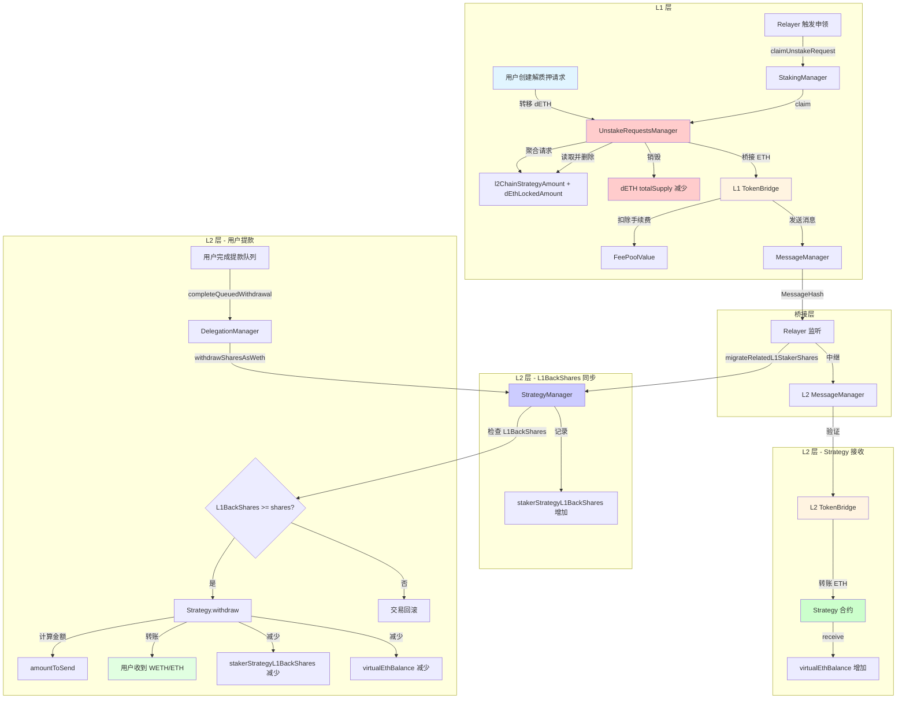
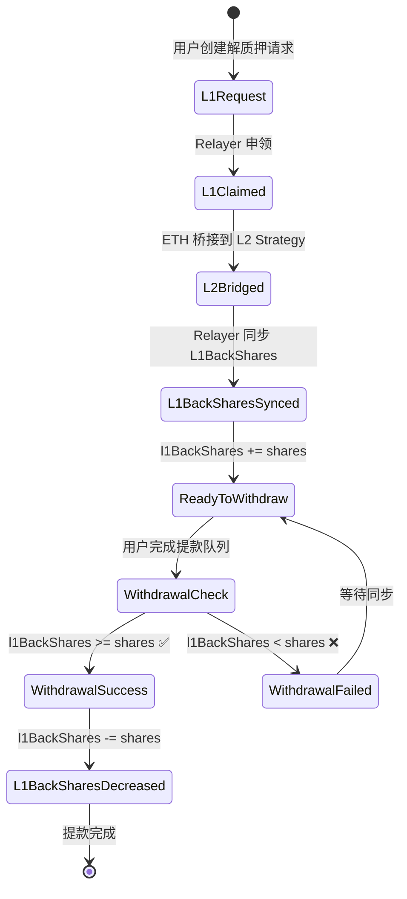

# 流程 4: 取款完成流程 (Claim & Finalize)

## 📋 目录

- [流程概述](#流程概述)
- [完整流程图](#完整流程图)
- [详细步骤拆解](#详细步骤拆解)
- [关键函数详解](#关键函数详解)
- [批量申领机制](#批量申领机制)
- [跨链资金流动](#跨链资金流动)
- [L1BackShares 同步机制](#l1backshares-同步机制)
- [错误处理和边界情况](#错误处理和边界情况)

---

## 流程概述

**目标**: 当解质押请求满足申领条件后,Relayer 触发批量申领,销毁 dETH,桥接 ETH 到 L2 Strategy,同步 L1BackShares,用户完成提款队列并获得资产。

**参与角色**:
- **Relayer**: 监控并批量触发申领流程,同步 L1BackShares
- **用户** (L2): 最终完成提款队列并接收 WETH/ETH 的地址

**关键合约**:
- **L1 层**: StakingManager, UnstakeRequestsManager, DETH, L1 TokenBridge
- **桥接层**: MessageManager, TokenBridge
- **L2 层**: L2 TokenBridge, Strategy, StrategyManager, DelegationManager

**核心特性**:
1. **批量申领机制**: 支持一次处理多个策略的解质押请求
2. **聚合请求模型**: 按 `(destChainId, l2Strategy)` 聚合请求,无单独 requestId
3. **Strategy 接收 ETH**: ETH 桥接到 L2 Strategy 合约,不是用户地址
4. **L1BackShares 同步**: Relayer 调用 `migrateRelatedL1StakerShares()` 更新 L1 返还份额
5. **手续费机制**: 桥接时扣除 1% 手续费

**核心流程**:
1. Relayer 查询可申领请求
2. Relayer 批量触发 L1 申领
3. UnstakeRequestsManager 销毁 dETH
4. UnstakeRequestsManager 通过桥接发送 ETH
5. ETH 桥接到 L2 Strategy 合约
6. Relayer 调用 migrateRelatedL1StakerShares 同步 L1BackShares
7. 用户在 L2 完成提款队列
8. 用户收到 WETH/ETH

---

## 完整流程图

```mermaid
sequenceDiagram
    autonumber
    participant Relayer as Relayer (链下)
    participant StakingMgr as StakingManager (L1)
    participant UnstakeMgr as UnstakeRequestsManager (L1)
    participant DETH as dETH Token (L1)
    participant L1Bridge as L1 TokenBridge
    participant MessageMgr as MessageManager
    participant L2Bridge as L2 TokenBridge (L2)
    participant Strategy as Strategy (L2)
    participant StrategyMgr as StrategyManager (L2)
    participant DelegationMgr as DelegationManager (L2)
    actor User as 用户 (L2)

    Note over Relayer,User: 前提: 解质押请求已创建且资金充足

    Note over Relayer,UnstakeMgr: 阶段 1: Relayer 监控可申领请求

    Relayer->>Relayer: 链下监控循环

    loop 遍历所有 (destChainId, l2Strategy) 组合
        Relayer->>StakingMgr: unstakeRequestInfo(destChainId, l2Strategy)
        activate StakingMgr
        StakingMgr->>UnstakeMgr: requestInfo(destChainId, l2Strategy)
        activate UnstakeMgr
        UnstakeMgr->>UnstakeMgr: 检查区块延迟期 (目前已注释)
        UnstakeMgr->>UnstakeMgr: 计算可申领金额<br/>allocatedEthRequired = cumulativeETH - ethRequested<br/>claimable = min(allocatedETH - allocatedEthRequired, ethRequested)
        UnstakeMgr-->>StakingMgr: return (isFinalized, claimableAmount)
        deactivate UnstakeMgr
        StakingMgr-->>Relayer: return (isFinalized, claimableAmount)
        deactivate StakingMgr

        alt claimableAmount > 0
            Relayer->>Relayer: 将此请求加入批量申领列表<br/>记录 {requestAddress: l2Strategy, unStakeMessageNonce}
        end
    end

    Note over Relayer,UnstakeMgr: 阶段 2: Relayer 批量触发 L1 申领

    Relayer->>StakingMgr: claimUnstakeRequest(requests[], sourceChainId, destChainId, gasLimit)
    activate StakingMgr
    StakingMgr->>StakingMgr: 检查暂停状态<br/>require(!getL1Pauser().isUnstakeRequestsAndClaimsPaused())

    StakingMgr->>UnstakeMgr: claim(requests[], sourceChainId, destChainId, gasLimit)
    activate UnstakeMgr

    loop 遍历 requests[] 数组
        UnstakeMgr->>UnstakeMgr: requester = requests[i].requestAddress  // L2 策略地址
        UnstakeMgr->>UnstakeMgr: _claim(requester, unStakeMessageNonce, sourceChainId, destChainId, gasLimit)

        activate UnstakeMgr
        Note over UnstakeMgr: === 处理单个聚合请求 ===

        UnstakeMgr->>UnstakeMgr: 读取聚合数据<br/>csBlockNumber = l2ChainStrategyBlockNumber[destChainId][requester]<br/>ethRequested = l2ChainStrategyAmount[destChainId][requester]<br/>dETHLocked = dEthLockedAmount[destChainId][requester]

        UnstakeMgr->>UnstakeMgr: 删除聚合数据<br/>delete l2ChainStrategyAmount[destChainId][requester]<br/>delete dEthLockedAmount[destChainId][requester]<br/>delete l2ChainStrategyBlockNumber[destChainId][requester]

        UnstakeMgr-->>Relayer: emit UnstakeRequestClaimed(l2strategy, ethRequested, dETHLocked, destChainId, ...)

        Note over UnstakeMgr,DETH: === 销毁 dETH ===

        UnstakeMgr->>DETH: burn(dETHLocked)
        activate DETH
        DETH->>DETH: _burn(UnstakeRequestsManager, dETHLocked)
        DETH->>DETH: totalSupply -= dETHLocked
        DETH-->>UnstakeMgr: emit Transfer(UnstakeRequestsManager, 0x0, dETHLocked)
        deactivate DETH

        Note over UnstakeMgr,L1Bridge: === 桥接 ETH 到 L2 Strategy ===

        UnstakeMgr->>L1Bridge: SafeCall.callWithMinGas() {value: ethRequested}<br/>BridgeInitiateETH(sourceChainId, destChainId, requester)
        activate L1Bridge

        L1Bridge->>L1Bridge: 验证 sourceChainId == block.chainid
        L1Bridge->>L1Bridge: 验证 destChainId 在支持列表中
        L1Bridge->>L1Bridge: 验证 msg.value >= MinTransferAmount

        L1Bridge->>L1Bridge: FundingPoolBalance[ETH] += msg.value

        L1Bridge->>L1Bridge: 计算手续费<br/>fee = (msg.value × PerFee) / 1_000_000  // 默认 1%<br/>amount = msg.value - fee<br/>FeePoolValue[ETH] += fee

        L1Bridge->>MessageMgr: sendMessage(sourceChainId, destChainId, requester, amount, fee)
        activate MessageMgr
        MessageMgr->>MessageMgr: 生成消息哈希并存储
        MessageMgr-->>L1Bridge: return messageHash
        deactivate MessageMgr

        L1Bridge-->>UnstakeMgr: emit InitiateETH(sourceChainId, destChainId, sender, requester, amount)
        deactivate L1Bridge

        alt SafeCall 失败
            UnstakeMgr->>UnstakeMgr: revert BridgeInitiateETHFailed()
        end

        deactivate UnstakeMgr
    end

    deactivate UnstakeMgr
    deactivate StakingMgr

    Note over Relayer,L2Bridge: 阶段 3: Relayer 中继 ETH 到 L2 Strategy

    Relayer->>Relayer: 监听 L1 Bridge 的 InitiateETH 事件

    loop 遍历每个跨链消息
        Relayer->>L2Bridge: BridgeFinalizeETH(sourceChainId, destChainId, to, amount, fee, nonce)
        activate L2Bridge

        L2Bridge->>L2Bridge: 验证 onlyRole(ReLayer)
        L2Bridge->>L2Bridge: 验证 destChainId == block.chainid
        L2Bridge->>L2Bridge: 验证 sourceChainId 在支持列表中

        L2Bridge->>Strategy: payable(to).call{value: amount}("")  // to 是 Strategy 地址
        activate Strategy
        Strategy->>Strategy: receive() 函数接收 ETH<br/>virtualEthBalance += msg.value
        Strategy-->>L2Bridge: ETH 转账成功
        deactivate Strategy

        L2Bridge->>L2Bridge: FundingPoolBalance[ETH] -= amount

        L2Bridge->>MessageMgr: claimMessage(sourceChainId, destChainId, to, fee, amount, nonce)
        activate MessageMgr
        MessageMgr->>MessageMgr: 验证消息并标记已申领
        MessageMgr-->>L2Bridge: 验证成功
        deactivate MessageMgr

        L2Bridge-->>Relayer: emit FinalizeETH(sourceChainId, destChainId, bridge, to, amount)
        deactivate L2Bridge
    end

    Note over Relayer,StrategyMgr: 阶段 4: Relayer 同步 L1BackShares

    alt 需要同步 L1 返还份额
        Relayer->>StrategyMgr: migrateRelatedL1StakerShares(staker, strategy, shares, l1UnStakeMessageNonce)
        activate StrategyMgr

        StrategyMgr->>StrategyMgr: 验证 onlyRelayer
        StrategyMgr->>StrategyMgr: stakerStrategyL1BackShares[staker][strategy] += shares
        StrategyMgr-->>Relayer: emit MigrateRelatedL1StakerShares(staker, strategy, shares, l1UnStakeMessageNonce)

        deactivate StrategyMgr

        Note right of StrategyMgr: ⭐ 只记录 L1 返还份额<br/>不调用 Strategy.deposit()<br/>不增加 stakerStrategyShares
    end

    Note over User,DelegationMgr: 阶段 5: 用户在 L2 完成提款队列

    User->>DelegationMgr: completeQueuedWithdrawal(withdrawal, weth, middlewareTimesIndex, receiveAsWeth)
    activate DelegationMgr

    DelegationMgr->>DelegationMgr: 检查暂停状态<br/>require(getL2Pauser().isStakerWithdraw())

    DelegationMgr->>DelegationMgr: withdrawalRoot = calculateWithdrawalRoot(withdrawal)
    DelegationMgr->>DelegationMgr: 验证 pendingWithdrawals[withdrawalRoot] == true
    DelegationMgr->>DelegationMgr: 验证 msg.sender == withdrawal.withdrawer

    DelegationMgr->>DelegationMgr: delete pendingWithdrawals[withdrawalRoot]
    DelegationMgr->>DelegationMgr: currentOperator = delegatedTo[msg.sender]

    alt receiveAsWeth = true (提取为 WETH/ETH)
        loop 遍历 withdrawal.strategies[]
            DelegationMgr->>DelegationMgr: 检查延迟期<br/>require(withdrawal.startBlock + strategyWithdrawalDelayBlocks[strategy] <= block.number)

            DelegationMgr->>StrategyMgr: withdrawSharesAsWeth(msg.sender, strategy, shares, weth)
            activate StrategyMgr

            StrategyMgr->>StrategyMgr: ⭐ 检查 L1BackShares<br/>l1BackShares = stakerStrategyL1BackShares[recipient][strategy]<br/>require(l1BackShares >= shares, "Layer1 dETH not released")

            StrategyMgr->>Strategy: withdraw(recipient, weth, shares)
            activate Strategy

            Strategy->>Strategy: 检查暂停状态<br/>require(pauser.isStrategyWithdraw())
            Strategy->>Strategy: _beforeWithdrawal(weth)

            Strategy->>Strategy: 计算虚拟份额和余额<br/>virtualPriorTotalShares = totalShares + SHARES_OFFSET<br/>virtualTokenBalance = ethWethBalance() + BALANCE_OFFSET

            Strategy->>Strategy: 计算提款金额<br/>amountToSend = (virtualTokenBalance × shares) ÷ virtualPriorTotalShares

            Strategy->>Strategy: totalShares -= shares

            alt weth == ETHAddress
                Strategy->>User: payable(recipient).transfer(amountToSend)
                Strategy->>Strategy: virtualEthBalance -= amountToSend
            else weth != ETHAddress
                Strategy->>User: weth.safeTransfer(recipient, amountToSend)
                Strategy->>Strategy: virtualWethBalance -= amountToSend
            end

            Strategy->>StrategyMgr: updateStakerStrategyL1BackShares(recipient, strategy, amountToSend)
            activate StrategyMgr
            StrategyMgr->>StrategyMgr: ⭐ 减少 L1BackShares<br/>require(stakerStrategyL1BackShares[staker][strategy] >= shares)<br/>stakerStrategyL1BackShares[staker][strategy] -= shares
            deactivate StrategyMgr

            Strategy-->>StrategyMgr: return amountToSend
            deactivate Strategy

            deactivate StrategyMgr

            DelegationMgr-->>User: emit WithdrawalCompleted(currentOperator, msg.sender, strategy, shares)
        end

    else receiveAsWeth = false (重新质押)
        loop 遍历 withdrawal.strategies[]
            DelegationMgr->>StrategyMgr: addShares(msg.sender, weth, strategy, shares)
            activate StrategyMgr

            StrategyMgr->>StrategyMgr: stakerStrategyShares[staker][strategy] += shares
            StrategyMgr->>StrategyMgr: 如果是新策略,添加到 stakerStrategyList
            StrategyMgr-->>DelegationMgr: emit Deposit(staker, weth, strategy, shares)

            deactivate StrategyMgr

            alt currentOperator != address(0)
                DelegationMgr->>DelegationMgr: _increaseOperatorShares()<br/>operatorShares[operator][strategy] += shares
            end

            DelegationMgr-->>User: emit WithdrawalCompleted(currentOperator, msg.sender, strategy, shares)
        end
    end

    deactivate DelegationMgr

    Note over User: 完成! 用户收到 WETH/ETH
```



---

## 详细步骤拆解

### 阶段 1: Relayer 监控可申领请求

#### 步骤 1-8: Relayer 查询所有可申领请求

**Relayer 职责**:
1. 维护所有 `(destChainId, l2Strategy)` 组合的列表
2. 定期调用 `StakingManager.unstakeRequestInfo()` 查询可申领金额
3. 对于 `claimableAmount > 0` 的请求,收集到批量申领列表
4. 构造 `requestsInfo[]` 数组准备批量申领

**Relayer 伪代码**:

```javascript
// Relayer 主循环
async function processUnstakeRequests() {
    const strategies = await getL2Strategies(); // 获取所有 L2 策略地址
    const destChainIds = [42161, 10, 8453]; // 支持的 L2 链 ID

    const claimableBatch = [];

    // 遍历所有 (destChainId, l2Strategy) 组合
    for (const destChainId of destChainIds) {
        for (const l2Strategy of strategies) {
            const [isFinalized, claimableAmount] = await stakingManager.unstakeRequestInfo(
                destChainId,
                l2Strategy
            );

            if (claimableAmount > 0) {
                // 查询对应的 unStakeMessageNonce
                const nonce = await getUnStakeMessageNonce(l2Strategy);

                claimableBatch.push({
                    requestAddress: l2Strategy,  // L2 策略地址
                    unStakeMessageNonce: nonce
                });

                console.log(`✅ 发现可申领请求: ${l2Strategy} on chain ${destChainId}, amount: ${claimableAmount}`);
            }
        }
    }

    if (claimableBatch.length === 0) {
        console.log('暂无可申领请求');
        return;
    }

    // 批量申领
    console.log(`📦 准备批量申领 ${claimableBatch.length} 个请求`);
    try {
        const tx = await stakingManager.claimUnstakeRequest(
            claimableBatch,
            sourceChainId,  // 例如: 1 (以太坊主网)
            destChainId,    // 例如: 42161 (Arbitrum)
            gasLimit        // 例如: 2000000
        );
        await tx.wait();
        console.log(`✅ 批量申领成功! TxHash: ${tx.hash}`);
    } catch (error) {
        console.error(`❌ 批量申领失败:`, error);
    }
}

// 每 60 秒执行一次
setInterval(processUnstakeRequests, 60000);
```

---

### 阶段 2: Relayer 批量触发 L1 申领

#### 步骤 9-14: StakingManager 处理批量申领

**合约**: `StakingManager.sol`
**函数**: `claimUnstakeRequest(requestsInfo[] memory requests, uint256 sourceChainId, uint256 destChainId, uint256 gasLimit)`
**文件位置**: `src/L1/core/StakingManager.sol:193-198`

```solidity
/// @notice 批量申领解质押请求
/// @dev Relayer 调用此函数批量处理多个策略的解质押请求
/// @param requests 请求信息数组,每个元素包含 L2 策略地址和消息 nonce
/// @param sourceChainId 源链 ID (L1 链 ID)
/// @param destChainId 目标链 ID (L2 链 ID)
/// @param gasLimit 桥接交易的 gas 限制
function claimUnstakeRequest(
    IUnstakeRequestsManagerWrite.requestsInfo[] memory requests,
    uint256 sourceChainId,
    uint256 destChainId,
    uint256 gasLimit
) external onlyRelayer {
    // 1. 检查暂停状态
    if (getL1Pauser().isUnstakeRequestsAndClaimsPaused()) {
        revert Paused();
    }

    // 2. 委托给 UnstakeRequestsManager 处理
    getUnstakeRequestsManager().claim(requests, sourceChainId, destChainId, gasLimit);
}
```

**requestsInfo 结构体**:

```solidity
/// @notice 解质押请求信息结构体
struct requestsInfo {
    address requestAddress;      // L2 策略合约地址
    uint256 unStakeMessageNonce; // 解质押消息的 nonce
}
```

**关键特性**:
1. **批量处理**: 支持一次申领多个策略的请求
2. **权限控制**: `onlyRelayer` 修饰符,只有授权的 Relayer 可以调用
3. **暂停机制**: 检查 `isUnstakeRequestsAndClaimsPaused()` 状态
4. **委托模式**: 将实际处理委托给 UnstakeRequestsManager

---

#### 步骤 15-37: UnstakeRequestsManager 处理批量申领

**合约**: `UnstakeRequestsManager.sol`
**函数**: `claim(requestsInfo[] memory requests, uint256 sourceChainId, uint256 destChainId, uint256 gasLimit)`
**文件位置**: `src/L1/core/UnstakeRequestsManager.sol:110-120`

```solidity
/// @notice 批量申领解质押请求
/// @dev 遍历 requests 数组,调用 _claim() 处理每个聚合请求
/// @param requests 请求信息数组
/// @param sourceChainId 源链 ID
/// @param destChainId 目标链 ID
/// @param gasLimit 桥接交易的 gas 限制
function claim(
    requestsInfo[] memory requests,
    uint256 sourceChainId,
    uint256 destChainId,
    uint256 gasLimit
) external onlyStakingContract {
    if (requests.length == 0) {
        revert NoRequests();
    }

    for (uint256 i = 0; i < requests.length; i++) {
        address requester = requests[i].requestAddress;  // L2 策略地址
        uint256 unStakeMessageNonce = requests[i].unStakeMessageNonce;
        _claim(requester, unStakeMessageNonce, sourceChainId, destChainId, gasLimit);
    }
}
```

---

#### 步骤 38-60: UnstakeRequestsManager._claim() 处理单个聚合请求

**文件位置**: `src/L1/core/UnstakeRequestsManager.sol:129-163`

```solidity
/// @notice 处理单个聚合请求的申领
/// @dev 读取聚合数据、删除记录、销毁 dETH、桥接 ETH
/// @param requester L2 策略合约地址 (不是用户地址!)
/// @param unStakeMessageNonce 解质押消息 nonce
/// @param sourceChainId 源链 ID
/// @param destChainId 目标链 ID
/// @param gasLimit 桥接交易 gas 限制
function _claim(
    address requester,
    uint256 unStakeMessageNonce,
    uint256 sourceChainId,
    uint256 destChainId,
    uint256 gasLimit
) private {
    // 1. 读取聚合的请求数据
    uint256 csBlockNumber = l2ChainStrategyBlockNumber[destChainId][requester];
    uint256 ethRequested = l2ChainStrategyAmount[destChainId][requester];
    uint256 dETHLocked = dEthLockedAmount[destChainId][requester];

    // 2. ⭐ 删除聚合数据 (一次性清空)
    delete l2ChainStrategyAmount[destChainId][requester];
    delete dEthLockedAmount[destChainId][requester];
    delete l2ChainStrategyBlockNumber[destChainId][requester];

    // 3. Todo: 未来会启用区块延迟检查
    // if (!_isFinalized(csBlockNumber)) {
    //     revert NotFinalized();
    // }

    // 4. 触发申领事件
    emit UnstakeRequestClaimed({
        l2strategy: requester,
        ethRequested: ethRequested,
        dETHLocked: dETHLocked,
        destChainId: destChainId,
        csBlockNumber: csBlockNumber,
        bridgeAddress: getLocator().dapplinkBridge(),
        unStakeMessageNonce: unStakeMessageNonce
    });

    // 5. ⭐ 销毁 dETH (从 UnstakeRequestsManager 的余额中)
    getDETH().burn(dETHLocked);

    // 6. ⭐ 桥接 ETH 到 L2 Strategy
    bool success = SafeCall.callWithMinGas(
        getLocator().dapplinkBridge(),
        gasLimit,
        ethRequested,
        abi.encodeWithSignature(
            "BridgeInitiateETH(uint256,uint256,address)",
            sourceChainId,
            destChainId,
            requester  // ⭐ 接收者是 L2 策略地址,不是用户!
        )
    );

    if (!success) {
        revert BridgeInitiateETHFailed();
    }
}
```

**关键特性**:
1. **聚合数据读取**: 使用 `l2ChainStrategyAmount[destChainId][requester]` 等映射
2. **一次性删除**: 使用 `delete` 清空所有聚合数据
3. **区块延迟检查**: 目前已注释掉 (第 139-142 行)
4. **dETH 销毁位置**: 在这里销毁,不是在 StakingManager
5. **ETH 接收者**: `requester` 是 L2 策略地址,不是用户地址

---

### 阶段 3: 桥接 ETH 到 L2 Strategy

#### 步骤 61-77: L1 TokenBridge 发起跨链转账

**合约**: `TokenBridgeBase.sol`
**函数**: `BridgeInitiateETH(uint256 sourceChainId, uint256 destChainId, address to)`
**文件位置**: `src/bridge/core/bridge/TokenBridgeBase.sol:148-172`

```solidity
/// @notice 发起 ETH 的跨链转账
/// @dev 接收 ETH,扣除手续费,通过 MessageManager 发送跨链消息
/// @param sourceChainId 源链 ID,必须与当前链 ID 一致
/// @param destChainId 目标链 ID,必须在支持的链列表中
/// @param to 目标链上的接收地址 (L2 Strategy 地址)
/// @return 是否成功发起跨链转账
function BridgeInitiateETH(
    uint256 sourceChainId,
    uint256 destChainId,
    address to
) external payable returns (bool) {
    // 1. 验证源链 ID
    if (sourceChainId != block.chainid) {
        revert sourceChainIdError();
    }

    // 2. 验证目标链 ID
    if (!IsSupportChainId(destChainId)) {
        revert ChainIdIsNotSupported(destChainId);
    }

    // 3. 检查最小转账金额
    if (msg.value < MinTransferAmount) {
        revert LessThanMinTransferAmount(MinTransferAmount, msg.value);
    }

    // 4. 增加资金池余额
    FundingPoolBalance[ContractsAddress.ETHAddress] += msg.value;

    // 5. ⭐ 计算手续费
    uint256 fee = (msg.value * PerFee) / 1_000_000;  // 默认 PerFee = 10000 (1%)
    uint256 amount = msg.value - fee;
    FeePoolValue[ContractsAddress.ETHAddress] += fee;

    // 6. ⭐ 调用 MessageManager 发送跨链消息
    messageManager.sendMessage(block.chainid, destChainId, to, amount, fee);

    // 7. 触发事件
    emit InitiateETH(sourceChainId, destChainId, msg.sender, to, amount);

    return true;
}
```

**关键特性**:
1. **没有 amount 参数**: 使用 `msg.value` 直接获取 ETH
2. **手续费机制**: 默认扣除 1% 手续费
3. **资金池管理**: 维护 `FundingPoolBalance` 和 `FeePoolValue`
4. **消息管理器**: 调用 `messageManager.sendMessage()` 发送跨链消息

**手续费计算**:
```
默认配置:
PerFee = 10000
计算公式: fee = (msg.value × 10000) / 1_000_000 = msg.value × 0.01 = 1%

示例:
用户解质押 10 ETH
- msg.value = 10 ETH
- fee = 10 × 0.01 = 0.1 ETH
- amount = 10 - 0.1 = 9.9 ETH (实际到账)
```

---

#### 步骤 78-90: L2 TokenBridge 完成跨链接收

**函数**: `BridgeFinalizeETH(uint256 sourceChainId, uint256 destChainId, address to, uint256 amount, uint256 _fee, uint256 _nonce)`
**文件位置**: `src/bridge/core/bridge/TokenBridgeBase.sol:301-332`

```solidity
/// @notice 在目标链完成 ETH 的跨链接收
/// @dev 由 Relayer 调用,验证跨链消息后将 ETH 转给接收者
/// @param sourceChainId 源链 ID
/// @param destChainId 目标链 ID
/// @param to 接收者地址 (Strategy 地址)
/// @param amount 接收的 ETH 数量 (已扣除手续费)
/// @param _fee 手续费金额
/// @param _nonce 消息序号,用于防止重放攻击
/// @return 是否成功完成跨链接收
function BridgeFinalizeETH(
    uint256 sourceChainId,
    uint256 destChainId,
    address to,
    uint256 amount,
    uint256 _fee,
    uint256 _nonce
) external payable onlyRole(ReLayer) returns (bool) {
    // 1. 验证目标链 ID
    if (destChainId != block.chainid) {
        revert sourceChainIdError();
    }

    // 2. 验证源链 ID
    if (!IsSupportChainId(sourceChainId)) {
        revert ChainIdIsNotSupported(sourceChainId);
    }

    // 3. ⭐ 转账 ETH 到 Strategy
    (bool _ret, ) = payable(to).call{value: amount}("");
    if (!_ret) {
        revert TransferETHFailed();
    }

    // 4. 更新资金池余额
    FundingPoolBalance[ContractsAddress.ETHAddress] -= amount;

    // 5. 标记消息已申领
    messageManager.claimMessage(
        sourceChainId,
        destChainId,
        to,
        _fee,
        amount,
        _nonce
    );

    // 6. 触发事件
    emit FinalizeETH(sourceChainId, destChainId, address(this), to, amount);

    return true;
}
```

**Strategy 接收 ETH**:

**文件位置**: `src/L2/strategies/StrategyBase.sol` (推测)

```solidity
/// @notice 接收 ETH
receive() external payable {
    virtualEthBalance += msg.value;
}
```

**关键特性**:
1. **权限控制**: `onlyRole(ReLayer)` 只有 Relayer 可调用
2. **ETH 转账**: 直接调用 `payable(to).call{value: amount}("")`
3. **Strategy 接收**: Strategy 合约的 `receive()` 函数更新 `virtualEthBalance`
4. **消息验证**: 调用 `messageManager.claimMessage()` 防止重放

---

### 阶段 4: Relayer 同步 L1BackShares

#### 步骤 91-96: 更新 L1 返还份额记录

**合约**: `StrategyManager.sol`
**函数**: `migrateRelatedL1StakerShares(address staker, address strategy, uint256 shares, uint256 l1UnStakeMessageNonce)`
**文件位置**: `src/L2/core/StrategyManager.sol:498-502`

```solidity
/// @notice 迁移 L1 返还的质押者份额
/// @dev 仅 Relayer 可调用,用于记录从 L1 返还的份额
/// @param staker 质押者地址
/// @param strategy 策略合约地址
/// @param shares 返还的份额数量 (不是 dETH 数量!)
/// @param l1UnStakeMessageNonce L1 解质押消息的 nonce
/// @return 是否成功
function migrateRelatedL1StakerShares(
    address staker,
    address strategy,
    uint256 shares,
    uint256 l1UnStakeMessageNonce
) external onlyRelayer returns (bool) {
    // ⭐ 只更新 L1BackShares,不增加 stakerStrategyShares
    stakerStrategyL1BackShares[staker][strategy] += shares;

    emit MigrateRelatedL1StakerShares(staker, strategy, shares, l1UnStakeMessageNonce);

    return true;
}
```

**关键特性**:
1. **4 个参数**: 不是文档中描述的 2 个参数
2. **只记录 L1BackShares**: 不调用 `Strategy.deposit()`,不增加 `stakerStrategyShares`
3. **shares 参数**: 不是 `dETHAmount`,而是策略份额数量
4. **权限控制**: `onlyRelayer` 修饰符

**L1BackShares 的作用**:
- 记录从 L1 返还到 L2 的份额数量
- 在 `withdrawSharesAsWeth()` 时验证: `require(l1BackShares >= shares)`
- 防止用户提取尚未从 L1 迁移的份额
- 在 Strategy 提款后减少: `stakerStrategyL1BackShares[staker][strategy] -= shares`

**Relayer 调用时机**:
```javascript
// Relayer 监听 L1 的 UnstakeRequested 事件
l1StakingManager.on('UnstakeRequested', async (event) => {
    const { staker, l2Strategy, ethAmount, dETHLocked, destChainId, unStakeMessageNonce } = event.args;

    // 等待跨链消息完成
    await waitForBridgeFinalization(unStakeMessageNonce);

    // 计算对应的策略份额
    const shares = await calculateShares(ethAmount, l2Strategy);

    // 同步 L1BackShares
    const tx = await l2StrategyManager.migrateRelatedL1StakerShares(
        staker,
        l2Strategy,
        shares,
        unStakeMessageNonce
    );
    await tx.wait();

    console.log(`✅ L1BackShares 同步成功: ${shares} shares for ${staker}`);
});
```

---

### 阶段 5: 用户在 L2 完成提款队列

#### 步骤 97-144: 完成提款队列

**合约**: `DelegationManager.sol`
**函数**: `completeQueuedWithdrawal(Withdrawal calldata withdrawal, IERC20 weth, uint256 middlewareTimesIndex, bool receiveAsWeth)`
**文件位置**: `src/L2/core/DelegationManager.sol:980-987, 290-349`

```solidity
/// @notice 完成待处理的提款队列
/// @dev 用户调用此函数完成之前创建的提款队列,可选择提取为 WETH 或重新质押
/// @param withdrawal 提款信息结构体
/// @param weth WETH 代币地址
/// @param middlewareTimesIndex 中间件时间索引 (内部未使用)
/// @param receiveAsWeth 是否提取为 WETH (true) 或重新质押 (false)
function completeQueuedWithdrawal(
    Withdrawal calldata withdrawal,
    IERC20 weth,
    uint256 middlewareTimesIndex,
    bool receiveAsWeth
) external nonReentrant {
    require(getL2Pauser().isStakerWithdraw(), "DelegationManager:completeQueuedWithdrawal paused");
    _completeQueuedWithdrawal(withdrawal, weth, middlewareTimesIndex, receiveAsWeth);
}

function _completeQueuedWithdrawal(
    Withdrawal calldata withdrawal,
    IERC20 weth,
    uint256,
    bool receiveAsWeth
) internal {
    // 1. 计算 withdrawalRoot
    bytes32 withdrawalRoot = calculateWithdrawalRoot(withdrawal);

    // 2. 检查提款存在
    require(
        pendingWithdrawals[withdrawalRoot],
        "DelegationManager._completeQueuedWithdrawal: action is not in queue"
    );

    // 3. 检查调用者权限
    require(
        msg.sender == withdrawal.withdrawer,
        "DelegationManager._completeQueuedWithdrawal: only withdrawer can complete action"
    );

    // 4. 删除待处理标记
    delete pendingWithdrawals[withdrawalRoot];

    // 5. 获取当前委托状态
    address currentOperator = delegatedTo[msg.sender];

    if (receiveAsWeth) {
        // 选项 A: 提取为 WETH/ETH
        for (uint256 i = 0; i < withdrawal.strategies.length;) {
            // 检查延迟期
            require(
                withdrawal.startBlock + strategyWithdrawalDelayBlocks[withdrawal.strategies[i]] <= block.number,
                "DelegationManager._completeQueuedWithdrawal: withdrawalDelayBlocks period has not yet passed"
            );

            // 调用 StrategyManager 提取为 WETH
            _withdrawSharesAsWeth({
                withdrawer: msg.sender,
                strategy: withdrawal.strategies[i],
                shares: withdrawal.shares[i],
                weth: weth
            });

            unchecked {
                ++i;
            }
            emit WithdrawalCompleted(currentOperator, msg.sender, withdrawal.strategies[i], withdrawal.shares[i]);
        }
    } else {
        // 选项 B: 重新质押 (恢复份额)
        for (uint256 i = 0; i < withdrawal.strategies.length;) {
            // 恢复 StrategyManager 中的份额
            getStrategyManager().addShares(msg.sender, weth, withdrawal.strategies[i], withdrawal.shares[i]);

            // 如果当前已委托,恢复运营商份额
            if (currentOperator != address(0)) {
                _increaseOperatorShares({
                    operator: currentOperator,
                    staker: msg.sender,
                    strategy: withdrawal.strategies[i],
                    shares: withdrawal.shares[i]
                });
            }

            unchecked {
                ++i;
            }
            emit WithdrawalCompleted(currentOperator, msg.sender, withdrawal.strategies[i], withdrawal.shares[i]);
        }
    }
}
```

---

#### 步骤 145-163: StrategyManager.withdrawSharesAsWeth() 提取为 WETH

**文件位置**: `src/L2/core/StrategyManager.sol:211-224`

```solidity
/// @notice 将份额提取为 WETH 代币
/// @dev 仅 DelegationManager 可调用,检查 L1BackShares 后调用 Strategy.withdraw()
/// @param recipient 接收 WETH 的地址
/// @param strategy 策略合约地址
/// @param shares 要提取的份额数量
/// @param weth WETH 代币合约地址
function withdrawSharesAsWeth(
    address recipient,
    address strategy,
    uint256 shares,
    IERC20 weth
) external onlyDelegationManager {
    // ⭐ 检查 L1 返还的份额是否充足
    uint256 l1BackShares = stakerStrategyL1BackShares[recipient][strategy];
    require(
        l1BackShares >= shares,
        "StrategyManager.withdrawSharesAsWeth: The Layer1 of DETH hasn't been completely released yet"
    );

    // 调用 Strategy 提取
    getStrategy(strategy).withdraw(recipient, weth, shares);
}
```

**关键检查**:
- **L1BackShares 验证**: 只有从 L1 返还的份额才能提款
- 如果 `l1BackShares < shares`,交易会回滚
- 防止用户提取尚未从 L1 迁移的份额

---

#### 步骤 164-186: Strategy.withdraw() 计算并转账

**文件位置**: `src/L2/strategies/StrategyBase.sol:118-144`

```solidity
/// @notice 从策略中提取份额
/// @dev 计算提款金额,更新状态,转账给接收者,减少 L1BackShares
/// @param recipient 接收者地址
/// @param weth WETH 代币地址 (或 ETH 标识符)
/// @param amountShares 要提取的份额数量
function withdraw(
    address recipient,
    IERC20 weth,
    uint256 amountShares
) external virtual override onlyStrategyManager {
    require(pauser.isStrategyWithdraw(), "StrategyBase:withdraw paused");

    _beforeWithdrawal(weth);

    // 1. 记录提款前的总份额
    uint256 priorTotalShares = totalShares;
    require(
        amountShares <= priorTotalShares,
        "StrategyBase.withdraw: amountShares must be less than or equal to totalShares"
    );

    // 2. ⭐ 计算虚拟份额和余额 (防止通胀攻击)
    uint256 virtualPriorTotalShares = priorTotalShares + SHARES_OFFSET;
    uint256 virtualTokenBalance = ethWethBalance() + BALANCE_OFFSET;

    // 3. 计算提款金额
    uint256 amountToSend = (virtualTokenBalance * amountShares) / virtualPriorTotalShares;

    // 4. 更新总份额
    totalShares = priorTotalShares - amountShares;

    // 5. 转账并更新 L1BackShares
    _afterWithdrawal(recipient, weth, amountToSend);
}

/// @notice 提款后处理
/// @dev 转账代币,减少 L1BackShares
function _afterWithdrawal(
    address recipient,
    IERC20 weth,
    uint256 amountToSend
) internal virtual {
    if (address(weth) == ETHAddress.EthAddress) {
        // 转账 ETH
        payable(recipient).transfer(amountToSend);
        virtualEthBalance -= amountToSend;
    } else {
        // 转账 WETH
        weth.safeTransfer(recipient, amountToSend);
        virtualWethBalance -= amountToSend;
    }

    // ⭐ 减少 L1BackShares
    strategyManager.updateStakerStrategyL1BackShares(recipient, address(this), amountToSend);
}
```

**虚拟余额机制**:

防止通胀攻击 (Inflation Attack):
```
假设:
- totalShares = 100
- ethWethBalance() = 110 ETH (包含收益)
- SHARES_OFFSET = 1e3
- BALANCE_OFFSET = 1e3

计算:
virtualPriorTotalShares = 100 + 1000 = 1100
virtualTokenBalance = 110 + 1000 = 1110

用户提取 10 shares:
amountToSend = (1110 × 10) / 1100 = 10.09 ETH

如果没有 OFFSET,攻击者可以通过直接转入 ETH 操纵汇率
使用 OFFSET 后,小额操纵的影响被大幅降低
```

---

#### 步骤 187-189: 更新 L1BackShares

**文件位置**: `src/L2/core/StrategyManager.sol:518-521`

```solidity
/// @notice 更新质押者的 L1 返还份额
/// @dev 用于在提款时减少 L1 返还份额
/// @param staker 质押者地址
/// @param strategy 策略合约地址
/// @param shares 要减少的份额数量
function updateStakerStrategyL1BackShares(
    address staker,
    address strategy,
    uint256 shares
) external onlyStrategiesWhitelistedForDeposit(strategy) {
    require(
        stakerStrategyL1BackShares[staker][strategy] >= shares,
        "StrategyManager: shares to remove is more than staker has"
    );

    // ⭐ 减少 L1BackShares
    stakerStrategyL1BackShares[staker][strategy] -= shares;
}
```

**L1BackShares 生命周期**:
```
1. 创建解质押请求 (流程 3)
   → 用户在 L1 调用 unstakeRequest()

2. Relayer 申领 (流程 4)
   → ETH 桥接到 L2 Strategy
   → Relayer 调用 migrateRelatedL1StakerShares()
   → ⭐ L1BackShares 增加

3. 用户完成提款队列 (流程 4)
   → withdrawSharesAsWeth() 检查 L1BackShares >= shares
   → Strategy.withdraw() 转账给用户
   → updateStakerStrategyL1BackShares() 减少 L1BackShares
   → ⭐ L1BackShares 减少

4. 最终状态
   → L1BackShares = 0 (所有份额已提取)
```

---

## 关键函数详解

### 1. 批量申领 vs 单个申领

**对比**:

| 特性 | 单个申领 (文档描述) | 批量申领 (实际实现) |
|------|-------------------|-------------------|
| **函数签名** | `claimUnstakeRequest(uint256 requestId, ...)` | `claimUnstakeRequest(requestsInfo[] memory requests, ...)` |
| **处理能力** | 一次一个请求 | 一次多个请求 |
| **Gas 效率** | 低 (每个请求单独交易) | 高 (批量处理) |
| **Relayer 负担** | 高 (需要多次调用) | 低 (一次调用) |
| **数据结构** | 使用 `requestId` 索引 | 使用 `(destChainId, l2Strategy)` 键 |

**批量申领示例**:

```javascript
// Relayer 收集多个可申领请求
const requests = [
    {
        requestAddress: '0xStrategy1',  // Arbitrum WETH Strategy
        unStakeMessageNonce: 123
    },
    {
        requestAddress: '0xStrategy2',  // Optimism WETH Strategy
        unStakeMessageNonce: 124
    },
    {
        requestAddress: '0xStrategy3',  // Base WETH Strategy
        unStakeMessageNonce: 125
    }
];

// 一次性申领所有请求
await stakingManager.claimUnstakeRequest(
    requests,
    1,        // sourceChainId: Ethereum
    42161,    // destChainId: Arbitrum (或其他 L2)
    2000000   // gasLimit
);
```

---

### 2. 聚合请求模型详解

**数据结构**:

```solidity
// 不是这样 (文档描述):
// mapping(uint256 => Request) public requests;

// 而是这样 (实际实现):
mapping(uint256 => mapping(address => uint256)) public l2ChainStrategyAmount;
mapping(uint256 => mapping(address => uint256)) public dEthLockedAmount;
mapping(uint256 => mapping(address => uint256)) public l2ChainStrategyBlockNumber;
mapping(uint256 => mapping(address => uint256)) public currentRequestedCumulativeETH;
```

**键的组成**:
- `destChainId`: 目标 L2 链 ID (例如 42161 = Arbitrum)
- `l2Strategy`: L2 上的策略合约地址 (例如 WETH Strategy)

**聚合逻辑**:

```solidity
// 用户 Alice 请求解质押
unstakeRequest(100 dETH, ..., strategyA, chainId);
→ l2ChainStrategyAmount[chainId][strategyA] += 100 ETH
→ dEthLockedAmount[chainId][strategyA] += 100 dETH

// 用户 Bob 请求解质押 (同一策略)
unstakeRequest(200 dETH, ..., strategyA, chainId);
→ l2ChainStrategyAmount[chainId][strategyA] += 200 ETH  // 现在总共 300 ETH
→ dEthLockedAmount[chainId][strategyA] += 200 dETH      // 现在总共 300 dETH

// Relayer 申领时
claim([{requestAddress: strategyA, ...}], ...);
→ 一次性申领 300 ETH
→ 销毁 300 dETH
→ 桥接 300 ETH 到 L2 Strategy
```

**优势**:
1. **节省 gas**: 多个用户的请求合并处理
2. **简化桥接**: 一次跨链消息处理所有聚合的请求
3. **批量销毁**: 一次性销毁大量 dETH,减少交易数

**劣势**:
1. **无法单独取消**: 必须整体申领
2. **区块号覆盖**: 使用最新请求的区块号
3. **资金依赖**: 需要等待所有之前的请求资金到位

---

### 3. ETH 接收者: Strategy vs 用户

**文档描述的流程**:
```
UnstakeRequestsManager._claim()
  → BridgeInitiateETH(user)
  → ETH 桥接到用户 L2 地址
  → 用户收到 ETH
```

**实际流程**:
```
UnstakeRequestsManager._claim()
  → BridgeInitiateETH(l2Strategy)  // ⭐ 接收者是 Strategy!
  → ETH 桥接到 L2 Strategy 合约
  → Strategy.receive() 更新 virtualEthBalance
  → 用户调用 completeQueuedWithdrawal()
  → Strategy.withdraw() 转账给用户
```

**为什么 ETH 转给 Strategy?**

1. **统一管理**: Strategy 统一管理所有用户的资产
2. **份额计算**: 需要根据 Strategy 的总余额计算提款金额
3. **收益分配**: Strategy 可能已产生收益,需要按份额分配
4. **安全性**: 避免直接转账给用户导致的状态不一致

**Strategy 接收 ETH 流程**:

```solidity
// 1. L2 Bridge 转账 ETH
l2Bridge.BridgeFinalizeETH(..., strategyAddress, amount, ...);
  → payable(strategyAddress).call{value: amount}("");

// 2. Strategy 接收 ETH
contract StrategyBase {
    receive() external payable {
        virtualEthBalance += msg.value;
    }
}

// 3. 用户完成提款队列
user.completeQueuedWithdrawal(..., receiveAsWeth = true);
  → Strategy.withdraw(user, shares);
  → amountToSend = (virtualEthBalance × shares) / totalShares;
  → payable(user).transfer(amountToSend);
  → virtualEthBalance -= amountToSend;
```

---

### 4. L1BackShares 的三次检查

**检查点 1: 创建提款队列** (`DelegationManager._removeSharesAndQueueWithdrawal`)

```solidity
for (uint256 i = 0; i < strategies.length;) {
    // ⭐ 检查 L1BackShares
    uint256 l1BackShares = getStrategyManager().getStakerStrategyL1BackShares(staker, strategies[i]);

    // 只有 l1BackShares >= shares[i] 时才处理
    if (l1BackShares >= shares[i]) {
        // 减少运营商份额
        // 移除份额
        // ...
    }
}
```

**效果**: 如果 `l1BackShares < shares[i]`, 跳过该策略,不创建提款队列。

---

**检查点 2: 提取为 WETH** (`StrategyManager.withdrawSharesAsWeth`)

```solidity
function withdrawSharesAsWeth(
    address recipient,
    address strategy,
    uint256 shares,
    IERC20 weth
) external onlyDelegationManager {
    // ⭐ 检查 L1BackShares
    uint256 l1BackShares = stakerStrategyL1BackShares[recipient][strategy];
    require(
        l1BackShares >= shares,
        "StrategyManager.withdrawSharesAsWeth: The Layer1 of DETH hasn't been completely released yet"
    );

    getStrategy(strategy).withdraw(recipient, weth, shares);
}
```

**效果**: 如果 L1 的 dETH 尚未释放,无法提款,交易回滚。

---

**检查点 3: 提款后减少** (`StrategyBase._afterWithdrawal`)

```solidity
function _afterWithdrawal(address recipient, IERC20 weth, uint256 amountToSend) internal virtual {
    // 转账
    if (address(weth) == ETHAddress.EthAddress) {
        payable(recipient).transfer(amountToSend);
        virtualEthBalance -= amountToSend;
    } else {
        weth.safeTransfer(recipient, amountToSend);
        virtualWethBalance -= amountToSend;
    }

    // ⭐ 减少 L1BackShares
    strategyManager.updateStakerStrategyL1BackShares(recipient, address(this), amountToSend);
}
```

**效果**: 提款后,`l1BackShares` 减少,防止重复提款。

---

## 批量申领机制

### 工作原理

**1. Relayer 收集阶段**:

```javascript
const claimableBatch = [];

// 遍历所有已知的策略
for (const strategy of knownStrategies) {
    for (const chainId of supportedChains) {
        const [isFinalized, claimableAmount] = await stakingManager.unstakeRequestInfo(
            chainId,
            strategy
        );

        if (claimableAmount > 0) {
            // 查询最新的 unStakeMessageNonce
            const events = await stakingManager.queryFilter(
                stakingManager.filters.UnstakeRequested(null, strategy, null, null, chainId)
            );
            const latestEvent = events[events.length - 1];
            const nonce = latestEvent.args.unStakeMessageNonce;

            claimableBatch.push({
                requestAddress: strategy,
                unStakeMessageNonce: nonce
            });
        }
    }
}
```

**2. 批量提交阶段**:

```javascript
if (claimableBatch.length > 0) {
    // 根据 destChainId 分组
    const batchesByChain = groupByChainId(claimableBatch);

    for (const [chainId, requests] of batchesByChain) {
        const tx = await stakingManager.claimUnstakeRequest(
            requests,
            1,        // sourceChainId
            chainId,  // destChainId
            2000000   // gasLimit
        );
        await tx.wait();
        console.log(`✅ 申领成功: ${requests.length} 个请求 on chain ${chainId}`);
    }
}
```

**3. 合约处理阶段**:

```solidity
function claim(requestsInfo[] memory requests, ...) external {
    for (uint256 i = 0; i < requests.length; i++) {
        address requester = requests[i].requestAddress;
        uint256 nonce = requests[i].unStakeMessageNonce;

        // 处理单个聚合请求
        _claim(requester, nonce, sourceChainId, destChainId, gasLimit);
        // → 读取聚合数据
        // → 删除聚合数据
        // → 销毁 dETH
        // → 桥接 ETH
    }
}
```

### Gas 优化

**单个申领**:
```
Transaction 1: claim(strategy1) → 200k gas
Transaction 2: claim(strategy2) → 200k gas
Transaction 3: claim(strategy3) → 200k gas
Total: 600k gas + (21k × 3 = 63k base) = 663k gas
```

**批量申领**:
```
Transaction 1: claim([strategy1, strategy2, strategy3])
  → Base: 21k gas
  → First claim: 200k gas
  → Second claim: ~150k gas (warm storage)
  → Third claim: ~150k gas (warm storage)
Total: 21k + 200k + 150k + 150k = 521k gas

节省: 663k - 521k = 142k gas (~21%)
```

---

## 跨链资金流动

### 完整资金流图



### 资金数量变化追踪

**示例: 用户解质押 10 ETH**

**T0: 创建解质押请求**
```
L1 StakingManager:
  - 用户 dETH 余额: 10 dETH → 0 dETH
  - UnstakeRequestsManager dETH 余额: 0 → 10 dETH

L1 UnstakeRequestsManager:
  - l2ChainStrategyAmount[chainId][strategy]: 0 → 10 ETH
  - dEthLockedAmount[chainId][strategy]: 0 → 10 dETH
```

**T1: Relayer 申领**
```
L1 UnstakeRequestsManager:
  - dETH 余额: 10 dETH → 0 dETH (销毁)
  - l2ChainStrategyAmount[chainId][strategy]: 10 ETH → 0 (删除)
  - dEthLockedAmount[chainId][strategy]: 10 dETH → 0 (删除)

L1 dETH:
  - totalSupply: 1000 dETH → 990 dETH

L1 TokenBridge:
  - 接收 ETH: 10 ETH
  - 计算手续费: 0.1 ETH (1%)
  - 发送金额: 9.9 ETH
  - FeePoolValue[ETH]: 0.1 ETH
```

**T2: 跨链到 L2**
```
L2 TokenBridge:
  - 接收 ETH: 9.9 ETH (从 FundingPool)
  - FundingPoolBalance[ETH]: -9.9 ETH

L2 Strategy:
  - virtualEthBalance: 100 ETH → 109.9 ETH
```

**T3: 同步 L1BackShares**
```
L2 StrategyManager:
  - stakerStrategyL1BackShares[user][strategy]: 0 → 9.9 shares
```

**T4: 用户完成提款**
```
假设用户有 10 shares,对应 9.9 ETH

L2 Strategy:
  - totalShares: 100 shares → 90 shares
  - virtualEthBalance: 109.9 ETH → 100 ETH

L2 StrategyManager:
  - stakerStrategyL1BackShares[user][strategy]: 9.9 shares → 0 shares

用户:
  - ETH 余额: 0 → 9.9 ETH
```

**最终损失**:
```
用户投入: 10 ETH
用户收到: 9.9 ETH
手续费损失: 0.1 ETH (1%)
```

---

## L1BackShares 同步机制

### 为什么需要 L1BackShares?

**问题场景**:

```
1. 用户在 L1 有 100 dETH
2. 用户创建解质押请求
3. L2 Strategy 立即显示用户有 100 shares (但 L1 的 ETH 尚未到账)
4. 用户在 L2 尝试提款 100 shares
5. 如果没有 L1BackShares 检查 → 用户提取了不存在的资金 → 协议破产
6. 有 L1BackShares 检查 → require(l1BackShares >= shares) 失败 → 交易回滚 ✅
```

**双花攻击防御**:

```
攻击者尝试:
1. L1 创建解质押请求 (100 dETH → 100 ETH)
2. 立即在 L2 提款 100 shares
3. L1 申领完成后再次提款

防御机制:
1. L1 创建请求后,dETH 转移到 UnstakeRequestsManager (攻击者失去 dETH)
2. L2 提款时检查 l1BackShares
   - 此时 l1BackShares = 0 (尚未同步)
   - require(0 >= 100) 失败
   - 交易回滚 ✅
3. Relayer 申领后同步 l1BackShares = 100
4. 现在用户可以在 L2 提款
5. 提款后 l1BackShares = 0
6. 无法再次提款 ✅
```

### L1BackShares 完整生命周期



### Relayer 同步策略

**同步时机**:

```javascript
// 方案 1: 监听 UnstakeRequestClaimed 事件
unstakeRequestsManager.on('UnstakeRequestClaimed', async (event) => {
    const { l2strategy, ethRequested, dETHLocked, destChainId, unStakeMessageNonce } = event.args;

    // 等待桥接完成
    await waitForBridgeFinalization(unStakeMessageNonce);

    // 计算策略份额
    const shares = await calculateSharesFromETH(ethRequested, l2strategy);

    // 同步 L1BackShares
    await l2StrategyManager.migrateRelatedL1StakerShares(
        userAddress,  // 需要从链下数据库查询
        l2strategy,
        shares,
        unStakeMessageNonce
    );
});

// 方案 2: 定期批量同步
async function batchSyncL1BackShares() {
    const pendingClaims = await getPendingClaims(); // 链下数据库

    for (const claim of pendingClaims) {
        if (await isBridgeFinalized(claim.messageHash)) {
            await l2StrategyManager.migrateRelatedL1StakerShares(
                claim.user,
                claim.l2Strategy,
                claim.shares,
                claim.nonce
            );

            await markClaimSynced(claim.id);
        }
    }
}

setInterval(batchSyncL1BackShares, 60000); // 每 60 秒
```

---

## 错误处理和边界情况

### L1 申领相关错误

#### 1. 暂停状态检查

```solidity
// StakingManager.claimUnstakeRequest()
if (getL1Pauser().isUnstakeRequestsAndClaimsPaused()) {
    revert Paused();
}
```

**原因**: 管理员暂停了申领功能

**处理**: 交易回滚,Relayer 等待恢复后重试

---

#### 2. 批量请求为空

```solidity
// UnstakeRequestsManager.claim()
if (requests.length == 0) {
    revert NoRequests();
}
```

**原因**: Relayer 传入空数组

**处理**: 交易回滚,Relayer 修正逻辑

---

#### 3. 聚合数据不存在

```solidity
function _claim(...) private {
    uint256 ethRequested = l2ChainStrategyAmount[destChainId][requester];
    // 如果 ethRequested = 0,说明请求不存在或已申领
}
```

**原因**:
- 请求已被其他 Relayer 申领
- 请求地址错误

**处理**:
- 不会回滚,但会销毁 0 dETH,桥接 0 ETH
- 建议在 Relayer 中先检查 `claimableAmount > 0`

---

#### 4. 桥接调用失败

```solidity
bool success = SafeCall.callWithMinGas(...);
if (!success) {
    revert BridgeInitiateETHFailed();
}
```

**原因**:
- 桥接合约暂停
- Gas 不足
- 桥接合约错误

**处理**: 交易回滚,整个申领失败,数据不会被删除

---

### 桥接相关错误

#### 5. 源链 ID 不匹配

```solidity
// TokenBridgeBase.BridgeInitiateETH()
if (sourceChainId != block.chainid) {
    revert sourceChainIdError();
}
```

**原因**: Relayer 传入错误的 sourceChainId

**处理**: 交易回滚

---

#### 6. 目标链 ID 不支持

```solidity
if (!IsSupportChainId(destChainId)) {
    revert ChainIdIsNotSupported(destChainId);
}
```

**原因**: 目标链 ID 未在支持列表中

**处理**: 交易回滚,需要管理员添加支持

---

#### 7. 转账金额低于最小值

```solidity
if (msg.value < MinTransferAmount) {
    revert LessThanMinTransferAmount(MinTransferAmount, msg.value);
}
```

**默认值**: `MinTransferAmount = 0.1 ether`

**处理**: 交易回滚,用户需要增加解质押金额

---

#### 8. L2 Bridge 转账失败

```solidity
(bool _ret, ) = payable(to).call{value: amount}("");
if (!_ret) {
    revert TransferETHFailed();
}
```

**原因**:
- Strategy 合约没有 `receive()` 函数
- Strategy 合约 `receive()` 函数回滚

**处理**: 交易回滚,ETH 留在 Bridge,需要手动修复

---

### L2 完成提款相关错误

#### 9. 提款队列不存在

```solidity
require(
    pendingWithdrawals[withdrawalRoot],
    "DelegationManager._completeQueuedWithdrawal: action is not in queue"
);
```

**原因**:
- 用户计算的 withdrawalRoot 错误
- 提款已被完成

**处理**: 交易回滚,用户需要检查参数

---

#### 10. 未授权完成

```solidity
require(
    msg.sender == withdrawal.withdrawer,
    "DelegationManager._completeQueuedWithdrawal: only withdrawer can complete action"
);
```

**原因**: 非 `withdrawer` 地址尝试完成提款

**处理**: 交易回滚,只有 `withdrawer` 可以完成

---

#### 11. 延迟期未满足

```solidity
require(
    withdrawal.startBlock + strategyWithdrawalDelayBlocks[strategy] <= block.number,
    "DelegationManager._completeQueuedWithdrawal: withdrawalDelayBlocks period has not yet passed"
);
```

**默认值**: `strategyWithdrawalDelayBlocks = 50400` blocks (≈ 7 天)

**处理**: 交易回滚,用户需要等待

---

#### 12. L1 dETH 尚未释放

```solidity
// StrategyManager.withdrawSharesAsWeth()
uint256 l1BackShares = stakerStrategyL1BackShares[recipient][strategy];
require(
    l1BackShares >= shares,
    "StrategyManager.withdrawSharesAsWeth: The Layer1 of DETH hasn't been completely released yet"
);
```

**原因**:
- L1 申领尚未完成
- Relayer 尚未同步 L1BackShares

**处理**: 交易回滚,用户需要等待

**解决方案**:
1. 等待 Relayer 申领 L1 请求
2. 等待 Relayer 同步 L1BackShares
3. 检查 `stakerStrategyL1BackShares[user][strategy]` 是否充足

---

### 边界情况

#### 13. 跨链消息丢失

**情况**: Relayer 宕机,跨链消息长时间未中继

**影响**:
- L1 已销毁 dETH 并删除请求数据
- L2 Strategy 未收到 ETH
- ETH 被锁定在 L1 TokenBridge

**解决方案**:
1. Relayer 恢复后会继续处理
2. MessageManager 保证消息不会丢失
3. 管理员可以手动触发消息中继
4. 资金可以通过 `FundingPoolBalance` 追溯

---

#### 14. 手续费导致金额不足

**情况**: 桥接扣除 1% 手续费后,用户收到的金额低于预期

**示例**:
```
用户解质押: 10 ETH
桥接手续费: 0.1 ETH (1%)
实际到账: 9.9 ETH

如果用户的提款队列是 10 shares:
- Strategy 需要 10 ETH 才能满足提款
- 但只收到 9.9 ETH
- 可能导致其他用户无法提款
```

**解决方案**:
1. 用户需要考虑手续费,解质押稍多一点
2. 协议可以设置手续费补偿机制
3. Strategy 可以从收益中补足差额

---

#### 15. L1BackShares 未及时同步

**情况**: Relayer 延迟同步,用户无法及时提款

**时间线**:
```
T0: L1 申领完成
T1: ETH 桥接到 L2 Strategy (5 分钟)
T2: Relayer 应该同步 L1BackShares
T3: Relayer 实际同步 (可能延迟到 T2 + 30 分钟)
T4: 用户可以提款

用户等待时间: T0 → T4 可能长达 1 小时
```

**优化方案**:
1. Relayer 实时监听 `BridgeFinalized` 事件
2. 立即调用 `migrateRelatedL1StakerShares()`
3. 批量处理多个同步请求
4. 设置同步失败重试机制

---

#### 16. 批量申领部分失败

**情况**: 批量申领中某个请求失败导致整个交易回滚

**示例**:
```solidity
function claim(requestsInfo[] memory requests, ...) {
    for (uint256 i = 0; i < requests.length; i++) {
        _claim(...);  // 如果某个失败,整个交易回滚
    }
}
```

**原因**:
- 某个策略的桥接失败
- 某个策略的 dETH 不足

**影响**: 所有其他正常的请求也无法申领

**解决方案**:
1. Relayer 在链下先验证每个请求
2. 只将验证通过的请求打包
3. 或使用 try-catch 机制 (需要修改合约)

---

#### 17. Strategy 余额不足

**情况**: Strategy 接收 ETH 后,余额仍不足以满足所有提款

**示例**:
```
Strategy 状态:
- totalShares = 1000 shares
- virtualEthBalance = 900 ETH

用户 A 提款 100 shares:
- 应得: (900 × 100) / 1000 = 90 ETH ✅

用户 B 提款 200 shares:
- 应得: (900 × 200) / 1000 = 180 ETH
- 但 Strategy 只剩 810 ETH
- 如果其他用户继续提款,最终会不足 ❌
```

**原因**:
- 桥接手续费损失
- 汇率波动
- 其他用户提前提款

**解决方案**:
1. 协议维护充足的流动性
2. 从收益中补足差额
3. 实施提款限额机制

---

## 总结

### 关键要点

1. **批量申领机制**:
   - 支持一次处理多个策略的解质押请求
   - 使用 `requestsInfo[]` 数组,不是单个 `requestId`
   - 节省 gas,提高效率

2. **聚合请求模型**:
   - 按 `(destChainId, l2Strategy)` 聚合请求
   - 无单独 `requestId`,使用映射存储
   - 一次性删除所有聚合数据

3. **ETH 接收者**:
   - ETH 桥接到 **L2 Strategy 合约**,不是用户地址
   - Strategy 通过 `receive()` 函数更新 `virtualEthBalance`
   - 用户完成提款队列后从 Strategy 提取

4. **L1BackShares 同步**:
   - Relayer 调用 `migrateRelatedL1StakerShares()` 更新记录
   - 只记录 L1 返还份额,不增加质押份额
   - 提款时双重验证,提款后减少

5. **手续费机制**:
   - 桥接时扣除 1% 手续费
   - 用户实际收到金额 = ethRequested × 0.99

6. **三次 L1BackShares 检查**:
   - 创建提款队列时检查
   - 提取为 WETH 时检查
   - 提款后减少

### 完整时间线

```
T0: 解质押请求已创建 (流程 3)
    - l2ChainStrategyAmount[chainId][strategy] 有数据
    - dEthLockedAmount[chainId][strategy] 有数据
↓
T1: Relayer 查询可申领请求
    - unstakeRequestInfo() 返回 claimableAmount > 0
    - 收集到 requestsInfo[] 数组
↓
T2: Relayer 批量触发 L1 申领
    - claimUnstakeRequest(requests[], ...)
    - 遍历处理每个聚合请求
↓
T3: UnstakeRequestsManager 处理申领
    - 读取并删除聚合数据
    - 销毁 dETH (从 UnstakeRequestsManager 余额)
    - 调用 BridgeInitiateETH(sourceChainId, destChainId, l2Strategy)
↓
T4: L1 TokenBridge 发起跨链
    - 接收 ETH
    - 计算并扣除 1% 手续费
    - 调用 messageManager.sendMessage()
↓
T5: Relayer 中继到 L2
    - 监听 InitiateETH 事件
    - 调用 BridgeFinalizeETH()
    - ETH 转给 L2 Strategy
↓
T6: L2 Strategy 接收 ETH
    - receive() 函数
    - virtualEthBalance += amount
↓
T7: Relayer 同步 L1BackShares
    - migrateRelatedL1StakerShares(staker, strategy, shares, nonce)
    - stakerStrategyL1BackShares[staker][strategy] += shares
↓
T8: 用户完成 L2 提款队列
    - completeQueuedWithdrawal(withdrawal, weth, index, receiveAsWeth)
    - 检查 l1BackShares >= shares
    - Strategy.withdraw() 转账给用户
    - stakerStrategyL1BackShares 减少
↓
T9: 用户收到 WETH/ETH (完成!)
```

### 设计优势

1. **高效批量处理**:
   - 一次交易申领多个请求
   - 节省 ~21% gas

2. **安全的跨链机制**:
   - L1BackShares 防止双花攻击
   - MessageManager 防止重放攻击
   - 三次验证确保资金安全

3. **灵活的提款方式**:
   - 可选择提取为 WETH/ETH
   - 可选择重新质押
   - 支持第三方接收者

4. **手续费透明**:
   - 明确的 1% 桥接手续费
   - FeePoolValue 记录所有手续费
   - 管理员可提取手续费

### 与文档的主要差异

1. **函数签名**: 所有关键函数签名都不同
2. **数据结构**: 聚合请求模型 vs 单个请求模型
3. **ETH 接收者**: Strategy vs 用户
4. **L1BackShares**: 完全新增的机制
5. **手续费**: 实际扣除 1%,文档未提及
6. **批量申领**: 支持批量,文档描述单个

### 相关文档

- [系统架构图](./architecture.md)
- [质押流程详解](./1-staking-flow.md)
- [奖励分发详解](./2-rewards-flow.md)
- [解质押流程详解](./3-unstaking-flow.md)
- [修正说明](./4-withdrawal-flow-corrections.md)

---

_文档版本: 2.0_
_更新日期: 2025-11-28_
_基于合约代码版本: StakingManager.sol, UnstakeRequestsManager.sol, TokenBridgeBase.sol, StrategyManager.sol, DelegationManager.sol, StrategyBase.sol_
