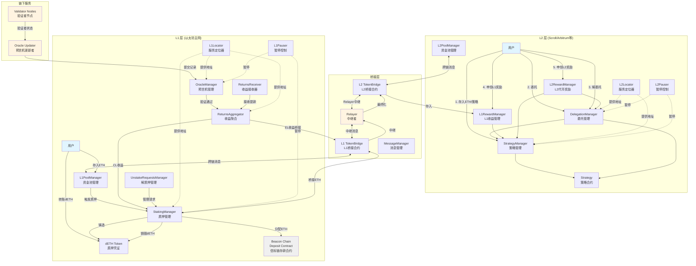
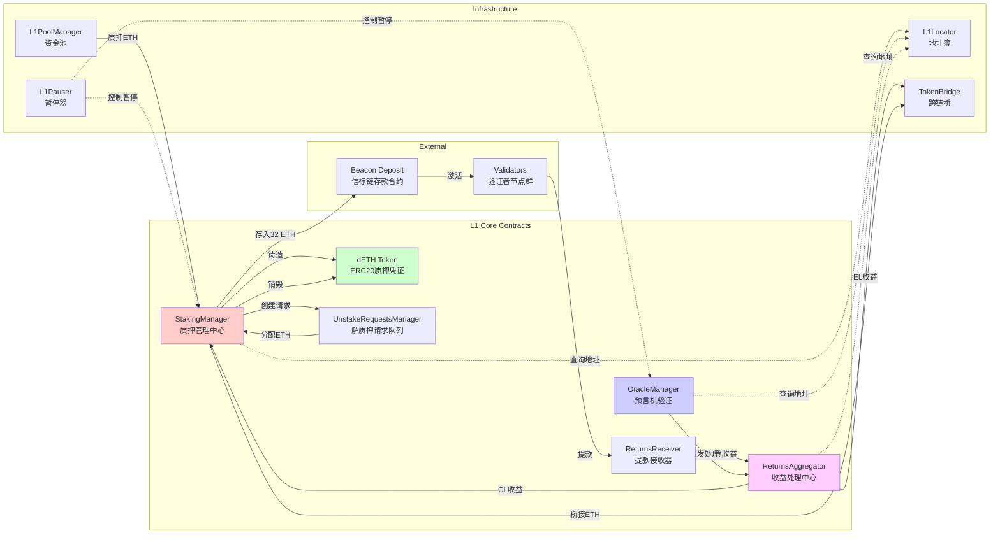
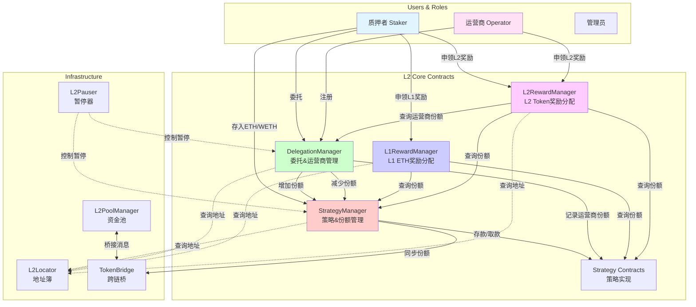
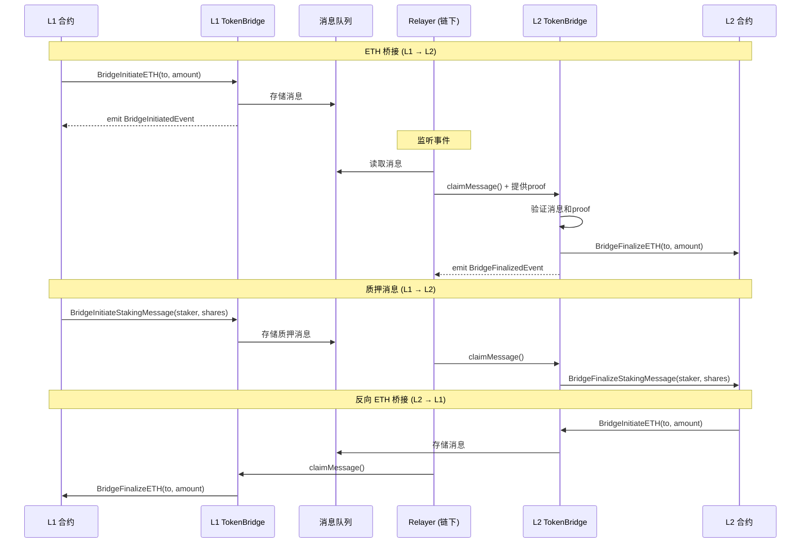
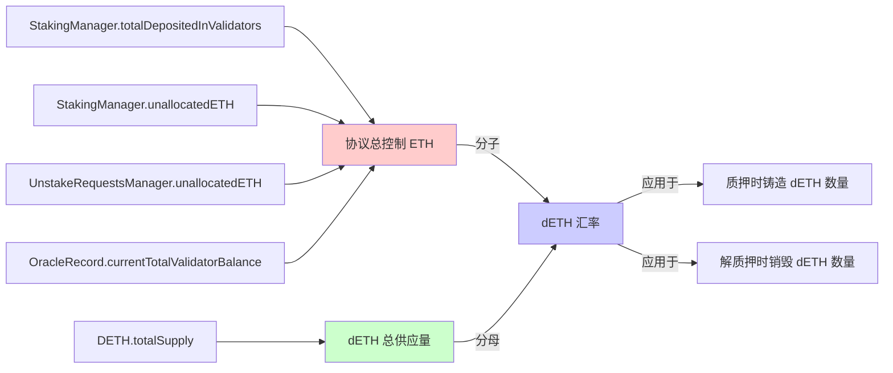
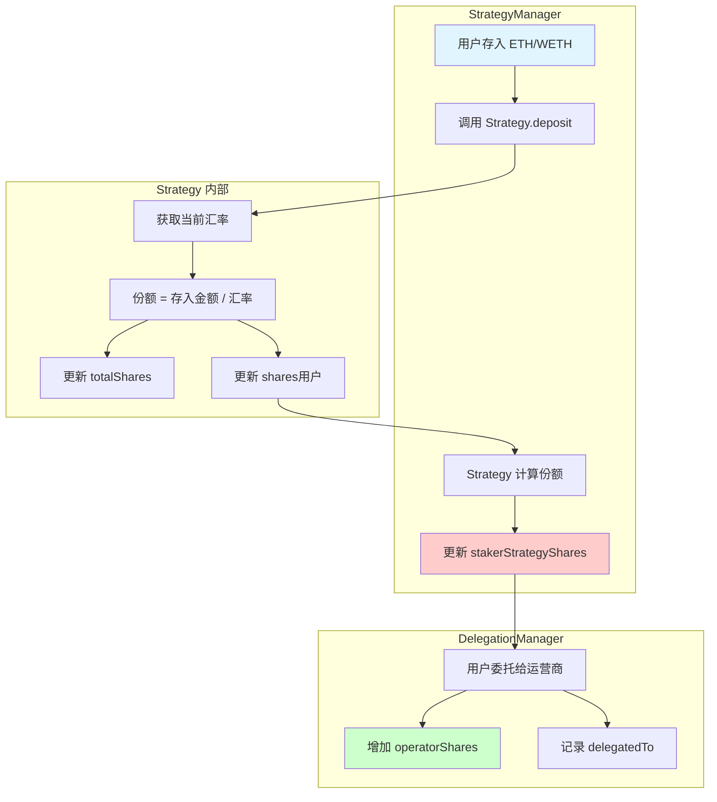
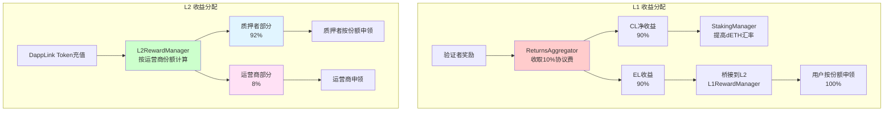
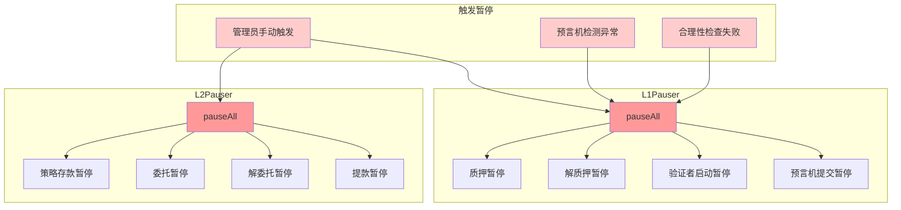

# 跨链质押协议 - 系统架构

## 📋 目录

- [整体架构图](#整体架构图)
- [L1 层架构](#l1-层架构)
- [L2 层架构](#l2-层架构)
- [桥接层架构](#桥接层架构)
- [核心数据流](#核心数据流)
- [关键交互流程](#关键交互流程)

---

## 整体架构图



---

## L1 层架构

### 核心合约关系图



### L1 合约职责表

| 合约 | 主要职责 | 核心状态变量 |
|------|----------|-------------|
| **StakingManager** | ETH汇聚、dETH铸造/销毁、验证者启动 | `totalDepositedInValidators`<br/>`numInitiatedValidators`<br/>`unallocatedETH`<br/>`allocatedETHForDeposits`<br/>`unStakeMessageNonce` |
| **DETH** | 质押凭证代币、转账触发跨链 | `totalSupply`<br/>`balances`<br/>`dETHToETH` 汇率 |
| **UnstakeRequestsManager** | 解质押请求队列、申领管理 | `l2ChainStrategyAmount`<br/>`dEthLockedAmount`<br/>`l2ChainStrategyBlockNumber`<br/>`allocatedETHForClaims`<br/>`latestCumulativeETHRequested` |
| **OracleManager** | 验证者状态验证、记录管理 | `_records[]`<br/>`hasPendingUpdate`<br/>`finalizationBlockNumberDelta` |
| **ReturnsAggregator** | 收益分类处理、费用收取 | `feesBasisPoints`<br/>`protocolFeesAccrued` |
| **ReturnsReceiver** | 接收验证者提款 | (无状态,纯接收) |
| **L1PoolManager** | 接收用户存款、触发桥接 | 资金池余额 |
| **L1Pauser** | 暂停控制 | 暂停状态位 |
| **L1Locator** | 地址簿 | 所有核心合约地址 |

---

## L2 层架构

### 核心合约关系图



### L2 合约职责表

| 合约 | 主要职责 | 核心状态变量 |
|------|----------|-------------|
| **StrategyManager** | 管理用户在各策略中的份额 | `stakerStrategyShares[staker][strategy]`<br/>`stakerStrategyL1BackShares[staker][strategy]`<br/>`stakerStrategyList[staker][]` |
| **DelegationManager** | 管理委托关系、运营商份额、提款队列 | `delegatedTo[staker]`<br/>`operatorShares[operator][strategy]`<br/>`cumulativeWithdrawalsQueued[staker]`<br/>`pendingWithdrawals[withdrawalRoot]` |
| **Strategy** | 具体策略实现(ETH/WETH/ERC20) | `totalShares`<br/>`shares[user]`<br/>`underlyingToken`<br/>`virtualEthBalance`<br/>`virtualWethBalance` |
| **L1RewardManager** | 分配L1桥接来的ETH奖励 | `L1RewardBalance`<br/>按份额比例分配 |
| **L2RewardManager** | 分配L2 DappLink代币奖励 | `stakerRewards[strategy]`<br/>`operatorRewards[operator]`<br/>`stakerPercent=92%` |
| **L2PoolManager** | 接收L2存款、触发L2→L1桥接 | 资金池余额 |
| **L2Pauser** | 暂停控制 | 暂停状态位 |
| **L2Locator** | 地址簿 | 所有核心合约地址 |

---

## 桥接层架构

### 跨链消息流



### 桥接合约职责

| 合约 | 层级 | 主要职责 |
|------|------|----------|
| **TokenBridgeBase** | 基类 | 提供桥接基础功能、事件定义 |
| **L1 TokenBridge** | L1 | 发起L1→L2消息、接收L2→L1消息 |
| **L2 TokenBridge** | L2 | 接收L1→L2消息、发起L2→L1消息 |
| **MessageManager** | 两侧 | 管理跨链消息队列、验证proof |

### 关键桥接函数

```solidity
// L1 → L2 ETH 桥接
function BridgeInitiateETH(
    uint256 sourceChainId,
    uint256 destChainId,
    address to
) external payable returns (bool);

function BridgeFinalizeETH(
    uint256 sourceChainId,
    uint256 destChainId,
    address to,
    uint256 amount,
    uint256 _fee,
    uint256 _nonce
) external payable onlyRole(ReLayer) returns (bool);

// L1 → L2 质押消息
function BridgeInitiateStakingMessage(
    address from,      // dETH 转出地址
    address to,        // dETH 接收地址
    uint256 shares     // 转移的份额数量
) external returns (bool);

function BridgeFinalizeStakingMessage(
    address shareAddress,      // Strategy 合约地址
    address from,
    address to,
    uint256 shares,
    uint256 stakeMessageNonce,
    uint256 gasLimit
) external returns (bool);

// 消息验证和申领
function claimMessage(
    uint256 sourceChainId,
    uint256 destChainId,
    address to,
    uint256 _fee,
    uint256 _value,
    uint256 _nonce
) external;
```

---

## 核心数据流

### 1. dETH 汇率计算



**公式**:
```
dETH汇率 = 协议总控制ETH / dETH总供应量

铸造dETH数量 = 存入ETH数量 * (1 / dETH汇率)
销毁dETH数量 = 取回ETH数量 * (1 / dETH汇率)
```

### 2. L2 份额计算



**公式**:
```
Strategy汇率 = Strategy持有的基础资产 / totalShares

新增份额 = 存入金额 / Strategy汇率

用户总份额 = stakerStrategyShares[staker][strategy]
运营商总份额 = Σ operatorShares[operator][strategy]
```

### 3. 奖励分配比例



---

## 关键交互流程

### 服务定位器模式 (Locator Pattern)

所有合约通过 Locator 获取其他合约地址,避免硬编码:

```solidity
// L1 合约获取依赖
interface IL1Locator {
    function stakingManager() external view returns (address);
    function dETH() external view returns (address);
    function oracleManager() external view returns (address);
    function returnsAggregator() external view returns (address);
    // ... 其他地址
}

// 使用示例
contract StakingManager is L1Base {
    function getUnstakeRequestsManager() internal view returns (IUnstakeRequestsManager) {
        return IUnstakeRequestsManager(getLocator().unStakingRequestsManager());
    }
}
```

**优点**:
- 解耦合约依赖
- 便于升级和测试
- 集中管理地址

### 暂停机制



### 角色权限矩阵

| 角色 | L1权限 | L2权限 | 说明 |
|------|--------|--------|------|
| **用户** | 在L1PoolManager存款 | 存入策略、委托、解委托、申领奖励 | 普通质押用户 |
| **Relayer** | 触发质押、触发申领、中继消息 | 中继消息、同步状态 | 跨链消息中继者 |
| **Oracle Updater** | 提交验证者状态记录 | - | 监控验证者并提交状态 |
| **Admin** | 设置参数、分配ETH、启动验证者、暂停 | 设置参数、暂停、管理运营商 | 系统管理员 |
| **Operator** | - | 注册为运营商、接受委托 | 验证者运营商 |
| **Oracle Manager** | 修改预言机记录 | - | 预言机管理者 |
| **Pending Resolver** | 接受/拒绝待处理更新 | - | 处理异常预言机记录 |

---

## 合约地址配置

### L1Locator 配置

```solidity
struct Config {
    address stakingManager;              // 质押管理合约
    address unStakingRequestsManager;    // 解质押请求管理
    address dETH;                        // dETH 代币
    address pauser;                      // L1 暂停器
    address returnsAggregator;           // 收益聚合器
    address oracleManager;               // 预言机管理
    address oracleQuorumManager;         // 预言机仲裁(暂未使用)
    address consensusLayerReceiver;      // CL 收益接收器
    address executionLayerReceiver;      // EL 收益接收器
    address dapplinkBridge;              // 桥接合约
    address depositContract;             // 信标链存款合约 (0x00000000219ab540356cBB839Cbe05303d7705Fa)
    address relayerAddress;              // Relayer 地址
}
```

### L2Locator 配置

```solidity
struct Config {
    address delegation;                  // 委托管理 (DelegationManager)
    address strategyManager;             // 策略管理
    address dapplinkToken;               // DappLink 代币
    address pauser;                      // L2 暂停器
    address slasher;                     // Slasher 合约
    address relayer;                     // Relayer 地址
    address l1RewardManager;             // L1 奖励管理
    address l2RewardManager;             // L2 奖励管理
}
```

---

## 总结

### 架构特点

1. **分层设计**: L1负责ETH质押和验证者管理,L2负责用户份额和委托管理
2. **服务定位器**: 通过Locator集中管理依赖,降低耦合
3. **桥接通信**: 使用消息桥接实现L1和L2的状态同步
4. **双重奖励**: L1的ETH奖励 + L2的代币奖励
5. **安全机制**: 暂停、预言机双层验证、Finalize检查、重入保护
6. **角色分离**: 用户、运营商、Relayer、预言机、管理员各司其职

### 关键设计模式

- **代理模式**: OpenZeppelin Upgradeable Contracts
- **服务定位器**: L1Locator / L2Locator
- **观察者模式**: 事件驱动的跨链消息
- **策略模式**: 多种Strategy实现(ETH/WETH/ERC20)
- **状态机**: 请求创建 → 等待完成 → 申领
- **RBAC**: 基于角色的访问控制

### 扩展性

- 可添加新的Strategy类型支持更多资产
- 可扩展到多条L2链
- 可接入多个预言机数据源
- 可调整费率和参数适应不同场景

---

**相关文档**:
- [质押流程详解](./1-staking-flow.md)
- [奖励分发详解](./2-rewards-flow.md)
- [解质押流程详解](./3-unstaking-flow.md)
- [取款完成详解](./4-withdrawal-flow.md)
